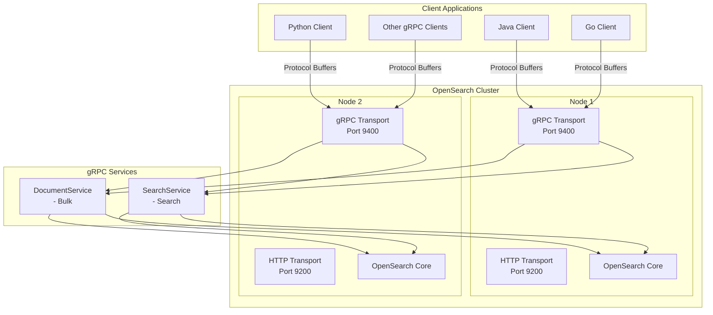
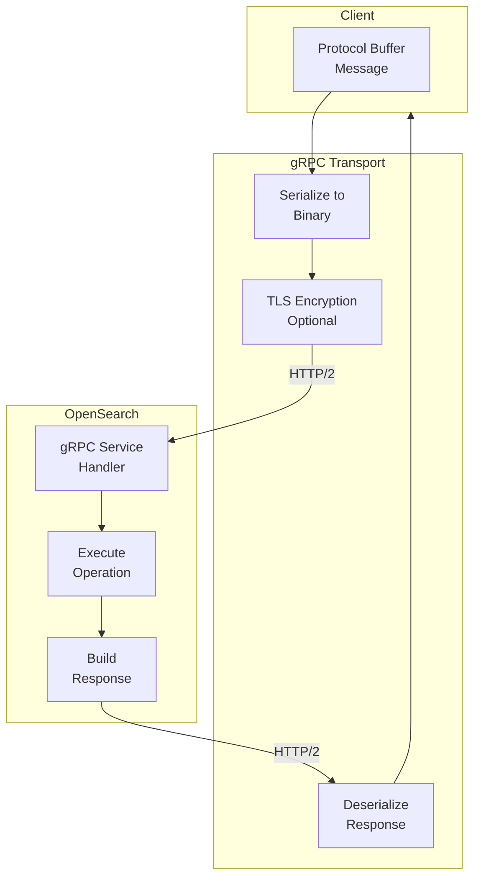

# gRPC Transport & Services

## Summary

gRPC Transport & Services provides an alternative communication protocol for OpenSearch, enabling high-performance, binary-encoded API access using protocol buffers over gRPC. This feature allows client applications in Java, Go, Python, and other languages to interact with OpenSearch using native gRPC stubs, offering lower latency and higher throughput compared to traditional HTTP REST APIs for high-volume workloads.

## Details

### Architecture



### Data Flow



### Components

| Component | Description |
|-----------|-------------|
| `transport-grpc` | Core module providing gRPC server transport capability (installed by default since v3.2.0) |
| `Netty4GrpcServerTransport` | Base gRPC server implementation using Netty4 |
| `SecureNetty4GrpcServerTransport` | TLS-enabled gRPC transport for secure connections |
| `DocumentService` | gRPC service handling document operations (Bulk API) |
| `SearchService` | gRPC service handling search operations (Search API) |
| `opensearch-protobufs` | Protocol buffer definitions for OpenSearch APIs |
| `GrpcServiceExtension` | Interface for plugins to register custom gRPC services (v3.2.0+) |
| `GrpcStatusMapper` | Maps OpenSearch exceptions to proper gRPC status codes (v3.2.0+) |

### Configuration

| Setting | Description | Default |
|---------|-------------|---------|
| `grpc.port` | Port for gRPC server to listen on | `9400` |
| `grpc.publish_port` | Port published for external connections | Same as `grpc.port` |
| `grpc.bind_host` | Network interface to bind gRPC server | Network host setting |
| `grpc.publish_host` | Host address published for gRPC | Network host setting |

### Supported Services

#### DocumentService

The DocumentService provides the Bulk API for batch document operations:

| Operation | Description |
|-----------|-------------|
| `index` | Index a document (creates or replaces) |
| `create` | Create a new document (fails if exists) |
| `update` | Partially update an existing document |
| `delete` | Delete a document by ID |

**Request Fields:**
- `request_body`: List of bulk operations
- `index`: Default index for operations
- `pipeline`: Ingest pipeline ID
- `refresh`: Refresh behavior after indexing
- `routing`: Custom routing value
- `timeout`: Operation timeout

#### SearchService

The SearchService provides the Search API for querying documents:

**Supported Query Types:**
- `match_all`: Match all documents
- `term`: Exact term matching on a field
- `terms`: Match any of multiple terms
- `match_none`: Match no documents

**Request Fields:**
- `index`: Target indexes
- `request_body`: Search request with query DSL
- `source`: Control `_source` field return
- `from`/`size`: Pagination
- `sort`: Result ordering
- `timeout`: Query timeout

### Usage Example

**Enabling gRPC (v3.2.0+, no installation required):**

```yaml
# opensearch.yml
grpc.port: 9400
```

**Installing the Plugin (v3.1.0 and earlier):**

```bash
bin/opensearch-plugin install transport-grpc
```

**Plugin Extension Example (v3.2.0+):**

```java
public class MyPlugin extends Plugin implements GrpcServiceExtension {
    
    @Override
    public Collection<BindableService> getGrpcServices(
            Client client, 
            ClusterService clusterService) {
        return List.of(new MyCustomGrpcService(client));
    }
}
```

**Java Client Example:**

```java
import org.opensearch.protobufs.*;
import io.grpc.ManagedChannel;
import io.grpc.ManagedChannelBuilder;
import com.google.protobuf.ByteString;

// Create channel
ManagedChannel channel = ManagedChannelBuilder
    .forAddress("localhost", 9400)
    .usePlaintext()
    .build();

// Bulk indexing
DocumentServiceGrpc.DocumentServiceBlockingStub docStub = 
    DocumentServiceGrpc.newBlockingStub(channel);

BulkRequest bulkRequest = BulkRequest.newBuilder()
    .setIndex("my-index")
    .addRequestBody(BulkRequestBody.newBuilder()
        .setIndex(IndexOperation.newBuilder()
            .setId("1")
            .build())
        .setDoc(ByteString.copyFromUtf8("{\"title\": \"Document 1\"}"))
        .build())
    .build();

BulkResponse bulkResponse = docStub.bulk(bulkRequest);

// Search
SearchServiceGrpc.SearchServiceBlockingStub searchStub = 
    SearchServiceGrpc.newBlockingStub(channel);

SearchRequest searchRequest = SearchRequest.newBuilder()
    .addIndex("my-index")
    .setRequestBody(SearchRequestBody.newBuilder()
        .setQuery(QueryContainer.newBuilder()
            .setTerm(TermQuery.newBuilder()
                .putTerm("title", TermQueryField.newBuilder()
                    .setValue(FieldValue.newBuilder()
                        .setStringValue("Document")
                        .build())
                    .build())
                .build())
            .build())
        .setSize(10)
        .build())
    .build();

SearchResponse searchResponse = searchStub.search(searchRequest);

channel.shutdown();
```

**Document Encoding:**

Documents in gRPC requests must be Base64 encoded:

```json
// Original document
{"title": "Inception", "year": 2010}

// Base64 encoded for gRPC
"eyJ0aXRsZSI6ICJJbmNlcHRpb24iLCAieWVhciI6IDIwMTB9"
```

## Limitations

- **Limited query support**: Only basic queries (match_all, term, terms, match_none) supported
- **No aggregations**: Aggregation support not yet available
- **Limited services**: Only Bulk and Search endpoints implemented
- **Opt-in activation**: Requires explicit configuration to enable

## Related PRs

| Version | PR | Description |
|---------|-----|-------------|
| v3.2.0 | [#18516](https://github.com/opensearch-project/OpenSearch/pull/18516) | Make GRPC transport extensible to allow plugins to register custom services |
| v3.2.0 | [#18897](https://github.com/opensearch-project/OpenSearch/pull/18897) | Move transport-grpc from a core plugin to a module |
| v3.2.0 | [#18915](https://github.com/opensearch-project/OpenSearch/pull/18915) | Remove `experimental` designation from transport-grpc settings |
| v3.2.0 | [#18923](https://github.com/opensearch-project/OpenSearch/pull/18923) | Rename package to org.opensearch.transport.grpc |
| v3.2.0 | [#18925](https://github.com/opensearch-project/OpenSearch/pull/18925) | Map to proper GRPC status codes and achieve exception handling parity |
| v3.2.0 | [#18880](https://github.com/opensearch-project/OpenSearch/pull/18880) | Upgrade to protobufs 0.6.0 |
| v3.1.0 | [#18303](https://github.com/opensearch-project/OpenSearch/pull/18303) | Optimize gRPC perf by passing by reference |
| v3.1.0 | [#18031](https://github.com/opensearch-project/OpenSearch/pull/18031) | Package reorganization to org.opensearch.plugin.transport.grpc |
| v3.0.0 | [#17796](https://github.com/opensearch-project/OpenSearch/pull/17796) | Enable TLS for Netty4GrpcServerTransport |
| v3.0.0 | [#17727](https://github.com/opensearch-project/OpenSearch/pull/17727) | Add DocumentService and Bulk gRPC endpoint v1 |
| v3.0.0 | [#17830](https://github.com/opensearch-project/OpenSearch/pull/17830) | SearchService and Search gRPC endpoint v1 |
| v3.0.0 | [#17888](https://github.com/opensearch-project/OpenSearch/pull/17888) | Add terms query support in Search gRPC endpoint |

## References

- [Issue #16787](https://github.com/opensearch-project/OpenSearch/issues/16787): gRPC Transport tracking issue
- [Issue #18893](https://github.com/opensearch-project/OpenSearch/issues/18893): Move transport-grpc from plugin to module
- [Issue #18513](https://github.com/opensearch-project/OpenSearch/issues/18513): GRPC Plugin Extensibility for Query Conversion
- [gRPC APIs Documentation](https://docs.opensearch.org/3.0/api-reference/grpc-apis/index/): Official documentation
- [Bulk (gRPC) API](https://docs.opensearch.org/3.0/api-reference/grpc-apis/bulk/): Bulk endpoint reference
- [Search (gRPC) API](https://docs.opensearch.org/3.0/api-reference/grpc-apis/search/): Search endpoint reference
- [opensearch-protobufs](https://github.com/opensearch-project/opensearch-protobufs): Protocol buffer definitions
- [Additional Plugins](https://docs.opensearch.org/3.0/install-and-configure/additional-plugins/index/): Plugin installation guide

## Change History

- **v3.2.0** (2026-01-14): GA release - moved to module, plugin extensibility, proper gRPC status codes, removed experimental designation
- **v3.1.0** (2026-01-14): Performance optimization with pass-by-reference pattern, package reorganization
- **v3.0.0** (2025-05-06): Initial implementation with DocumentService (Bulk) and SearchService (Search), TLS support
