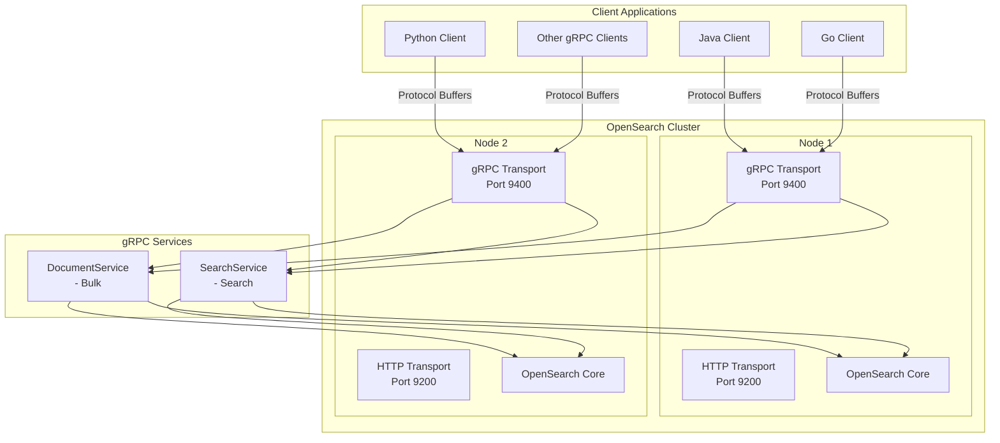
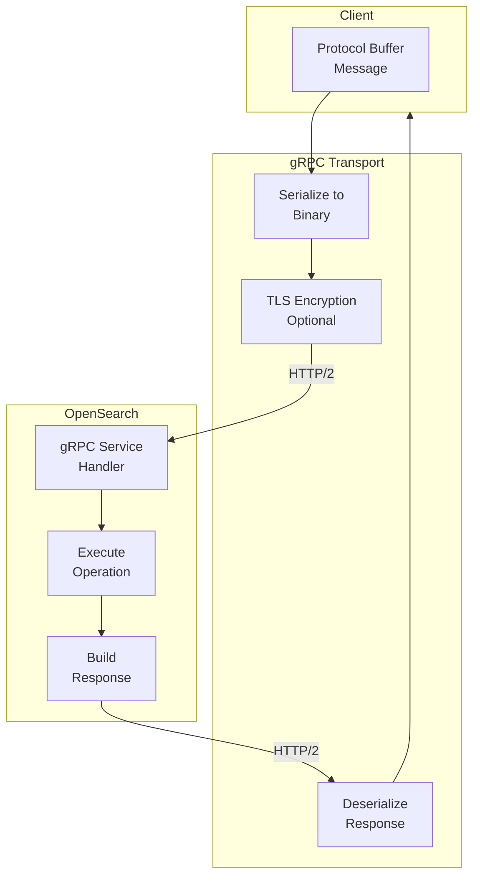

# gRPC Transport & Services

## Summary

gRPC Transport & Services provides an alternative communication protocol for OpenSearch, enabling high-performance, binary-encoded API access using protocol buffers over gRPC. This feature allows client applications in Java, Go, Python, and other languages to interact with OpenSearch using native gRPC stubs, offering lower latency and higher throughput compared to traditional HTTP REST APIs for high-volume workloads.

## Details

### Architecture



### Data Flow



### Components

| Component | Description |
|-----------|-------------|
| `transport-grpc` | Core module providing gRPC server transport capability (installed by default since v3.2.0) |
| `transport-grpc-spi` | Lightweight SPI module for external plugins to register query converters (v3.3.0+) |
| `Netty4GrpcServerTransport` | Base gRPC server implementation using Netty4 |
| `SecureNetty4GrpcServerTransport` | TLS-enabled gRPC transport for secure connections |
| `DocumentService` | gRPC service handling document operations (Bulk API) |
| `SearchService` | gRPC service handling search operations (Search API) |
| `opensearch-protobufs` | Protocol buffer definitions for OpenSearch APIs |
| `GrpcServiceExtension` | Interface for plugins to register custom gRPC services (v3.2.0+) |
| `GrpcInterceptorProvider` | Interface for plugins to provide custom gRPC interceptors with ordering (v3.4.0+) |
| `ContextPreservingServerCallListener` | Preserves ThreadContext across gRPC async callbacks (v3.4.0+) |
| `QueryBuilderProtoConverter` | Interface for converting protobuf queries to QueryBuilder (v3.3.0+) |
| `QueryBuilderProtoConverterRegistry` | Registry for query converters, supports built-in and external converters (v3.3.0+) |
| `GrpcStatusMapper` | Maps OpenSearch exceptions to proper gRPC status codes (v3.2.0+) |
| `MediaTypeRegistry.mediaTypeFromBytes` | Auto-detects document format from binary content (v3.4.0+) |

### Configuration

| Setting | Description | Default |
|---------|-------------|---------|
| `grpc.port` | Port for gRPC server to listen on | `9400` |
| `grpc.publish_port` | Port published for external connections | Same as `grpc.port` |
| `grpc.bind_host` | Network interface to bind gRPC server | Network host setting |
| `grpc.publish_host` | Host address published for gRPC | Network host setting |
| `grpc.netty.boss_count` | Number of boss threads for connection acceptance (v3.3.0+) | `1` |
| `grpc.netty.worker_count` | Number of worker threads for network I/O (v3.3.0+) | `availableProcessors()` |
| `grpc.netty.executor_threads` | Number of executor threads for request processing (v3.3.0+) | `availableProcessors() * 2` |

### Supported Services

#### DocumentService

The DocumentService provides the Bulk API for batch document operations:

| Operation | Description |
|-----------|-------------|
| `index` | Index a document (creates or replaces) |
| `create` | Create a new document (fails if exists) |
| `update` | Partially update an existing document |
| `delete` | Delete a document by ID |

**Request Fields:**
- `request_body`: List of bulk operations
- `index`: Default index for operations
- `pipeline`: Ingest pipeline ID
- `refresh`: Refresh behavior after indexing
- `routing`: Custom routing value
- `timeout`: Operation timeout

#### SearchService

The SearchService provides the Search API for querying documents:

**Supported Query Types (v3.4.0):**

| Category | Query Types |
|----------|-------------|
| Match | `match_all`, `match_none`, `match`, `match_bool_prefix`, `match_phrase_prefix` |
| Term-level | `term`, `terms`, `exists`, `ids`, `range`, `regexp`, `wildcard`, `terms_set`, `fuzzy`, `prefix` |
| Full-text | `match_phrase`, `multi_match` |
| Compound | `bool`, `constant_score`, `function_score` |
| Geographic | `geo_bounding_box`, `geo_distance` |
| Joining | `nested` |
| Specialized | `script` |

**Search Features (v3.4.0+):**
- `highlight`: Search result highlighting
- `sort`: Result ordering
- `derived_fields`: Derived field support

**Request Fields:**
- `index`: Target indexes
- `request_body`: Search request with query DSL
- `source`: Control `_source` field return
- `from`/`size`: Pagination
- `sort`: Result ordering
- `timeout`: Query timeout

### Usage Example

**Enabling gRPC (v3.2.0+, no installation required):**

```yaml
# opensearch.yml
grpc.port: 9400
```

**Installing the Plugin (v3.1.0 and earlier):**

```bash
bin/opensearch-plugin install transport-grpc
```

**Plugin Extension Example (v3.2.0+):**

```java
public class MyPlugin extends Plugin implements GrpcServiceExtension {
    
    @Override
    public Collection<BindableService> getGrpcServices(
            Client client, 
            ClusterService clusterService) {
        return List.of(new MyCustomGrpcService(client));
    }
}
```

**Java Client Example:**

```java
import org.opensearch.protobufs.*;
import io.grpc.ManagedChannel;
import io.grpc.ManagedChannelBuilder;
import com.google.protobuf.ByteString;

// Create channel
ManagedChannel channel = ManagedChannelBuilder
    .forAddress("localhost", 9400)
    .usePlaintext()
    .build();

// Bulk indexing
DocumentServiceGrpc.DocumentServiceBlockingStub docStub = 
    DocumentServiceGrpc.newBlockingStub(channel);

BulkRequest bulkRequest = BulkRequest.newBuilder()
    .setIndex("my-index")
    .addRequestBody(BulkRequestBody.newBuilder()
        .setIndex(IndexOperation.newBuilder()
            .setId("1")
            .build())
        .setDoc(ByteString.copyFromUtf8("{\"title\": \"Document 1\"}"))
        .build())
    .build();

BulkResponse bulkResponse = docStub.bulk(bulkRequest);

// Search
SearchServiceGrpc.SearchServiceBlockingStub searchStub = 
    SearchServiceGrpc.newBlockingStub(channel);

SearchRequest searchRequest = SearchRequest.newBuilder()
    .addIndex("my-index")
    .setRequestBody(SearchRequestBody.newBuilder()
        .setQuery(QueryContainer.newBuilder()
            .setTerm(TermQuery.newBuilder()
                .putTerm("title", TermQueryField.newBuilder()
                    .setValue(FieldValue.newBuilder()
                        .setStringValue("Document")
                        .build())
                    .build())
                .build())
            .build())
        .setSize(10)
        .build())
    .build();

SearchResponse searchResponse = searchStub.search(searchRequest);

channel.shutdown();
```

**Document Encoding:**

Documents in gRPC requests must be Base64 encoded:

```json
// Original document
{"title": "Inception", "year": 2010}

// Base64 encoded for gRPC
"eyJ0aXRsZSI6ICJJbmNlcHRpb24iLCAieWVhciI6IDIwMTB9"
```

## Limitations

- **No aggregations**: Aggregation support not yet available (throws exception if requested)
- **No suggest**: Suggest support not yet available (throws exception if requested)
- **Limited services**: Only Bulk and Search endpoints implemented
- **Opt-in activation**: Requires explicit configuration to enable
- **typed_keys**: Parameter not supported in gRPC requests
- **global_params**: Parameter not supported in Bulk/Search requests

## Change History

- **v3.4.0** (2026-01-14): Pluggable interceptors with ordering, thread context preservation, binary document format support (CBOR/SMILE/YAML), expanded query support (match, fuzzy, constant_score, function_score, prefix, match_bool_prefix, match_phrase_prefix), highlight and sort support, improved error responses, protobufs 0.24.0
- **v3.3.0** (2026-01-14): Expanded query support (15+ query types), thread management optimization, zero-copy serialization, transport-grpc-spi module for plugin extensibility
- **v3.2.0** (2026-01-14): GA release - moved to module, plugin extensibility, proper gRPC status codes, removed experimental designation
- **v3.1.0** (2026-01-14): Performance optimization with pass-by-reference pattern, package reorganization
- **v3.0.0** (2025-05-06): Initial implementation with DocumentService (Bulk) and SearchService (Search), TLS support

## References

### Documentation
- [gRPC APIs Documentation](https://docs.opensearch.org/3.0/api-reference/grpc-apis/index/): Official documentation
- [Bulk (gRPC) API](https://docs.opensearch.org/3.0/api-reference/grpc-apis/bulk/): Bulk endpoint reference
- [Search (gRPC) API](https://docs.opensearch.org/3.0/api-reference/grpc-apis/search/): Search endpoint reference
- [Additional Plugins](https://docs.opensearch.org/3.0/install-and-configure/additional-plugins/index/): Plugin installation guide
- [opensearch-protobufs](https://github.com/opensearch-project/opensearch-protobufs): Protocol buffer definitions

### Pull Requests
| Version | PR | Description | Related Issue |
|---------|-----|-------------|---------------|
| v3.4.0 | [#19005](https://github.com/opensearch-project/OpenSearch/pull/19005) | Introduce gRPC Interceptor Chain with pluggable interceptors |   |
| v3.4.0 | [#19304](https://github.com/opensearch-project/OpenSearch/pull/19304) | Add BindableServices extension point for custom gRPC services | [#19025](https://github.com/opensearch-project/OpenSearch/issues/19025) |
| v3.4.0 | [#19568](https://github.com/opensearch-project/OpenSearch/pull/19568) | Return full error details for gRPC error responses | [#18926](https://github.com/opensearch-project/OpenSearch/issues/18926) |
| v3.4.0 | [#19744](https://github.com/opensearch-project/OpenSearch/pull/19744) | Add SMILE/CBOR/YAML document format support to Bulk gRPC endpoint | [#19311](https://github.com/opensearch-project/OpenSearch/issues/19311) |
| v3.4.0 | [#19776](https://github.com/opensearch-project/OpenSearch/pull/19776) | Thread Context preservation by gRPC Interceptor |   |
| v3.4.0 | [#19831](https://github.com/opensearch-project/OpenSearch/pull/19831) | Bump opensearch-protobufs to 0.23.0 |   |
| v3.4.0 | [#19854](https://github.com/opensearch-project/OpenSearch/pull/19854) | Implement ConstantScoreQuery, FuzzyQuery, MatchBoolPrefixQuery, etc. |   |
| v3.4.0 | [#19868](https://github.com/opensearch-project/OpenSearch/pull/19868) | Implement Highlight and Sort for gRPC Search |   |
| v3.4.0 | [#19888](https://github.com/opensearch-project/OpenSearch/pull/19888) | Implement FunctionScoreQuery |   |
| v3.4.0 | [#20059](https://github.com/opensearch-project/OpenSearch/pull/20059) | Bump opensearch-protobufs to 0.24.0, add DerivedFields support |   |
| v3.4.0 | [#20162](https://github.com/opensearch-project/OpenSearch/pull/20162) | Throw exceptions for unsupported gRPC request fields |   |
| v3.4.0 | [#5763](https://github.com/opensearch-project/security/pull/5763) | Fix security plugin compilation for protobuf 0.23.0 |   |
| v3.4.0 | [#20010](https://github.com/opensearch-project/OpenSearch/pull/20010) | Fix ClassCastException in FlightClientChannel for requests larger than 16KB |   |
| v3.4.0 | [#19937](https://github.com/opensearch-project/OpenSearch/pull/19937) | Fix GRPC Bulk - update doc field, fetchSource default, pipeline support |   |
| v3.4.0 | [#19948](https://github.com/opensearch-project/OpenSearch/pull/19948) | Fix node bootstrap error when enable stream transport and remote cluster state |   |
| v3.3.0 | [#18949](https://github.com/opensearch-project/OpenSearch/pull/18949) | Publish transport-grpc-spi for QueryBuilderProtoConverter |   |
| v3.3.0 | [#19007](https://github.com/opensearch-project/OpenSearch/pull/19007) | Upgrade opensearch-protobufs to 0.13.0 |   |
| v3.3.0 | [#19278](https://github.com/opensearch-project/OpenSearch/pull/19278) | Optimize gRPC transport thread management | [#19277](https://github.com/opensearch-project/OpenSearch/issues/19277) |
| v3.3.0 | [#19280](https://github.com/opensearch-project/OpenSearch/pull/19280) | Zero-copy BytesRef optimization for search hits | [#19310](https://github.com/opensearch-project/OpenSearch/issues/19310) |
| v3.3.0 | [#19339](https://github.com/opensearch-project/OpenSearch/pull/19339) | Add failureaccess runtime dependency |   |
| v3.3.0 | [#19391](https://github.com/opensearch-project/OpenSearch/pull/19391) | Implement Boolean query and registry injection | [#19390](https://github.com/opensearch-project/OpenSearch/issues/19390) |
| v3.3.0 | [#19392](https://github.com/opensearch-project/OpenSearch/pull/19392) | Implement Exists, Regexp, Wildcard queries | [#18907](https://github.com/opensearch-project/OpenSearch/issues/18907) |
| v3.3.0 | [#19447](https://github.com/opensearch-project/OpenSearch/pull/19447) | Bump protobufs to 0.18.0, fix Inner Hits |   |
| v3.3.0 | [#19448](https://github.com/opensearch-project/OpenSearch/pull/19448) | Implement Ids, Range, Terms Set queries | [#18907](https://github.com/opensearch-project/OpenSearch/issues/18907) |
| v3.3.0 | [#19449](https://github.com/opensearch-project/OpenSearch/pull/19449) | Implement Match Phrase, MultiMatch queries | [#19389](https://github.com/opensearch-project/OpenSearch/issues/19389) |
| v3.3.0 | [#19451](https://github.com/opensearch-project/OpenSearch/pull/19451) | Implement GeoBoundingBox, GeoDistance queries | [#19450](https://github.com/opensearch-project/OpenSearch/issues/19450) |
| v3.3.0 | [#19453](https://github.com/opensearch-project/OpenSearch/pull/19453) | Implement Nested query, bump to protobufs 0.19.0 | [#19452](https://github.com/opensearch-project/OpenSearch/issues/19452) |
| v3.3.0 | [#19455](https://github.com/opensearch-project/OpenSearch/pull/19455) | Implement Script query | [#19454](https://github.com/opensearch-project/OpenSearch/issues/19454) |
| v3.2.0 | [#18516](https://github.com/opensearch-project/OpenSearch/pull/18516) | Make GRPC transport extensible to allow plugins to register custom services |   |
| v3.2.0 | [#18897](https://github.com/opensearch-project/OpenSearch/pull/18897) | Move transport-grpc from a core plugin to a module | [#18893](https://github.com/opensearch-project/OpenSearch/issues/18893) |
| v3.2.0 | [#18915](https://github.com/opensearch-project/OpenSearch/pull/18915) | Remove `experimental` designation from transport-grpc settings |   |
| v3.2.0 | [#18923](https://github.com/opensearch-project/OpenSearch/pull/18923) | Rename package to org.opensearch.transport.grpc |   |
| v3.2.0 | [#18925](https://github.com/opensearch-project/OpenSearch/pull/18925) | Map to proper GRPC status codes and achieve exception handling parity | [#18926](https://github.com/opensearch-project/OpenSearch/issues/18926) |
| v3.2.0 | [#18880](https://github.com/opensearch-project/OpenSearch/pull/18880) | Upgrade to protobufs 0.6.0 |   |
| v3.1.0 | [#18303](https://github.com/opensearch-project/OpenSearch/pull/18303) | Optimize gRPC perf by passing by reference | [#18291](https://github.com/opensearch-project/OpenSearch/issues/18291) |
| v3.1.0 | [#18031](https://github.com/opensearch-project/OpenSearch/pull/18031) | Package reorganization to org.opensearch.plugin.transport.grpc |   |
| v3.0.0 | [#17796](https://github.com/opensearch-project/OpenSearch/pull/17796) | Enable TLS for Netty4GrpcServerTransport | [#16905](https://github.com/opensearch-project/OpenSearch/issues/16905) |
| v3.0.0 | [#17727](https://github.com/opensearch-project/OpenSearch/pull/17727) | Add DocumentService and Bulk gRPC endpoint v1 |   |
| v3.0.0 | [#17830](https://github.com/opensearch-project/OpenSearch/pull/17830) | SearchService and Search gRPC endpoint v1 |   |
| v3.0.0 | [#17888](https://github.com/opensearch-project/OpenSearch/pull/17888) | Add terms query support in Search gRPC endpoint |   |

### Issues (Design / RFC)
- [Issue #16787](https://github.com/opensearch-project/OpenSearch/issues/16787): gRPC Transport tracking issue
- [Issue #18893](https://github.com/opensearch-project/OpenSearch/issues/18893): Move transport-grpc from plugin to module
- [Issue #18513](https://github.com/opensearch-project/OpenSearch/issues/18513): GRPC Plugin Extensibility for Query Conversion
- [Issue #19277](https://github.com/opensearch-project/OpenSearch/issues/19277): Optimize gRPC server for higher throughput
- [Issue #19310](https://github.com/opensearch-project/OpenSearch/issues/19310): Zero-copy optimization for search hits
- [Issue #19526](https://github.com/opensearch-project/OpenSearch/issues/19526): gRPC Search query support tracking
- [Issue #19311](https://github.com/opensearch-project/OpenSearch/issues/19311): Binary format support for Bulk API
- [Issue #5379](https://github.com/opensearch-project/security/issues/5379): gRPC extension points for security
