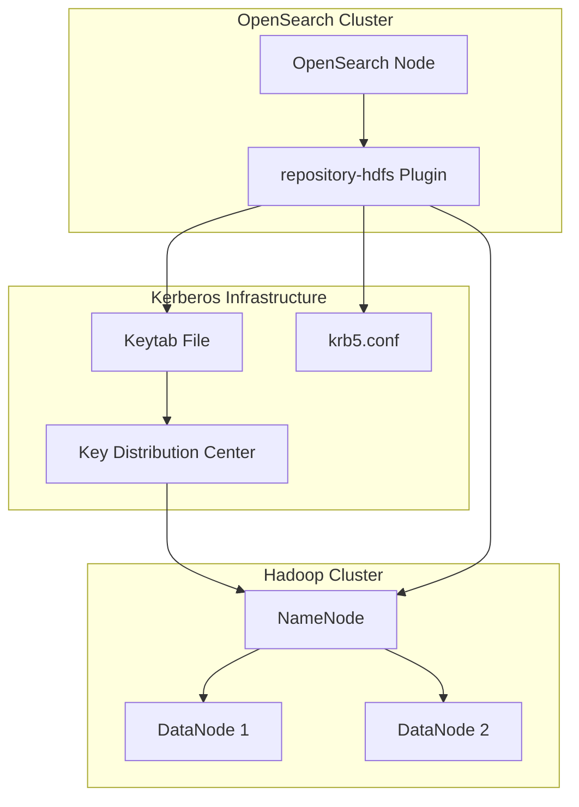
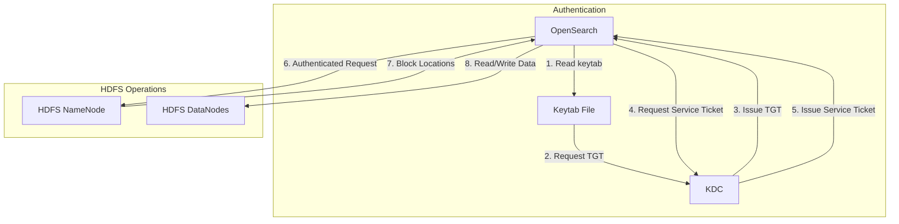

---
tags:
  - indexing
  - security
---

# HDFS Repository Kerberos Authentication

## Summary

The HDFS Repository plugin enables OpenSearch to use Hadoop Distributed File System (HDFS) as a snapshot repository backend. This feature supports Kerberos authentication for secure HDFS clusters, allowing enterprises to leverage their existing Hadoop infrastructure for OpenSearch backup and restore operations with enterprise-grade security.

## Details

### Architecture



### Data Flow



### Components

| Component | Description |
|-----------|-------------|
| repository-hdfs plugin | OpenSearch plugin providing HDFS repository support |
| hadoop-client-api | Hadoop client API library |
| hadoop-client-runtime | Hadoop client runtime dependencies |
| hadoop-hdfs | HDFS client implementation |
| krb5.conf | Kerberos configuration file |
| keytab | Kerberos keytab file containing service principal credentials |

### Configuration

#### OpenSearch Node Settings (opensearch.yml)

| Setting | Description | Required |
|---------|-------------|----------|
| `plugins.security.kerberos.krb5_filepath` | Path to Kerberos configuration file | Yes |
| `plugins.security.kerberos.acceptor_keytab_filepath` | Path to keytab file (relative to config directory) | Yes |
| `plugins.security.kerberos.acceptor_principal` | Kerberos principal for OpenSearch | Yes |

#### Security Backend Configuration (config.yml)

| Setting | Description | Default |
|---------|-------------|---------|
| `krb_debug` | Enable Kerberos debugging output | `false` |
| `strip_realm_from_principal` | Remove realm from username | `true` |
| `challenge` | Send WWW-Authenticate header on missing credentials | `true` |

### Usage Example

#### 1. Configure Kerberos in opensearch.yml

```yaml
plugins.security.kerberos.krb5_filepath: '/etc/krb5.conf'
plugins.security.kerberos.acceptor_keytab_filepath: 'opensearch_keytab.tab'
plugins.security.kerberos.acceptor_principal: 'HTTP/opensearch.example.com'
```

#### 2. Configure Security Backend (config.yml)

```yaml
kerberos_auth_domain:
  enabled: true
  order: 1
  http_authenticator:
    type: kerberos
    challenge: true
    config:
      krb_debug: false
      strip_realm_from_principal: true
  authentication_backend:
    type: noop
```

#### 3. Register HDFS Repository

```json
PUT _snapshot/hdfs_backup
{
  "type": "hdfs",
  "settings": {
    "uri": "hdfs://namenode.example.com:8020",
    "path": "/opensearch/snapshots",
    "conf.dfs.client.read.shortcircuit": "false"
  }
}
```

## Limitations

- Keytab file must be placed in the `config` directory or a subdirectory (security restriction)
- Path to keytab in `opensearch.yml` must be relative, not absolute
- Kerberos/SPNEGO behavior varies by browser and operating system
- Requires properly configured Kerberos infrastructure (KDC, realm, principals)

## Change History

- **v3.4.0** (2026-01-11): Updated Hadoop to 3.4.2, re-enabled Kerberos integration tests for JDK-24+

## References

### Documentation
- [Kerberos Authentication Documentation](https://docs.opensearch.org/3.0/security/authentication-backends/kerberos/): Official OpenSearch Kerberos configuration guide
- [Configuring the Security Backend](https://docs.opensearch.org/3.0/security/configuration/configuration/): Security backend configuration reference

### Pull Requests
| Version | PR | Description | Related Issue |
|---------|-----|-------------|---------------|
| v3.4.0 | [#19952](https://github.com/opensearch-project/OpenSearch/pull/19952) | Update Hadoop to 3.4.2 and enable security (Kerberos) integration tests under JDK-24 and above |   |
