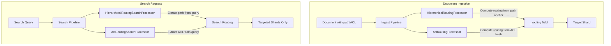
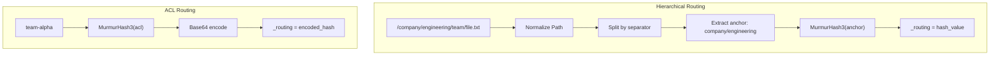

# Hierarchical & ACL-aware Routing

## Summary

Hierarchical and ACL-aware routing processors enable intelligent document co-location in OpenSearch by routing documents to specific shards based on hierarchical path structures (like folder paths) or access control metadata (like tenant IDs). This improves query performance by reducing shard fan-out when searching within specific hierarchies or access scopes.

Key benefits:
- **Improved query locality**: Related documents are stored on the same shard
- **Reduced I/O**: Queries targeting specific paths or ACL groups only hit relevant shards
- **Better cache efficiency**: Co-located documents improve cache hit rates
- **Multi-tenant optimization**: Tenant-specific queries avoid unnecessary shard access

## Details

### Architecture



### Data Flow



### Components

| Component | Type | Module | Description |
|-----------|------|--------|-------------|
| `HierarchicalRoutingProcessor` | Ingest | ingest-common | Routes documents based on hierarchical path structure |
| `HierarchicalRoutingSearchProcessor` | Search Request | search-pipeline-common | Adds routing to searches based on path queries |
| `AclRoutingProcessor` | Ingest | ingest-common | Routes documents based on ACL/tenant metadata |
| `AclRoutingSearchProcessor` | Search Request | search-pipeline-common | Extracts ACL from queries for search routing |

### Configuration

#### Hierarchical Routing Processor (Ingest)

| Setting | Type | Description | Default |
|---------|------|-------------|---------|
| `path_field` | String | Field containing the hierarchical path | Required |
| `anchor_depth` | Integer | Number of path segments to use for routing anchor | `2` |
| `path_separator` | String | Character used to separate path segments | `/` |
| `ignore_missing` | Boolean | Skip processing if path field is missing | `false` |
| `override_existing` | Boolean | Overwrite existing `_routing` value | `true` |

#### ACL Routing Processor (Ingest)

| Setting | Type | Description | Default |
|---------|------|-------------|---------|
| `acl_field` | String | Field containing ACL/tenant identifier | Required |
| `target_field` | String | Field to store the computed routing value | `_routing` |
| `ignore_missing` | Boolean | Skip processing if ACL field is missing | `false` |
| `override_existing` | Boolean | Overwrite existing routing value | `true` |

#### Hierarchical Routing Search Processor

| Setting | Type | Description | Default |
|---------|------|-------------|---------|
| `path_field` | String | Field name to look for in queries | Required |
| `anchor_depth` | Integer | Path segments for routing computation | `2` |
| `path_separator` | String | Path delimiter character | `/` |
| `enable_auto_detection` | Boolean | Automatically detect path queries | `true` |

#### ACL Routing Search Processor

| Setting | Type | Description | Default |
|---------|------|-------------|---------|
| `acl_field` | String | ACL field name to extract from queries | Required |
| `extract_from_query` | Boolean | Enable extraction from query clauses | `true` |

### Usage Example

#### Setting Up Hierarchical Routing

```json
// Create ingest pipeline
PUT _ingest/pipeline/hierarchical-routing
{
  "description": "Route documents based on folder hierarchy",
  "processors": [
    {
      "hierarchical_routing": {
        "path_field": "file_path",
        "anchor_depth": 2,
        "path_separator": "/"
      }
    }
  ]
}

// Create search pipeline
PUT _search/pipeline/hierarchical-search
{
  "request_processors": [
    {
      "hierarchical_routing_search": {
        "path_field": "file_path",
        "anchor_depth": 2,
        "path_separator": "/"
      }
    }
  ]
}

// Create index with pipelines
PUT documents
{
  "settings": {
    "number_of_shards": 5,
    "index.default_pipeline": "hierarchical-routing",
    "index.search.default_pipeline": "hierarchical-search"
  },
  "mappings": {
    "properties": {
      "file_path": { "type": "keyword" },
      "content": { "type": "text" }
    }
  }
}
```

#### Setting Up ACL Routing

```json
// Create ingest pipeline
PUT _ingest/pipeline/acl-routing
{
  "description": "Route documents based on team/tenant",
  "processors": [
    {
      "acl_routing": {
        "acl_field": "team",
        "target_field": "_routing"
      }
    }
  ]
}

// Create search pipeline
PUT _search/pipeline/acl-search
{
  "request_processors": [
    {
      "acl_routing_search": {
        "acl_field": "team",
        "extract_from_query": true
      }
    }
  ]
}
```

#### Indexing and Searching

```json
// Index documents - routing is automatically computed
POST documents/_doc
{
  "file_path": "/company/engineering/backend/api.pdf",
  "content": "API documentation"
}

POST documents/_doc
{
  "file_path": "/company/engineering/frontend/ui.pdf",
  "content": "UI guidelines"
}

// Search - routing is automatically added from query
GET documents/_search
{
  "query": {
    "prefix": {
      "file_path": "/company/engineering"
    }
  }
}
```

Both documents share the anchor `/company/engineering` and are routed to the same shard. The search query automatically targets only that shard.

## Limitations

- **Path format consistency**: Hierarchical routing requires consistent path formats across all documents
- **Single ACL value**: ACL routing uses the first value for multi-value fields
- **Query type support**: Search processors only extract routing from `term`, `terms`, `prefix`, and `wildcard` queries
- **Bool query handling**: Only `must` and `filter` clauses are considered; `should` and `must_not` are ignored
- **Re-indexing required**: Existing indices need re-indexing to apply new routing
- **Routing value changes**: Changing `anchor_depth` or `path_separator` will change routing values

## Related PRs

| Version | PR | Description |
|---------|-----|-------------|
| v3.2.0 | [#18826](https://github.com/opensearch-project/OpenSearch/pull/18826) | Add hierarchical routing processors for ingest and search pipelines |
| v3.2.0 | [#18834](https://github.com/opensearch-project/OpenSearch/pull/18834) | Add ACL-aware routing processors for multi-tenant document routing |

## References

- [Issue #18829](https://github.com/opensearch-project/OpenSearch/issues/18829): RFC: ACL-Aware Routing Strategy for Shard Assignment
- [Routing Documentation](https://docs.opensearch.org/3.2/field-types/metadata-fields/routing/): OpenSearch routing field
- [Search Shard Routing](https://docs.opensearch.org/3.2/search-plugins/searching-data/search-shard-routing/): Search routing documentation
- [Ingest Processors](https://docs.opensearch.org/3.2/ingest-pipelines/processors/index-processors/): Ingest pipeline processors
- [Search Processors](https://docs.opensearch.org/3.2/search-plugins/search-pipelines/search-processors/): Search pipeline processors

## Change History

- **v3.2.0** (2025-08): Initial implementation of hierarchical and ACL-aware routing processors
