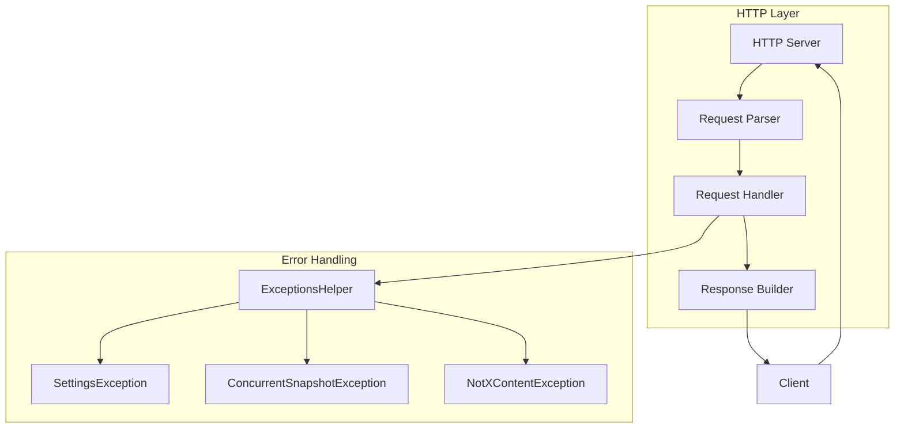

---
tags:
  - indexing
  - security
---

# HTTP API

## Summary

OpenSearch provides a RESTful HTTP API for all cluster operations. The HTTP layer handles request parsing, authentication, and response formatting. Proper HTTP status codes and configurable limits ensure reliable client-server communication and support for modern authentication mechanisms.

## Details

### Architecture



### Components

| Component | Description |
|-----------|-------------|
| `HttpTransportSettings` | Defines HTTP transport configuration settings including max header size |
| `ExceptionsHelper` | Maps exceptions to appropriate HTTP status codes |
| `SettingsException` | Exception for settings validation errors, returns 400 Bad Request |
| `ConcurrentSnapshotExecutionException` | Exception for snapshot conflicts, returns 409 Conflict |
| `NotXContentException` | Exception for invalid content format, returns 400 Bad Request |
| `AbstractScopedSettings` | Validates cluster and index settings, throws `SettingsException` for invalid settings |

### Configuration

| Setting | Description | Default |
|---------|-------------|---------|
| `http.max_header_size` | Maximum size of HTTP request headers | 16KB |
| `http.max_content_length` | Maximum size of HTTP request body | 100MB |
| `http.max_initial_line_length` | Maximum length of the initial HTTP request line | 4KB |

### HTTP Status Code Mapping

| Exception Type | HTTP Status | Description |
|----------------|-------------|-------------|
| `NotXContentException` | 400 Bad Request | Invalid content format in request body |
| `SettingsException` | 400 Bad Request | Invalid settings in request |
| `IllegalArgumentException` | 400 Bad Request | Invalid argument in request |
| `ConcurrentSnapshotExecutionException` | 409 Conflict | Concurrent snapshot operation conflict |
| `OpenSearchRejectedExecutionException` | 429 Too Many Requests | Request rejected due to overload |
| Other exceptions | 500 Internal Server Error | Unexpected server errors |

### Usage Example

```yaml
# opensearch.yml - HTTP configuration
http.max_header_size: 16kb
http.max_content_length: 100mb
http.max_initial_line_length: 4kb
```

Example API responses with proper status codes:

```bash
# Invalid JSON in create index request - returns 400
curl -X PUT "localhost:9200/test-index" -H 'Content-Type: application/json' -d'invalid'
# Response: {"error":{"type":"not_x_content_exception",...},"status":400}

# Invalid settings update - returns 400
curl -X PUT "localhost:9200/_cluster/settings" -H 'Content-Type: application/json' -d'
{
  "transient": {"unknown.setting": "value"}
}'
# Response: {"error":{"type":"settings_exception",...},"status":400}

# Concurrent snapshot conflict - returns 409
# When attempting to create a snapshot while another is in progress
# Response: {"error":{"type":"concurrent_snapshot_execution_exception",...},"status":409}
```

## Limitations

- `http.max_header_size` is a node-level setting requiring restart to change
- Header size increases may impact memory usage under high load
- Status code changes may affect existing client error handling logic

## Change History

- **v3.0.0** (2025-05-06): HTTP status code improvements and increased default max header size from 8KB to 16KB

## Related Features
- [OpenSearch Dashboards](../opensearch-dashboards/ai-chat.md)

## References

### Pull Requests
| Version | PR | Description | Related Issue |
|---------|-----|-------------|---------------|
| v3.0.0 | [#4773](https://github.com/opensearch-project/OpenSearch/pull/4773) | Change HTTP code on create index API with bad input from 500 to 400 |   |
| v3.0.0 | [#4792](https://github.com/opensearch-project/OpenSearch/pull/4792) | Improve summary error message for invalid setting updates | [#4745](https://github.com/opensearch-project/OpenSearch/issues/4745) |
| v3.0.0 | [#8986](https://github.com/opensearch-project/OpenSearch/pull/8986) | Return 409 Conflict instead of 503 for concurrent snapshot execution |   |
| v3.0.0 | [#18024](https://github.com/opensearch-project/OpenSearch/pull/18024) | Change default max header size from 8KB to 16KB | [#18022](https://github.com/opensearch-project/OpenSearch/issues/18022) |

### Issues (Design / RFC)
- [Issue #2756](https://github.com/opensearch-project/OpenSearch/issues/2756): Wrong HTTP code returned from create index API
- [Issue #4745](https://github.com/opensearch-project/OpenSearch/issues/4745): Update AbstractScopedSettings to throw OpenSearchExceptions
- [Issue #18022](https://github.com/opensearch-project/OpenSearch/issues/18022): Increase http.max_header_size default to 16KB
