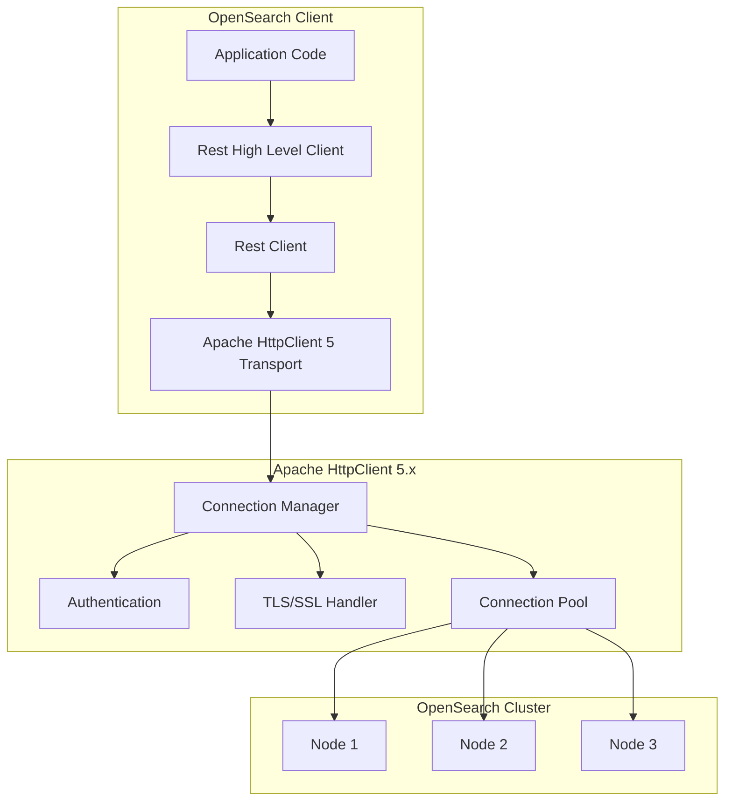

# HTTP Client

## Summary

OpenSearch uses Apache HttpClient as the underlying HTTP transport for its REST clients. This library handles all HTTP communication between OpenSearch clients and the cluster, including connection management, authentication, SSL/TLS, and request/response handling. Starting with OpenSearch 3.0.0, the client transports use Apache HttpClient 5.x, which provides modern HTTP features and improved performance.

## Details

### Architecture



### Components

| Component | Description |
|-----------|-------------|
| `ApacheHttpClient5TransportBuilder` | Default transport builder for Java client using HttpClient 5.x |
| `RestClient` | Low-level REST client for direct HTTP communication |
| `RestHighLevelClient` | High-level client with typed request/response handling |
| `ByteArrayEntity` | HTTP entity for binary content |
| `StringEntity` | HTTP entity for string content |
| `BasicCredentialsProvider` | Authentication credentials management |
| `PoolingAsyncClientConnectionManager` | Connection pooling for async operations |

### Configuration

| Setting | Description | Default |
|---------|-------------|---------|
| Connection timeout | Time to establish connection | 1000ms |
| Socket timeout | Time to wait for data | 30000ms |
| Max connections per route | Maximum connections to single host | 10 |
| Max total connections | Maximum total connections | 30 |

### Usage Example

```java
// Using Apache HttpClient 5 Transport (recommended for OpenSearch 3.x)
import org.apache.hc.client5.http.auth.AuthScope;
import org.apache.hc.client5.http.auth.UsernamePasswordCredentials;
import org.apache.hc.client5.http.impl.auth.BasicCredentialsProvider;
import org.apache.hc.core5.http.HttpHost;
import org.opensearch.client.opensearch.OpenSearchClient;
import org.opensearch.client.transport.httpclient5.ApacheHttpClient5TransportBuilder;

final HttpHost host = new HttpHost("https", "localhost", 9200);
final BasicCredentialsProvider credentialsProvider = new BasicCredentialsProvider();
credentialsProvider.setCredentials(
    new AuthScope(host), 
    new UsernamePasswordCredentials("admin", "admin".toCharArray())
);

final ApacheHttpClient5TransportBuilder builder = ApacheHttpClient5TransportBuilder.builder(host);
builder.setHttpClientConfigCallback(httpClientBuilder -> {
    return httpClientBuilder.setDefaultCredentialsProvider(credentialsProvider);
});

OpenSearchClient client = new OpenSearchClient(builder.build());
```

### Package Structure

| Package | Purpose |
|---------|---------|
| `org.apache.hc.core5.http` | Core HTTP interfaces and classes |
| `org.apache.hc.core5.http.io.entity` | HTTP entity implementations |
| `org.apache.hc.core5.http.message` | HTTP message implementations |
| `org.apache.hc.client5.http` | HTTP client interfaces |
| `org.apache.hc.client5.http.classic.methods` | HTTP method implementations |
| `org.apache.hc.client5.http.impl.auth` | Authentication implementations |
| `org.apache.hc.client5.http.impl.nio` | Async client implementations |

## Limitations

- HTTP/2 support requires additional configuration
- Custom SSL contexts need to be configured for self-signed certificates
- Connection pool settings may need tuning for high-throughput scenarios

## Related PRs

| Version | PR | Description |
|---------|-----|-------------|
| v3.0.0 | [#4459](https://github.com/opensearch-project/OpenSearch/pull/4459) | Migrate client transports to Apache HttpClient / Core 5.x |

## References

- [Issue #4256](https://github.com/opensearch-project/OpenSearch/issues/4256): Original feature request
- [Java Client Documentation](https://docs.opensearch.org/3.0/clients/java/): Official documentation
- [Apache HttpClient 5.x](https://hc.apache.org/httpcomponents-client-5.1.x/): Apache HttpClient project

## Change History

- **v3.0.0** (2025-03-11): Migrated from Apache HttpComponents 4.x to Apache HttpClient 5.x
