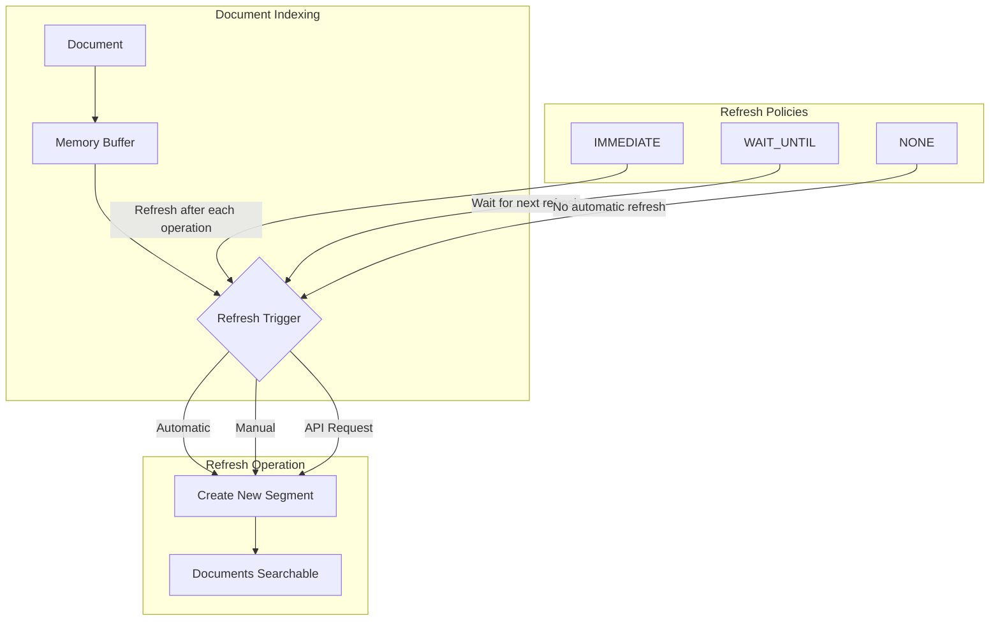
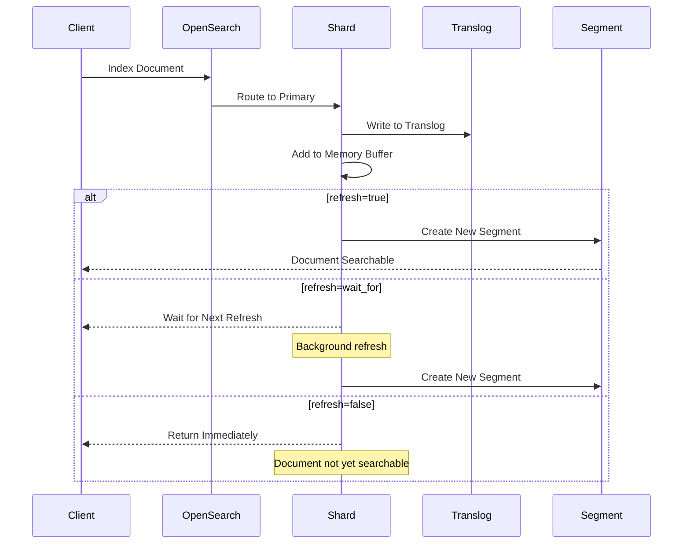

---
tags:
  - indexing
  - performance
---

# Index Refresh

## Summary

Index refresh is a core OpenSearch operation that makes newly indexed documents searchable by transferring them from the memory buffer to Lucene segments. OpenSearch provides configurable refresh policies (`IMMEDIATE`, `WAIT_UNTIL`, `NONE`) that control when and how refresh operations occur. This feature documentation covers the refresh mechanism and related optimizations.

## Details

### Architecture



### Data Flow



### Components

| Component | Description |
|-----------|-------------|
| `TransportShardBulkAction` | Handles bulk write operations and refresh policy enforcement |
| `AsyncAfterWriteAction` | Executes post-replication actions including refresh |
| `IndexShard` | Manages shard-level refresh operations |
| `RefreshPolicy` | Enum defining refresh behavior (IMMEDIATE, WAIT_UNTIL, NONE) |

### Configuration

| Setting | Description | Default |
|---------|-------------|---------|
| `index.refresh_interval` | How often the index should refresh automatically | `1s` |
| `index.search.idle.after` | Time after which an index is considered idle | `30s` |
| `refresh` (API parameter) | Per-request refresh policy | `false` |

### Usage Example

```bash
# Set refresh interval for an index
PUT /my-index/_settings
{
  "index": {
    "refresh_interval": "30s"
  }
}

# Index with immediate refresh
POST /my-index/_doc?refresh=true
{
  "field": "value"
}

# Update with retry and refresh
POST /my-index/_update/1?retry_on_conflict=5&refresh=true
{
  "doc": {
    "counter": 1
  }
}

# Manual refresh
POST /my-index/_refresh

# Disable automatic refresh (for bulk loading)
PUT /my-index/_settings
{
  "index": {
    "refresh_interval": "-1"
  }
}
```

## Limitations

- Frequent refresh operations are resource-intensive (CPU, memory, I/O)
- `refresh=true` adds latency to write operations
- In high-conflict scenarios with `retry_on_conflict`, unnecessary refreshes could occur (fixed in v3.3.0)
- Disabling refresh (`-1`) requires manual refresh to make documents searchable

## Change History

- **v3.3.0**: Fixed unnecessary refresh operations during update retry conflicts ([#18917](https://github.com/opensearch-project/OpenSearch/pull/18917))

## References

### Documentation
- [Refresh Index API](https://docs.opensearch.org/3.0/api-reference/index-apis/refresh/): Official API documentation
- [Index Settings](https://docs.opensearch.org/3.0/install-and-configure/configuring-opensearch/index-settings/): Configuration reference

### Blog Posts
- [Optimize OpenSearch Refresh Interval](https://opensearch.org/blog/optimize-refresh-interval/): Best practices blog

### Pull Requests
| Version | PR | Description | Related Issue |
|---------|-----|-------------|---------------|
| v3.3.0 | [#18917](https://github.com/opensearch-project/OpenSearch/pull/18917) | Fix unnecessary refreshes during update retry conflicts | [#15261](https://github.com/opensearch-project/OpenSearch/issues/15261) |

### Issues (Design / RFC)
- [Issue #15261](https://github.com/opensearch-project/OpenSearch/issues/15261): Bug report for unnecessary refresh on update conflicts
