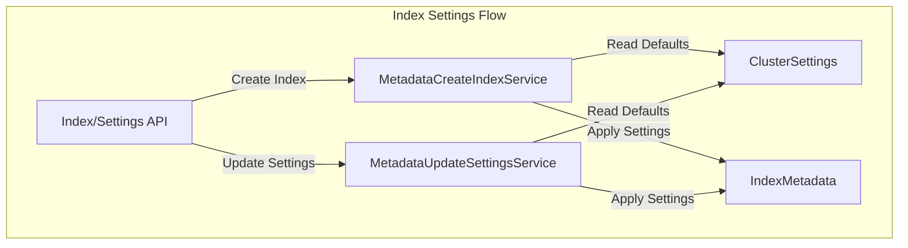

# Index Settings

## Summary

Index settings control the behavior and configuration of OpenSearch indexes. Settings can be specified at index creation time and some can be updated dynamically. This feature covers the proper handling of default values when settings are explicitly set to `null`, ensuring consistency with cluster-level defaults.

## Details

### Architecture



### Key Settings

| Setting | Type | Scope | Description |
|---------|------|-------|-------------|
| `index.number_of_replicas` | Integer | Dynamic | Number of replica shards per primary shard |
| `index.number_of_routing_shards` | Integer | Static | Number of routing shards for index splitting |
| `cluster.default_number_of_replicas` | Integer | Cluster | Default replica count when not specified |

### Default Value Resolution

When an index setting is set to `null`, OpenSearch resolves the default value using the following priority:

1. **Cluster-level setting** (e.g., `cluster.default_number_of_replicas`)
2. **Calculated optimal value** (e.g., routing shards based on number of shards)
3. **Hardcoded default** (e.g., `1` for replicas)

### Configuration

| Setting | Description | Default |
|---------|-------------|---------|
| `cluster.default_number_of_replicas` | Cluster-wide default for replica count | `1` |
| `index.number_of_replicas` | Per-index replica count | Uses cluster default |
| `index.number_of_routing_shards` | Routing shards for split operations | Calculated based on shards |

### Usage Example

```bash
# Configure cluster default
PUT _cluster/settings
{
  "persistent": {
    "cluster.default_number_of_replicas": 2
  }
}

# Create index (uses cluster default of 2 replicas)
PUT my-index
{
  "settings": {
    "number_of_shards": 3
  }
}

# Override replica count
PUT my-index/_settings
{
  "index": {
    "number_of_replicas": 5
  }
}

# Reset to cluster default
PUT my-index/_settings
{
  "index": {
    "number_of_replicas": null
  }
}

# Verify settings
GET my-index/_settings
```

## Limitations

- `index.number_of_routing_shards` is a static setting and cannot be changed after index creation
- Setting values to `null` requires explicit API calls; omitting a setting in a partial update does not reset it

## Related PRs

| Version | PR | Description |
|---------|-----|-------------|
| v2.18.0 | [#14948](https://github.com/opensearch-project/OpenSearch/pull/14948) | Fix update settings with null replica not honoring cluster setting |
| v2.18.0 | [#16331](https://github.com/opensearch-project/OpenSearch/pull/16331) | Fix wrong default value when setting routing shards to null |

## References

- [Issue #14810](https://github.com/opensearch-project/OpenSearch/issues/14810): Original bug report for replica count
- [Issue #16327](https://github.com/opensearch-project/OpenSearch/issues/16327): Original bug report for routing shards
- [Index Settings Documentation](https://docs.opensearch.org/2.18/install-and-configure/configuring-opensearch/index-settings/): Official documentation

## Change History

- **v2.18.0** (2024-11-05): Fixed default value handling when `index.number_of_replicas` and `index.number_of_routing_shards` are set to `null`
