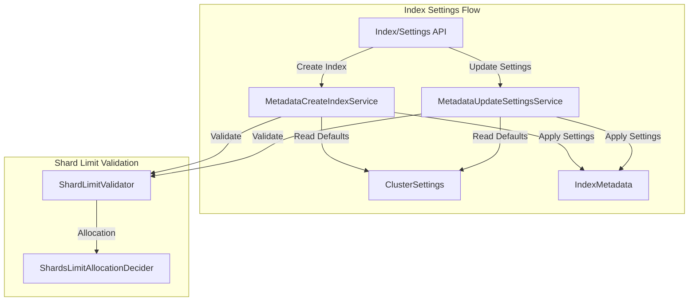
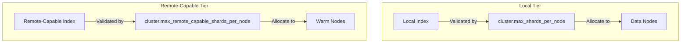

# Index Settings

## Summary

Index settings control the behavior and configuration of OpenSearch indexes. Settings can be specified at index creation time and some can be updated dynamically. This feature covers index-level and cluster-level settings for shard management, replica configuration, creation timestamps, and tier-aware shard limit validation.

## Details

### Architecture



### Key Settings

| Setting | Type | Scope | Description |
|---------|------|-------|-------------|
| `index.number_of_replicas` | Integer | Dynamic | Number of replica shards per primary shard |
| `index.number_of_routing_shards` | Integer | Static | Number of routing shards for index splitting |
| `index.creation_date` | Long | Final | Index creation timestamp (settable at creation) |
| `cluster.default_number_of_replicas` | Integer | Cluster | Default replica count when not specified |

### Default Value Resolution

When an index setting is set to `null`, OpenSearch resolves the default value using the following priority:

1. **Cluster-level setting** (e.g., `cluster.default_number_of_replicas`)
2. **Calculated optimal value** (e.g., routing shards based on number of shards)
3. **Hardcoded default** (e.g., `1` for replicas)

### Tier-Aware Shard Limit Validation

OpenSearch supports separate shard limits for local (hot) and remote-capable (warm) indices:



### Configuration

#### Cluster-Level Settings

| Setting | Description | Default |
|---------|-------------|---------|
| `cluster.default_number_of_replicas` | Cluster-wide default for replica count | `1` |
| `cluster.max_shards_per_node` | Maximum shards per data node | `1000` |
| `cluster.max_remote_capable_shards_per_node` | Maximum remote-capable shards per warm node | `1000` |
| `cluster.routing.allocation.total_remote_capable_shards_limit` | Total cluster-wide limit for remote-capable shards | `-1` |
| `cluster.routing.allocation.total_remote_capable_shards_per_node` | Remote-capable shards per node for allocation | `-1` |

#### Index-Level Settings

| Setting | Description | Default |
|---------|-------------|---------|
| `index.number_of_replicas` | Per-index replica count | Uses cluster default |
| `index.number_of_routing_shards` | Routing shards for split operations | Calculated |
| `index.creation_date` | Index creation timestamp | Current time |
| `index.routing.allocation.total_shards_per_node` | Max shards per node for this index | `-1` |
| `index.routing.allocation.total_primary_shards_per_node` | Max primary shards per node (remote store only) | `-1` |
| `index.routing.allocation.total_remote_capable_shards_per_node` | Max remote-capable shards per node | `-1` |
| `index.routing.allocation.total_remote_capable_primary_shards_per_node` | Max remote-capable primary shards per node | `-1` |

### Usage Examples

#### Setting Custom Creation Date

```json
PUT /migrated-index
{
  "settings": {
    "index.creation_date": 1234567890000,
    "number_of_shards": 3,
    "number_of_replicas": 1
  }
}
```

#### Configure Cluster Defaults

```json
PUT _cluster/settings
{
  "persistent": {
    "cluster.default_number_of_replicas": 2
  }
}
```

#### Configure Tier-Aware Shard Limits

```json
PUT _cluster/settings
{
  "persistent": {
    "cluster.max_shards_per_node": 1000,
    "cluster.max_remote_capable_shards_per_node": 2000
  }
}
```

#### Reset to Cluster Default

```json
PUT my-index/_settings
{
  "index": {
    "number_of_replicas": null
  }
}
```

## Limitations

- `index.number_of_routing_shards` is a static setting and cannot be changed after index creation
- `index.creation_date` cannot be modified after index creation (final setting)
- Setting values to `null` requires explicit API calls; omitting a setting in a partial update does not reset it
- Remote-capable shard limits only apply to clusters with remote store enabled
- `index.routing.allocation.total_primary_shards_per_node` requires remote store enabled clusters

## Change History

- **v3.4.0** (2025-01-15): Added custom creation_date setting and tier-aware shard limit validation
- **v2.18.0** (2024-11-05): Fixed default value handling when `index.number_of_replicas` and `index.number_of_routing_shards` are set to `null`

## References

### Documentation
- [Index Settings Documentation](https://docs.opensearch.org/3.0/install-and-configure/configuring-opensearch/index-settings/): Official documentation

### Pull Requests
| Version | PR | Description |
|---------|-----|-------------|
| v3.4.0 | [#19931](https://github.com/opensearch-project/OpenSearch/pull/19931) | Allow setting index.creation_date on index creation |
| v3.4.0 | [#19532](https://github.com/opensearch-project/OpenSearch/pull/19532) | Add separate shard limit validation for local and remote indices |
| v2.18.0 | [#14948](https://github.com/opensearch-project/OpenSearch/pull/14948) | Fix update settings with null replica not honoring cluster setting |
| v2.18.0 | [#16331](https://github.com/opensearch-project/OpenSearch/pull/16331) | Fix wrong default value when setting routing shards to null |

### Issues (Design / RFC)
- [Issue #19610](https://github.com/opensearch-project/OpenSearch/issues/19610): Feature request for tier-agnostic shard limit validation
- [Issue #14810](https://github.com/opensearch-project/OpenSearch/issues/14810): Bug report for replica count default
- [Issue #16327](https://github.com/opensearch-project/OpenSearch/issues/16327): Bug report for routing shards default
