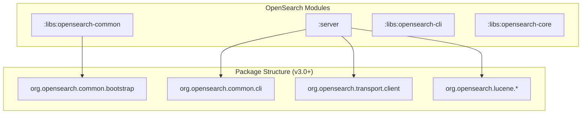

# Java Runtime & JPMS

## Summary

OpenSearch's Java runtime requirements and JPMS (Java Platform Module System) support define the minimum JDK version and module architecture. Starting with OpenSearch 3.0, JDK 21 is required, and the codebase has been refactored to eliminate split packages in preparation for full JPMS modularization.

## Details

### Architecture



### Components

| Component | Description | Since |
|-----------|-------------|-------|
| JDK 21 Runtime | Minimum supported Java version | v3.0.0 |
| MemorySegment API | Modern mmap implementation using JDK 19+ preview APIs | v3.0.0 |
| JPMS Phase-0 | Split package elimination for module system compatibility | v3.0.0 |

### Configuration

| Setting | Description | Default |
|---------|-------------|---------|
| `OPENSEARCH_JAVA_OPTS` | JVM options including `--enable-preview` for MemorySegment | None |
| `JAVA_HOME` | Path to JDK 21+ installation | System default |

### Package Mapping

| Original Package | New Package | Reason |
|-----------------|-------------|--------|
| `org.opensearch.bootstrap` (libs) | `org.opensearch.common.bootstrap` | Eliminate split with `:server` |
| `org.opensearch.cli` (server) | `org.opensearch.common.cli` | Eliminate split with `:libs:opensearch-cli` |
| `org.opensearch.client` (server) | `org.opensearch.transport.client` | Eliminate split with REST client |
| `org.apache.lucene.*` (server) | `org.opensearch.lucene.*` | Eliminate split with Lucene library |

### Usage Example

```bash
# Verify JDK version
java -version
# openjdk version "21.0.x" ...

# Start OpenSearch with MemorySegment API enabled
OPENSEARCH_JAVA_OPTS="--enable-preview" ./bin/opensearch

# Expected log output
# [INFO] Using MemorySegmentIndexInput with Java 21
```

## Limitations

- Full JPMS modularization (Phase 1+) is ongoing
- Some `org.apache.lucene` packages remain pending Star Tree implementation:
  - `org.apache.lucene.codecs`
  - `org.apache.lucene.index`
  - `org.apache.lucene.search.grouping`

## References

- [Issue #8110](https://github.com/opensearch-project/OpenSearch/issues/8110): META - Split and modularize the server monolith
- [Issue #1588](https://github.com/opensearch-project/OpenSearch/issues/1588): JPMS support tracking
- [Issue #5910](https://github.com/opensearch-project/OpenSearch/issues/5910): Modularization discussion
- [PR #5151](https://github.com/opensearch-project/OpenSearch/pull/5151): MMap preview API support
- [PR #17117](https://github.com/opensearch-project/OpenSearch/pull/17117): Bootstrap package refactor
- [PR #17153](https://github.com/opensearch-project/OpenSearch/pull/17153): CLI package refactor
- [PR #17241](https://github.com/opensearch-project/OpenSearch/pull/17241): Lucene package refactor
- [PR #17272](https://github.com/opensearch-project/OpenSearch/pull/17272): Client package refactor
- [Breaking Changes](https://docs.opensearch.org/3.0/breaking-changes/): Official documentation

## Change History

| Version | Changes |
|---------|---------|
| v3.0.0 | JDK 21 minimum requirement, JPMS Phase-0 split package elimination |
