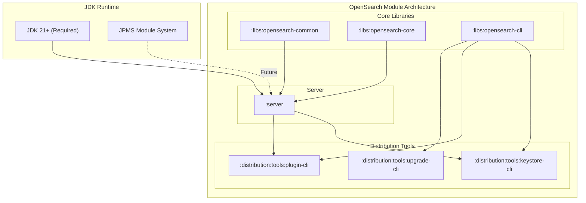

# Java Runtime & JPMS Support

## Summary

OpenSearch's Java runtime requirements and Java Platform Module System (JPMS) support define the minimum JDK version and module architecture for running OpenSearch. Starting with version 3.0.0, OpenSearch requires JDK 21 as the minimum runtime and has begun refactoring the codebase to support JPMS modularization. This enables OpenSearch to leverage modern Java features, improve startup performance, and provide better encapsulation of internal APIs.

## Details

### Architecture



### JDK Version History

| OpenSearch Version | Bundled JDK | Minimum JDK | Tested JDKs |
|-------------------|-------------|-------------|-------------|
| 1.0.0 - 1.2.4 | AdoptOpenJDK 15.0.1+9 | 11 | 11, 14, 15 |
| 1.3.x | Adoptium 11.0.14.1+1 | 8 | 8, 11, 14 |
| 2.x | Adoptium 17.x | 11 | 11, 17 |
| 3.0.0+ | Adoptium 21.x | 21 | 21 |

### JPMS Modularization Phases

The modularization effort is divided into phases:

#### Phase 0: Split Package Elimination (v3.0.0)
Eliminates split packages where the same Java package exists in multiple JAR files. This is a prerequisite for JPMS as the module system requires each package to belong to exactly one module.

**Completed refactoring:**
- `org.opensearch.bootstrap` → `org.opensearch.common.bootstrap` (in libs)
- `org.opensearch.cli` → `org.opensearch.common.cli` (in server)
- `org.opensearch.client` → `org.opensearch.transport.client` (in server)
- `org.apache.lucene.*` → `org.opensearch.lucene.*` (custom Lucene extensions)

#### Phase 1: Library Decoupling (Planned)
Further separation of concerns to support serverless and cloud-native implementations:
- `org.opensearch.env` → `:libs:opensearch-core`
- `org.opensearch.common.settings` → `:libs:opensearch-core`
- `org.opensearch.cluster.metadata` → `:libs:opensearch-cluster`

### Components

| Component | Description | Package |
|-----------|-------------|---------|
| JarHell | Detects duplicate classes across JARs | `org.opensearch.common.bootstrap` |
| JdkJarHellCheck | Validates JDK compatibility | `org.opensearch.common.bootstrap` |
| EnvironmentAwareCommand | Base class for CLI commands | `org.opensearch.common.cli` |
| KeyStoreAwareCommand | CLI commands with keystore access | `org.opensearch.tools.cli.keystore` |
| PluginCli | Plugin management CLI | `org.opensearch.tools.cli.plugin` |

### Configuration

| Setting | Description | Default |
|---------|-------------|---------|
| `JAVA_HOME` | Path to JDK installation | System default |
| `OPENSEARCH_JAVA_HOME` | OpenSearch-specific JDK path (takes precedence) | Not set |
| `OPENSEARCH_JAVA_OPTS` | Additional JVM options | Empty |

### Usage Example

```bash
# Check Java version
java -version
# openjdk version "21.0.1" 2023-10-17 LTS

# Set OpenSearch-specific Java home (optional)
export OPENSEARCH_JAVA_HOME=/path/to/jdk21

# Start OpenSearch (uses bundled JDK by default)
./bin/opensearch

# Verify JDK in use via nodes API
curl -X GET "localhost:9200/_nodes/jvm?pretty"
```

### Memory Mapping with JDK 21

JDK 21 provides stable `MemorySegment` API for memory-mapped files:

```java
// Lucene uses MemorySegment for efficient index access
// No --enable-preview flag required (was needed in JDK 19-20)
[INFO] Using MemorySegmentIndexInput with Java 21
```

## Limitations

- **Minimum JDK 21**: No support for JDK 8, 11, or 17 in OpenSearch 3.0+
- **Plugin compatibility**: Plugins must be compiled with JDK 21 and updated imports
- **JPMS not fully enabled**: Module descriptors (`module-info.java`) not yet added
- **Reflection restrictions**: Future JPMS enforcement may restrict reflective access

## Change History

- **v3.0.0** (2025-05-06): JDK 21 minimum requirement, JPMS Phase 0 split package elimination
- **v2.4.0** (2022-11-15): Added JDK 19 preview API support for memory mapping
- **v1.3.0** (2022-03-17): Introduced `OPENSEARCH_JAVA_HOME` environment variable, downgraded bundled JDK to 11 LTS
- **v1.0.0** (2021-07-12): Initial release with JDK 15 bundled, JDK 11 minimum

## References

### Documentation
- [Breaking Changes](https://docs.opensearch.org/3.0/breaking-changes/): Official v3.0.0 breaking changes

### Blog Posts
- [Java Runtime Blog](https://opensearch.org/blog/opensearch-java-runtime/): Using different Java runtimes

### Pull Requests
| Version | PR | Description |
|---------|-----|-------------|
| v3.0.0 | [#17153](https://github.com/opensearch-project/OpenSearch/pull/17153) | Refactor codebase for JPMS support |
| v3.0.0 | [#17117](https://github.com/opensearch-project/OpenSearch/pull/17117) | Refactor bootstrap package |
| v3.0.0 | [#17241](https://github.com/opensearch-project/OpenSearch/pull/17241) | Refactor Lucene packages |
| v3.0.0 | [#17272](https://github.com/opensearch-project/OpenSearch/pull/17272) | Refactor client package |
| v3.0.0 | [#16366](https://github.com/opensearch-project/OpenSearch/pull/16366) | Update to Apache Lucene 10 (requires JDK 21) |
| v3.0.0 | [#16429](https://github.com/opensearch-project/OpenSearch/pull/16429) | Update JDK to 23.0.1 |
| v3.0.0 | [#17900](https://github.com/opensearch-project/OpenSearch/pull/17900) | Custom Gradle plugin for Java agent (SecurityManager replacement) |
| v2.4.0 | [#5151](https://github.com/opensearch-project/OpenSearch/pull/5151) | Enable JDK 19 preview APIs for mmap |

### Issues (Design / RFC)
- [Issue #8110](https://github.com/opensearch-project/OpenSearch/issues/8110): META - Split and modularize the server monolith
- [Issue #1588](https://github.com/opensearch-project/OpenSearch/issues/1588): JPMS support tracking
- [Issue #5910](https://github.com/opensearch-project/OpenSearch/issues/5910): Modularization discussion
