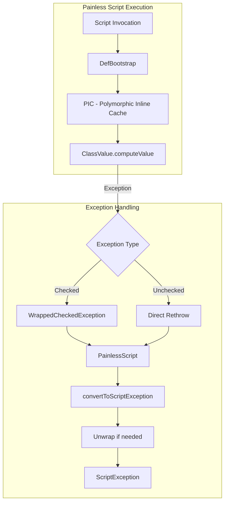

# JDK 25 Support

## Summary

OpenSearch supports running on JDK 25 through compatibility fixes in the Painless scripting engine. JDK 25 introduced behavioral changes in `ClassValue::remove` that required modifications to exception handling in the dynamic method invocation mechanism.

## Details

### Architecture



### Components

| Component | Description |
|-----------|-------------|
| `DefBootstrap` | Bootstrap class for Painless dynamic method invocation using invokedynamic |
| `DefBootstrap.PIC` | Polymorphic Inline Cache for caching method handles per receiver type |
| `DefBootstrap.WrappedCheckedException` | RuntimeException wrapper for checked exceptions during method lookup |
| `PainlessScript` | Interface for Painless scripts with exception conversion logic |

### JDK 25 Behavioral Change

JDK 25 changed how `ClassValue` handles exceptions in `computeValue`:

| JDK Version | Behavior |
|-------------|----------|
| JDK 24 and earlier | Checked exceptions propagate directly from `computeValue` |
| JDK 25+ | `ClassValue.getFromHashMap` wraps checked exceptions with `java.lang.Error` |

This change is documented in [JDK-8351996](https://bugs.openjdk.org/browse/JDK-8351996).

### Solution

The fix wraps checked exceptions in a custom `RuntimeException` before they can be wrapped by `ClassValue`, then unwraps them when converting to `ScriptException`:

```java
// In DefBootstrap.PIC.computeValue
try {
    return lookup(flavor, name, receiverType).asType(type);
} catch (Throwable t) {
    switch (t) {
        case Exception e -> throw new WrappedCheckedException(e);
        default -> Def.rethrow(t);
    }
}

// In PainlessScript.convertToScriptException
final Throwable unwrapped = switch (originalThrowable) {
    case DefBootstrap.WrappedCheckedException w -> w.getCause();
    default -> originalThrowable;
};
```

### Usage Example

Painless scripts work transparently on JDK 25:

```json
POST /my-index/_update/1
{
  "script": {
    "lang": "painless",
    "source": "ctx._source.counter += params.count",
    "params": {
      "count": 4
    }
  }
}
```

## Limitations

- This fix specifically addresses the `ClassValue` behavioral change
- Other JDK 25 compatibility issues may require separate fixes
- The fix uses Java 21+ pattern matching syntax (`switch` expressions with type patterns)

## Change History

- **v3.4.0**: Added JDK 25 compatibility through exception wrapping in Painless DefBootstrap

## References

### Documentation
- [JDK-8351996](https://bugs.openjdk.org/browse/JDK-8351996): Behavioral updates for ClassValue::remove

### Blog Posts
- [OpenSearch Java Runtime Blog](https://opensearch.org/blog/opensearch-java-runtime/): Using Different Java Runtimes with OpenSearch

### Pull Requests
| Version | PR | Description | Related Issue |
|---------|-----|-------------|---------------|
| v3.4.0 | [#19706](https://github.com/opensearch-project/OpenSearch/pull/19706) | Wrap checked exceptions in painless.DefBootstrap to support JDK-25 |   |
| v3.4.0 | [#19698](https://github.com/opensearch-project/OpenSearch/pull/19698) | Update bundled JDK to JDK-25 | [#19314](https://github.com/opensearch-project/OpenSearch/issues/19314) |

### Issues (Design / RFC)
- [Issue #19314](https://github.com/opensearch-project/OpenSearch/issues/19314): JDK 25 support tracking issue
