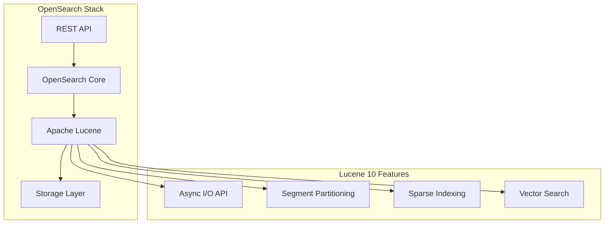
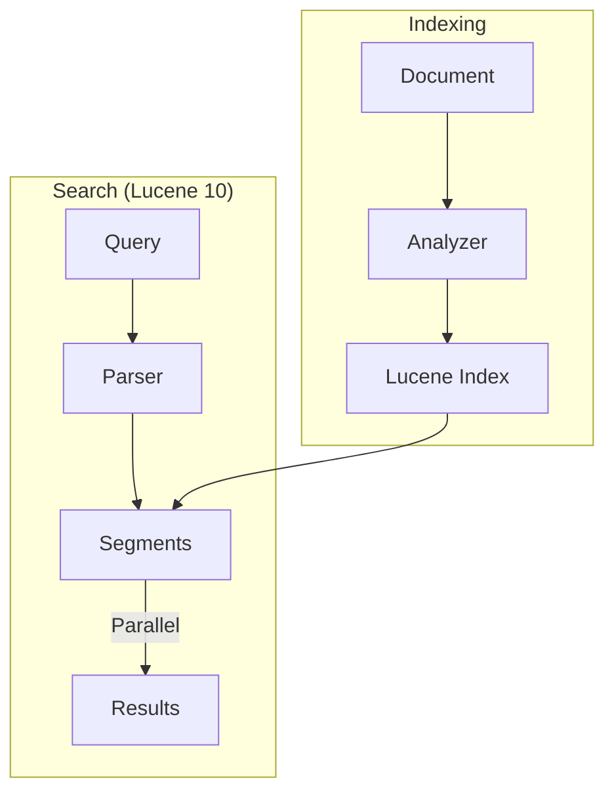

---
tags:
  - indexing
  - k-nn
  - performance
  - search
---

# Lucene 10 Upgrade

## Summary

Apache Lucene is the core search library that powers OpenSearch's indexing and search capabilities. The Lucene 10 upgrade brings major performance improvements in I/O operations, search parallelism, sparse indexing, and vector search. This upgrade is foundational to OpenSearch 3.0 and enables future performance optimizations.

## Details

### Architecture



### Data Flow



### Components

| Component | Description |
|-----------|-------------|
| Lucene Core | Core indexing and search library |
| Async I/O API | Enables asynchronous data fetching for improved disk I/O |
| Segment Partitioning | Logical partitions within segments for parallel search |
| Sparse Indexing | Block-based indexing with min/max values for query optimization |
| Vector Search | Improved HNSW implementation for k-NN searches |

### Configuration

| Setting | Description | Default |
|---------|-------------|---------|
| N/A | Lucene version is bundled with OpenSearch | Lucene 10.1.0 |

The Lucene upgrade is transparent to users - no configuration changes are required.

### Usage Example

```bash
# Verify Lucene version via cluster info
curl -X GET "localhost:9200"

# Response includes lucene_version
{
  "version": {
    "number": "3.0.0",
    "lucene_version": "10.1.0",
    ...
  }
}
```

## Limitations

- Requires JDK 21 or later as minimum runtime
- Some Snowball stemmers removed: `dutch_kp`, `lovins` (use alternatives)
- `german2` stemmer merged into `german` stemmer
- Plugins using Lucene APIs directly may require updates

## Change History

- **v3.0.0** (2025-05-06): Upgraded from Lucene 9.12.1 to Lucene 10.1.0

## References

### Documentation
- [Lucene 10.0.0 Release Notes](https://cwiki.apache.org/confluence/display/LUCENE/Release+Notes+10.0.0): Official release notes
- [Lucene 10 Changelog](https://lucene.apache.org/core/10_0_0/changes/Changes.html#v10.0.0): Detailed changes

### Blog Posts
- [OpenSearch 3.0 Blog](https://opensearch.org/blog/opensearch-3-0-what-to-expect/): Overview of 3.0 features

### Pull Requests
| Version | PR | Description | Related Issue |
|---------|-----|-------------|---------------|
| v3.0.0 | [#16366](https://github.com/opensearch-project/OpenSearch/pull/16366) | Update to Apache Lucene 10 for 3.0.0 | [#11415](https://github.com/opensearch-project/OpenSearch/issues/11415) |

### Issues (Design / RFC)
- [Issue #11415](https://github.com/opensearch-project/OpenSearch/issues/11415): Original feature request
- [JDK 21 Dependency](https://github.com/opensearch-project/OpenSearch/issues/14011): JDK 21 requirement tracking
