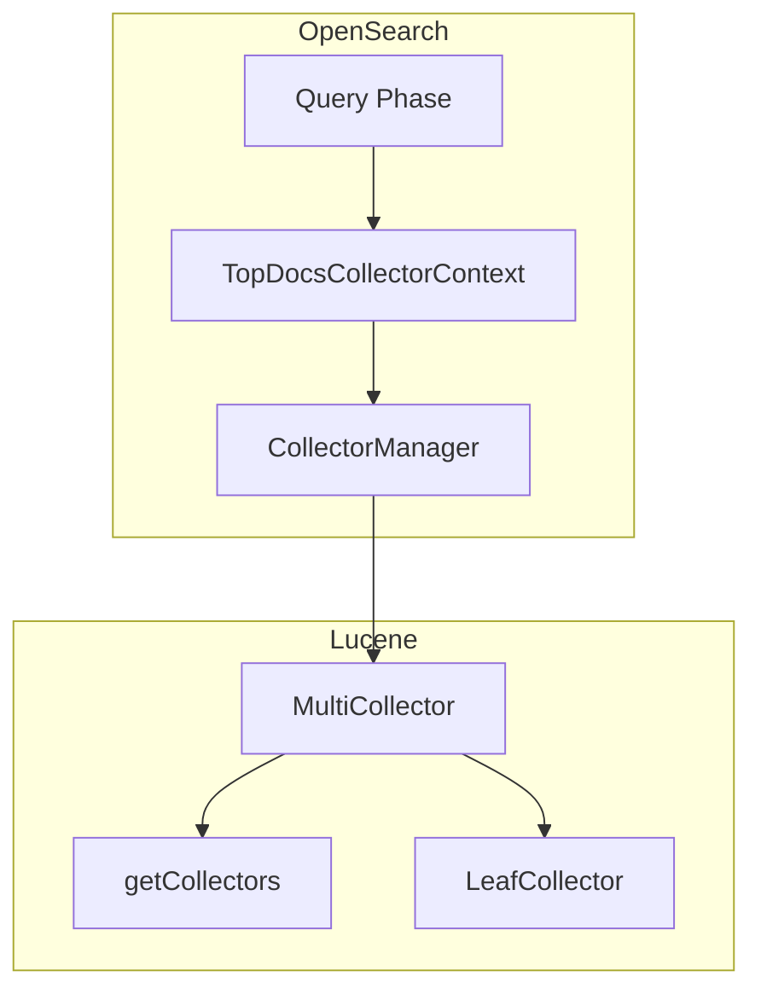

# Lucene Integration

## Summary

OpenSearch integrates with Apache Lucene for core search functionality. This feature tracks improvements to how OpenSearch leverages Lucene's APIs, reducing custom wrapper code and improving maintainability by adopting Lucene's public interfaces as they become available.

## Details

### Architecture



### Components

| Component | Description |
|-----------|-------------|
| `MultiCollector` | Lucene class that wraps multiple collectors into a single collector |
| `CollectorManager` | Interface for creating and reducing collectors in concurrent search |
| `TopDocsCollectorContext` | OpenSearch class managing top docs collection during query phase |

### Key Integration Points

#### MultiCollector Usage

OpenSearch uses Lucene's `MultiCollector` to combine multiple collectors (e.g., `TopDocsCollector` and `MaxScoreCollector`) during search operations. This is particularly important for:

- Concurrent segment search where multiple collectors run in parallel
- Field collapsing with score tracking
- Custom collector implementations

#### CollectorManager Pattern

The `CollectorManager` interface enables concurrent search by:

1. Creating independent collector instances per segment via `newCollector()`
2. Reducing results from all collectors via `reduce()`

```java
class SearchCollectorManager implements CollectorManager<Collector, TopDocs> {
    @Override
    public Collector newCollector() throws IOException {
        return MultiCollector.wrap(
            new TopScoreDocCollector(numHits),
            new MaxScoreCollector()
        );
    }
    
    @Override
    public TopDocs reduce(Collection<Collector> collectors) throws IOException {
        List<TopDocs> topDocs = new ArrayList<>();
        float maxScore = Float.NaN;
        
        for (Collector collector : collectors) {
            if (collector instanceof MultiCollector m) {
                for (Collector sub : m.getCollectors()) {
                    if (sub instanceof TopScoreDocCollector tdc) {
                        topDocs.add(tdc.topDocs());
                    } else if (sub instanceof MaxScoreCollector msc) {
                        maxScore = Math.max(maxScore, msc.getMaxScore());
                    }
                }
            }
        }
        return TopDocs.merge(numHits, topDocs.toArray(new TopDocs[0]));
    }
}
```

### Configuration

No user-facing configuration. This is an internal implementation detail.

## Limitations

- Lucene API changes may require OpenSearch updates
- Custom collectors must be compatible with `MultiCollector` wrapping

## Change History

- **v3.4.0** (2026-01-11): Removed `MultiCollectorWrapper`, now using Lucene's native `MultiCollector.getCollectors()` API

## References

### Documentation
- [Lucene PR #455](https://github.com/apache/lucene/pull/455): Made `MultiCollector.getCollectors()` public in Lucene 9.1
- [OpenSearch PR #1500](https://github.com/opensearch-project/OpenSearch/pull/1500): Original concurrent segment search implementation

### Pull Requests
| Version | PR | Description | Related Issue |
|---------|-----|-------------|---------------|
| v3.4.0 | [#19595](https://github.com/opensearch-project/OpenSearch/pull/19595) | Remove MultiCollectorWrapper and use MultiCollector in Lucene instead |   |

### Issues (Design / RFC)
- [LUCENE-10244](https://github.com/apache/lucene/issues/11280): Lucene issue for public `getCollectors()` method
