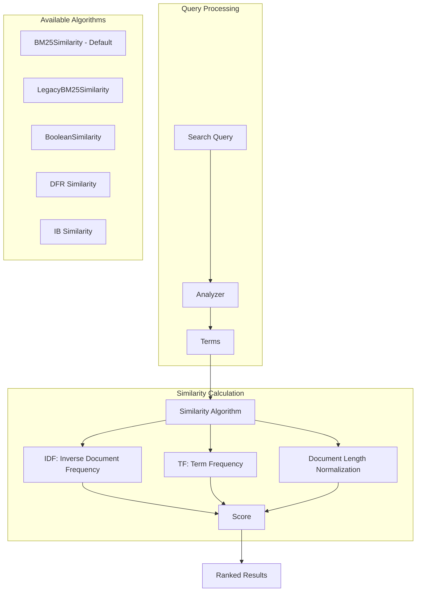

---
tags:
  - ml
  - search
---

# Lucene Similarity

## Summary

OpenSearch uses similarity algorithms to calculate relevance scores for text search. The similarity algorithm determines how documents are ranked based on term frequency, document length, and inverse document frequency. Starting with v3.0.0, OpenSearch defaults to Lucene's native `BM25Similarity` instead of the custom `LegacyBM25Similarity`.

## Details

### Architecture



### Similarity Types

| Type | Description | Use Case |
|------|-------------|----------|
| `BM25` | Lucene's native BM25 implementation (default since v3.0.0) | General text search |
| `LegacyBM25` | OpenSearch's previous BM25 implementation | Backward compatibility with v2.x |
| `boolean` | Returns constant scores (1 or 0) | When only matching matters, not relevance |
| `DFR` | Divergence from Randomness | Specialized ranking needs |
| `IB` | Information-Based model | Specialized ranking needs |

### Configuration

| Setting | Description | Default |
|---------|-------------|---------|
| `k1` | Controls term frequency saturation | `1.2` |
| `b` | Controls document length normalization | `0.75` |
| `discount_overlaps` | Whether to discount overlapping tokens | `true` |

### BM25 Parameters

- **k1**: Higher values increase the impact of term frequency. Range: 0 to 3 (typical)
- **b**: Higher values penalize longer documents more. Range: 0 to 1
  - `b=0`: No length normalization
  - `b=1`: Full length normalization

### Usage Example

#### Default BM25 (v3.0.0+)

```json
PUT /my-index
{
  "mappings": {
    "properties": {
      "content": {
        "type": "text"
      }
    }
  }
}
```

#### Custom BM25 Parameters

```json
PUT /my-index
{
  "settings": {
    "index": {
      "similarity": {
        "custom_bm25": {
          "type": "BM25",
          "k1": 1.5,
          "b": 0.8,
          "discount_overlaps": false
        }
      }
    }
  },
  "mappings": {
    "properties": {
      "content": {
        "type": "text",
        "similarity": "custom_bm25"
      }
    }
  }
}
```

#### Legacy BM25 (for v2.x compatibility)

```json
PUT /my-index
{
  "settings": {
    "index": {
      "similarity": {
        "default": {
          "type": "LegacyBM25",
          "k1": 1.2,
          "b": 0.75
        }
      }
    }
  }
}
```

#### Boolean Similarity

```json
PUT /my-index
{
  "mappings": {
    "properties": {
      "tags": {
        "type": "text",
        "similarity": "boolean"
      }
    }
  }
}
```

## Limitations

- Similarity settings are defined at index creation time and cannot be changed for existing fields
- Different similarity algorithms produce different score ranges, making cross-index score comparison difficult
- `LegacyBM25Similarity` is deprecated and may be removed in future versions

## Change History

- **v3.0.0** (2025-05-06): Changed default similarity from `LegacyBM25Similarity` to Lucene's `BM25Similarity`. Added `LegacyBM25` type for backward compatibility.

## Related Features
- [OpenSearch Dashboards](../opensearch-dashboards/ai-chat.md)

## References

### Documentation
- [Similarity Documentation](https://docs.opensearch.org/3.0/field-types/mapping-parameters/similarity/): Official OpenSearch docs
- [Keyword Search Documentation](https://docs.opensearch.org/3.0/search-plugins/keyword-search/): BM25 configuration guide

### Pull Requests
| Version | PR | Description | Related Issue |
|---------|-----|-------------|---------------|
| v3.0.0 | [#17306](https://github.com/opensearch-project/OpenSearch/pull/17306) | Use Lucene `BM25Similarity` as default | [#17315](https://github.com/opensearch-project/OpenSearch/issues/17315) |

### Issues (Design / RFC)
- [Issue #17315](https://github.com/opensearch-project/OpenSearch/issues/17315): Original feature request
