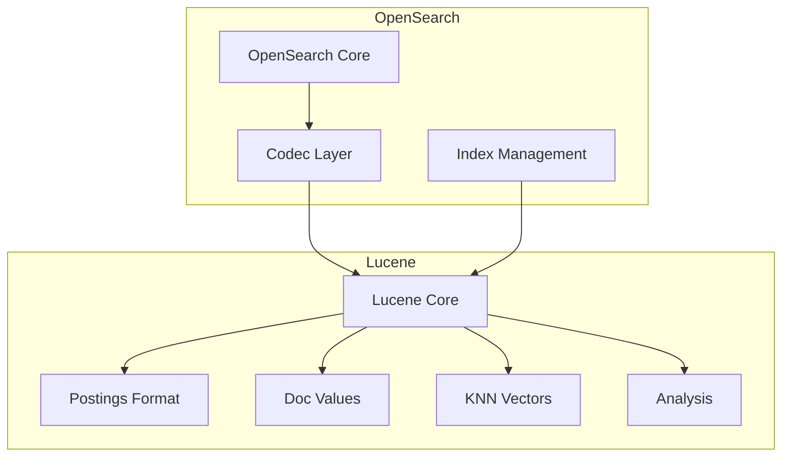

# Lucene Upgrade

## Summary

OpenSearch relies on Apache Lucene as its core search library. Lucene upgrades bring performance improvements, new features, bug fixes, and security enhancements to OpenSearch. These upgrades are essential for maintaining compatibility with the latest search capabilities and ensuring optimal performance.

## Details

### Architecture



### Components

| Component | Description |
|-----------|-------------|
| Lucene Core | Core search library providing indexing and search capabilities |
| Postings Format | Encodes term frequencies, positions, and skip data |
| Doc Values | Column-oriented storage for sorting and aggregations |
| KNN Vectors | Vector similarity search support |
| Analysis | Text analysis and tokenization |

### Configuration

No specific configuration is required for Lucene upgrades. The version is managed at the OpenSearch build level.

| Setting | Description | Default |
|---------|-------------|---------|
| N/A | Lucene version is bundled with OpenSearch | Determined by OpenSearch version |

### Usage Example

Lucene version can be verified through the nodes info API:

```bash
GET /_nodes?filter_path=nodes.*.version
```

## Limitations

- Lucene upgrades may require index format changes
- Major Lucene version upgrades may require reindexing
- Some Lucene features may not be exposed through OpenSearch APIs

## Related PRs

| Version | PR | Description |
|---------|-----|-------------|
| v3.3.0 | [#19397](https://github.com/opensearch-project/OpenSearch/pull/19397) | Migrate deprecated usages of Operations#union |
| v3.1.0 | [#17961](https://github.com/opensearch-project/OpenSearch/pull/17961) | Upgrade to Lucene 10.2.1 |
| v3.1.0 | [#18395](https://github.com/opensearch-project/OpenSearch/pull/18395) | Replace deprecated TopScoreDocCollectorManager construction |
| v3.1.0 | [neural-search#1336](https://github.com/opensearch-project/neural-search/pull/1336) | Update Lucene dependencies for hybrid query |
| v3.1.0 | [learning-to-rank-base#186](https://github.com/opensearch-project/opensearch-learning-to-rank-base/pull/186) | Lucene 10.2 upgrade changes for RankerQuery |
| v3.0.0 | [#16366](https://github.com/opensearch-project/OpenSearch/pull/16366) | Apache Lucene 10 update |
| v2.18.0 | [#15333](https://github.com/opensearch-project/OpenSearch/pull/15333) | Update Apache Lucene to 9.12.0 |

## References

- [Lucene 10.2.1 Changelog](https://lucene.apache.org/core/10_2_1/changes/Changes.html): Official Lucene 10.2.1 release notes
- [Lucene 10.2.0 Changelog](https://lucene.apache.org/core/10_2_0/changes/Changes.html): Official Lucene 10.2.0 release notes
- [Lucene 9.12.0 Changelog](https://lucene.apache.org/core/9_12_0/changes/Changes.html): Official Lucene 9.12.0 release notes
- [Apache Lucene](https://lucene.apache.org/): Official Apache Lucene project
- [OpenSearch Documentation](https://docs.opensearch.org/): OpenSearch official documentation
- [Issue #1334](https://github.com/opensearch-project/neural-search/issues/1334): Neural-search build failure due to Lucene API changes
- [Issue #184](https://github.com/opensearch-project/opensearch-learning-to-rank-base/issues/184): Learning to Rank build failure due to DisiPriorityQueue being abstract

## Change History

- **v3.3.0**: Migrate deprecated `Operations#union(Automaton, Automaton)` usages to `Operations#union(Collection<Automaton>)` in AutomatonQueries, XContentMapValues, and SystemIndices classes.
- **v3.1.0**: Upgrade to Apache Lucene 10.2.1 with SeededKnnVectorQuery, binary quantized vector codecs, TopDocs#rrf, and API changes (DisiPriorityQueue, TopScoreDocCollectorManager). Plugin updates: neural-search hybrid query refactoring, learning-to-rank RankerQuery fix.
- **v3.0.0**: Upgrade to Apache Lucene 10
- **v2.18.0**: Upgrade to Apache Lucene 9.12.0 with new Lucene912PostingsFormat, JDK 23 Panama Vectorization support, dynamic range facets, and various performance optimizations
