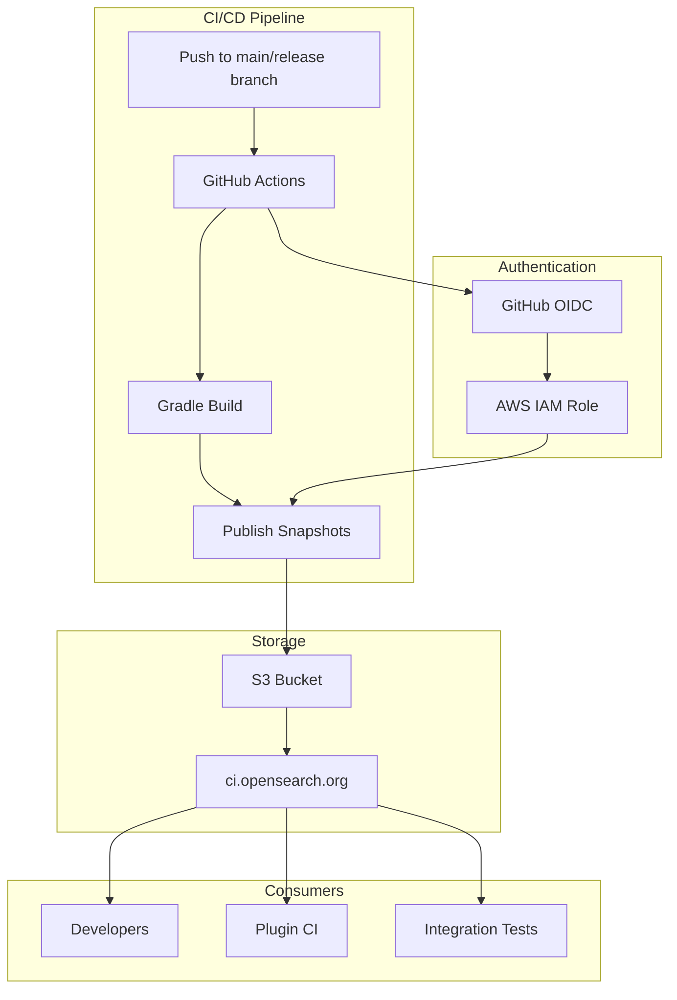
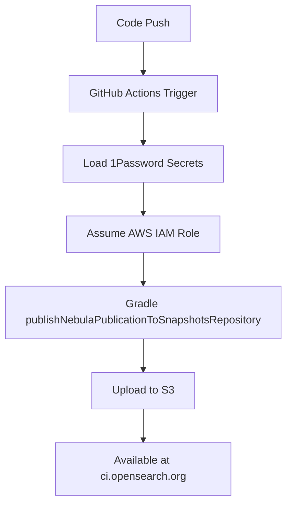

# Maven Snapshots Publishing

## Summary

OpenSearch publishes Maven snapshot artifacts to enable developers to test pre-release versions of the project. Starting with v3.4.0, snapshots are published to a self-hosted S3 repository at `ci.opensearch.org` instead of Sonatype, providing better control over artifact retention and availability.

## Details

### Architecture



### Data Flow



### Components

| Component | Description |
|-----------|-------------|
| `publish-maven-snapshots.yml` | GitHub Actions workflow for automated publishing |
| `build.gradle` | Gradle configuration with S3 repository and AWS credentials |
| `gradle/run.gradle` | Local development configuration for snapshot consumption |
| 1Password Secrets | Secure storage for S3 repository URL and IAM role ARN |

### Configuration

| Setting | Description | Default |
|---------|-------------|---------|
| `MAVEN_SNAPSHOTS_S3_REPO` | S3 repository URL for publishing | `https://ci.opensearch.org/ci/dbc/snapshots/maven/` |
| `MAVEN_SNAPSHOTS_S3_ROLE` | IAM role ARN for publishing | Stored in 1Password |
| `AWS_ACCESS_KEY_ID` | AWS access key (from role assumption) | Dynamic |
| `AWS_SECRET_ACCESS_KEY` | AWS secret key (from role assumption) | Dynamic |
| `AWS_SESSION_TOKEN` | AWS session token (from role assumption) | Dynamic |

### Usage Example

#### Consuming Snapshots (Gradle)

```groovy
repositories {
    maven {
        name = 'OpenSearch Snapshots'
        url = 'https://ci.opensearch.org/ci/dbc/snapshots/maven/'
    }
}

dependencies {
    implementation "org.opensearch:opensearch:3.4.0-SNAPSHOT"
    implementation "org.opensearch.plugin:opensearch-job-scheduler:3.4.0.0-SNAPSHOT"
}
```

#### Consuming Snapshots (Maven)

```xml
<repositories>
    <repository>
        <id>opensearch-snapshots</id>
        <url>https://ci.opensearch.org/ci/dbc/snapshots/maven/</url>
        <snapshots>
            <enabled>true</enabled>
        </snapshots>
    </repository>
</repositories>

<dependencies>
    <dependency>
        <groupId>org.opensearch</groupId>
        <artifactId>opensearch</artifactId>
        <version>3.4.0-SNAPSHOT</version>
    </dependency>
</dependencies>
```

#### Consuming Snapshots (Maven CLI)

```bash
mvn org.apache.maven.plugins:maven-dependency-plugin:2.1:get \
  -DrepoUrl=https://ci.opensearch.org/ci/dbc/snapshots/maven/ \
  -Dartifact=org.opensearch.plugin:opensearch-job-scheduler:3.4.0.0-SNAPSHOT:zip
```

## Limitations

- Publishing requires AWS IAM role assumption (internal CI only)
- No web-based browsing interface for the S3 repository
- Requires GitHub OIDC integration for secure authentication

## Change History

- **v3.4.0** (2025-10-15): Migrated snapshot publishing from Sonatype to S3-backed repository at ci.opensearch.org due to Sonatype's 30-day retention policy

## References

### Blog Posts
- [Blog: OpenSearch plugin zips now in Maven repo](https://opensearch.org/blog/opensearch-plugin-zips-now-in-maven-repo/): Background on Maven publishing infrastructure

### Pull Requests
| Version | PR | Description | Related Issue |
|---------|-----|-------------|---------------|
| v3.4.0 | [#19619](https://github.com/opensearch-project/OpenSearch/pull/19619) | Onboarding new maven snapshots publishing to S3 (OpenSearch Core) | [#5360](https://github.com/opensearch-project/opensearch-build/issues/5360) |

### Issues (Design / RFC)
- [Issue #5360](https://github.com/opensearch-project/opensearch-build/issues/5360): Migration from Sonatype snapshots repo to ci.opensearch.org
