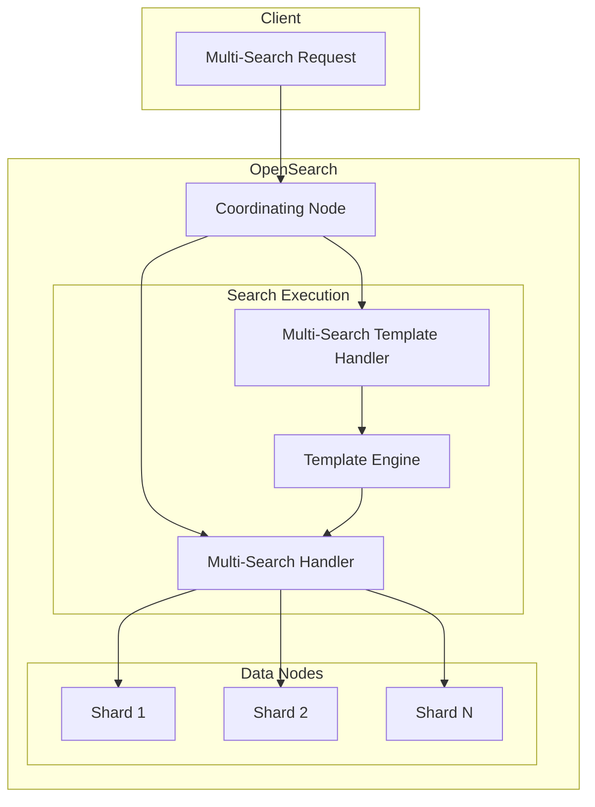
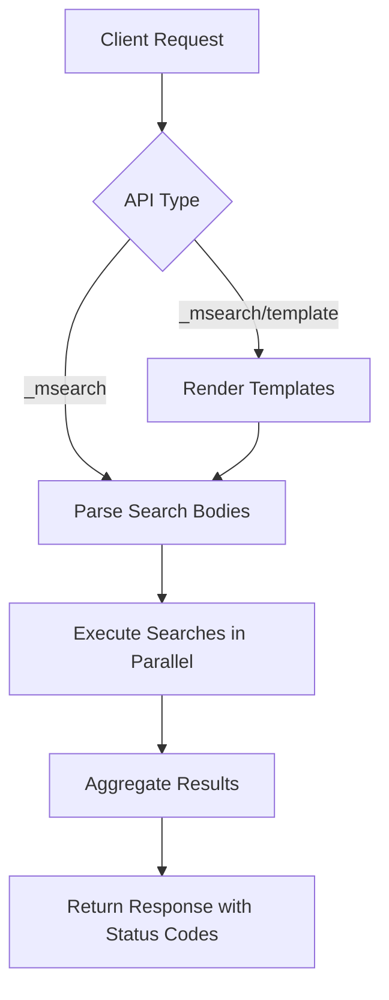

# Multi-Search API

## Summary

The Multi-Search API allows executing multiple search requests in a single API call, improving efficiency when running batch queries. OpenSearch provides two variants: the standard Multi-Search API (`_msearch`) and the Multi-Search Template API (`_msearch/template`) for parameterized searches using stored templates.

## Details

### Architecture



### Data Flow



### Components

| Component | Description |
|-----------|-------------|
| `MultiSearchRequest` | Holds multiple search requests |
| `MultiSearchResponse` | Contains array of search responses with status codes |
| `MultiSearchTemplateRequest` | Holds multiple template-based search requests |
| `MultiSearchTemplateResponse` | Contains array of template search responses with status codes |
| `SearchTemplateResponse` | Individual template search response |

### API Endpoints

| Endpoint | Description |
|----------|-------------|
| `GET/POST /_msearch` | Execute multiple search requests |
| `GET/POST /{index}/_msearch` | Execute multiple searches against specific index |
| `GET/POST /_msearch/template` | Execute multiple search template requests |
| `GET/POST /{index}/_msearch/template` | Execute multiple template searches against specific index |

### Configuration

| Setting | Description | Default |
|---------|-------------|---------|
| `max_concurrent_searches` | Maximum concurrent searches per request | Node count dependent |
| `max_concurrent_shard_requests` | Maximum concurrent shard requests per node | 5 |
| `pre_filter_shard_size` | Pre-filter shard size threshold | 128 |
| `rest_total_hits_as_int` | Return hits.total as integer | false |

### Usage Example

#### Multi-Search Request

```json
GET _msearch
{"index":"logs-*"}
{"query":{"match":{"message":"error"}}}
{"index":"metrics-*"}
{"query":{"range":{"@timestamp":{"gte":"now-1h"}}}}
```

#### Multi-Search Template Request

```json
GET _msearch/template
{"index":"products"}
{"id":"product_search","params":{"query":"laptop","size":10}}
{"index":"products"}
{"id":"product_search","params":{"query":"phone","size":5}}
```

#### Response Format

```json
{
  "took": 15,
  "responses": [
    {
      "took": 5,
      "timed_out": false,
      "_shards": {
        "total": 5,
        "successful": 5,
        "skipped": 0,
        "failed": 0
      },
      "hits": {
        "total": {"value": 100, "relation": "eq"},
        "max_score": 1.5,
        "hits": [...]
      },
      "status": 200
    },
    {
      "error": {
        "type": "index_not_found_exception",
        "reason": "no such index [unknown]"
      },
      "status": 404
    }
  ]
}
```

## Limitations

- Request body must use newline-delimited JSON format
- Each search is independent; no cross-search dependencies
- Large batch sizes may impact cluster performance

## Change History

- **v2.18.0** (2024-10-22): Added `status` field to Multi-Search Template API responses for consistency with Multi-Search API

## References

### Documentation
- [Multi-Search API Documentation](https://docs.opensearch.org/latest/api-reference/multi-search/): Official multi-search docs
- [Multi-Search Template Documentation](https://docs.opensearch.org/latest/api-reference/msearch-template/): Official template docs
- [Search Templates Documentation](https://docs.opensearch.org/latest/api-reference/search-template/): Search template reference

### Pull Requests
| Version | PR | Description | Related Issue |
|---------|-----|-------------|---------------|
| v2.18.0 | [#16265](https://github.com/opensearch-project/OpenSearch/pull/16265) | Fix multi-search with template doesn't return status code |   |

### Issues (Design / RFC)
- [Issue #11133](https://github.com/opensearch-project/OpenSearch/issues/11133): Bug report for missing status field
