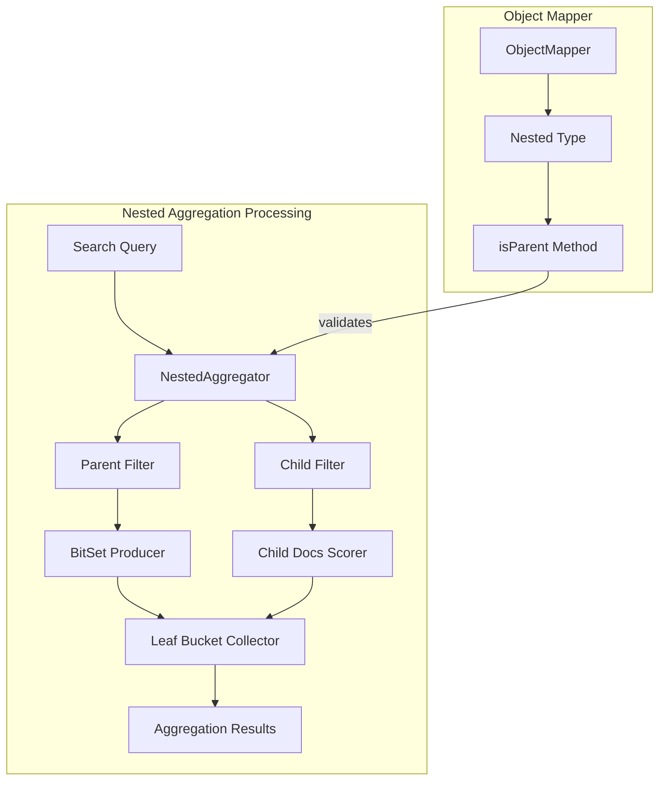
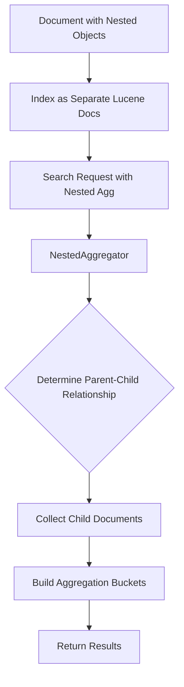

---
tags:
  - indexing
  - search
---

# Nested Aggregations

## Summary

Nested aggregations allow you to aggregate on fields inside nested objects. The `nested` type is a specialized version of the object data type that allows arrays of objects to be indexed in a way that they can be queried independently of each other.

Unlike the `object` type where all data is stored in the same document (allowing cross-object matches), nested objects are stored as separate hidden documents, enabling precise aggregations on specific nested object instances.

## Details

### Architecture



### Data Flow



### Components

| Component | Description |
|-----------|-------------|
| `NestedAggregator` | Main aggregator class that handles nested document collection |
| `ObjectMapper.Nested` | Contains nested type configuration and utility methods |
| `BitSetProducer` | Produces bit sets for identifying parent documents |
| `LeafBucketCollector` | Collects documents into aggregation buckets |
| `BufferingNestedLeafBucketCollector` | Buffers child documents for multi-bucket scenarios |

### Configuration

| Setting | Description | Default |
|---------|-------------|---------|
| `path` | The nested object path to aggregate on | Required |

### Usage Example

**Index Mapping:**
```json
PUT logs
{
  "mappings": {
    "properties": {
      "pages": {
        "type": "nested",
        "properties": {
          "page": { "type": "text" },
          "load_time": { "type": "double" }
        }
      }
    }
  }
}
```

**Nested Aggregation Query:**
```json
GET logs/_search
{
  "query": {
    "match": { "response": "200" }
  },
  "aggs": {
    "pages": {
      "nested": {
        "path": "pages"
      },
      "aggs": {
        "min_load_time": { 
          "min": { "field": "pages.load_time" } 
        }
      }
    }
  }
}
```

**Multi-level Nested Aggregation:**
```json
POST index/_search
{
  "aggregations": {
    "level1": {
      "nested": { "path": "a" },
      "aggregations": {
        "terms_agg": {
          "terms": { "field": "a.b1" },
          "aggregations": {
            "level2": {
              "nested": { "path": "a.b2.c" },
              "aggregations": {
                "inner_terms": {
                  "terms": { "field": "a.b2.c.d" }
                }
              }
            }
          }
        }
      }
    }
  }
}
```

## Limitations

- Nested objects increase index size as each nested object is stored as a separate Lucene document
- Deep nesting (many levels) can impact query performance
- The `nested` aggregation must specify a path relative to the parent document

## Change History

- **v2.18.0** (2024-10-22): Fixed infinite loop bug in deeply nested aggregations ([#15931](https://github.com/opensearch-project/OpenSearch/pull/15931))

## References

### Documentation
- [Nested Aggregations Documentation](https://docs.opensearch.org/2.18/aggregations/bucket/nested/): Official documentation
- [Nested Field Type](https://docs.opensearch.org/2.18/field-types/supported-field-types/nested/): Nested field type documentation

### Pull Requests
| Version | PR | Description | Related Issue |
|---------|-----|-------------|---------------|
| v2.18.0 | [#15931](https://github.com/opensearch-project/OpenSearch/pull/15931) | Fix infinite loop in nested agg | [#15914](https://github.com/opensearch-project/OpenSearch/issues/15914) |

### Issues (Design / RFC)
- [Issue #15914](https://github.com/opensearch-project/OpenSearch/issues/15914): Bug report for infinite loop in deep nested aggregations
