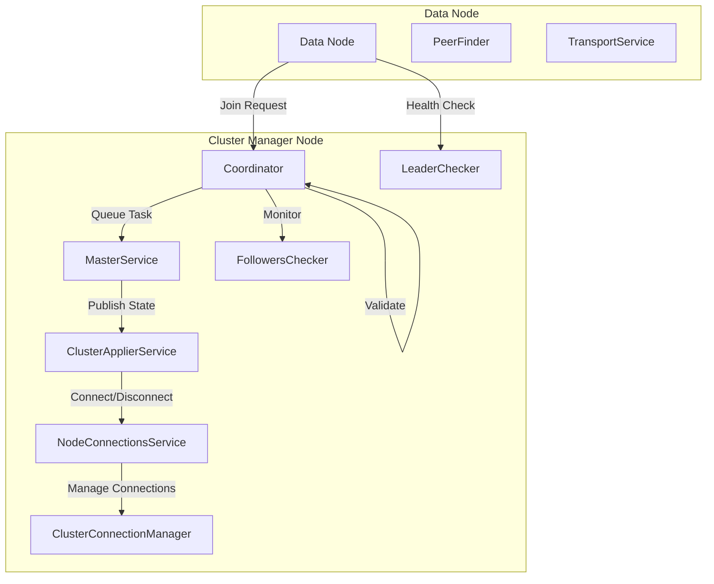

---
tags:
  - search
---

# Node Join/Leave

## Summary

Node Join/Leave refers to the cluster coordination mechanism that handles nodes joining and leaving an OpenSearch cluster. The cluster manager is responsible for processing node-join and node-left tasks, maintaining cluster state, and ensuring proper connection management between nodes. This feature ensures cluster stability during node membership changes.

## Details

### Architecture



### Data Flow

```mermaid
flowchart TB
    subgraph "Node Join Flow"
        A1[Node sends join request] --> A2[Coordinator validates]
        A2 --> A3[Queue node-join task]
        A3 --> A4[Compute new cluster state]
        A4 --> A5[Publish to all nodes]
        A5 --> A6[Wait for acknowledgments]
        A6 --> A7[Commit cluster state]
        A7 --> A8[FollowersChecker monitors node]
    end
    
    subgraph "Node Left Flow"
        B1[FollowersChecker detects failure] --> B2[Queue node-left task]
        B2 --> B3[Mark pending disconnect]
        B3 --> B4[Compute new cluster state]
        B4 --> B5[Publish to remaining nodes]
        B5 --> B6[Commit cluster state]
        B6 --> B7[Disconnect from node]
        B7 --> B8[Clear pending disconnect]
    end
```



### Components

| Component | Description |
|-----------|-------------|
| `Coordinator` | Main coordination component handling cluster state changes and node membership |
| `MasterService` | Single-threaded executor for cluster state update tasks |
| `ClusterApplierService` | Applies cluster state changes and manages node connections |
| `NodeConnectionsService` | Abstraction for managing connections to cluster nodes |
| `ClusterConnectionManager` | Low-level connection management with pending disconnection tracking |
| `FollowersChecker` | Monitors follower nodes from the cluster manager |
| `LeaderChecker` | Monitors the cluster manager from follower nodes |
| `PeerFinder` | Discovers and connects to cluster peers |

### Configuration

| Setting | Description | Default |
|---------|-------------|---------|
| `cluster.fault_detection.follower_check.timeout` | Timeout for follower health checks | 30s |
| `cluster.fault_detection.follower_check.interval` | Interval between follower checks | 1s |
| `cluster.fault_detection.follower_check.retry_count` | Retries before marking node as failed | 3 |
| `cluster.publish.timeout` | Timeout for cluster state publication | 30s |
| `discovery.find_peers_interval` | Interval for peer discovery/join retries | 1s |
| `cluster.node_reconnect_interval` | Interval for reconnection attempts | 10s |

### Usage Example

Node join/leave is handled automatically by the cluster. Relevant log messages:

```
# Node joining
[INFO ][o.o.c.s.MasterService] node-join[{node-id} join existing leader]

# Node leaving
[INFO ][o.o.c.s.MasterService] node-left[{node-id} reason: disconnected]

# Cluster state applied
[INFO ][o.o.c.s.ClusterApplierService] added {{node-id}...}
[INFO ][o.o.c.s.ClusterApplierService] removed {{node-id}...}
```

## Limitations

- Cluster manager is single-threaded for state updates, which can cause delays under heavy load
- Node-join requests are rejected if the node has a pending disconnect to prevent race conditions
- The `pendingDisconnections` tracking is only maintained on the active cluster manager

## Change History

- **v2.18.0** (2024-10-22): Fixed race condition in node-join/node-left loop by introducing pending disconnection tracking

## References

### Documentation
- [Cluster Settings Documentation](https://docs.opensearch.org/2.18/install-and-configure/configuring-opensearch/cluster-settings/): Cluster configuration options
- [Creating a Cluster](https://docs.opensearch.org/2.18/tuning-your-cluster/): Cluster tuning guide

### Pull Requests
| Version | PR | Description | Related Issue |
|---------|-----|-------------|---------------|
| v2.18.0 | [#15521](https://github.com/opensearch-project/OpenSearch/pull/15521) | Fix race condition in node-join/node-left loop | [#4874](https://github.com/opensearch-project/OpenSearch/issues/4874) |

### Issues (Design / RFC)
- [Issue #4874](https://github.com/opensearch-project/OpenSearch/issues/4874): Race in node-left and node-join can prevent node from joining the cluster indefinitely
