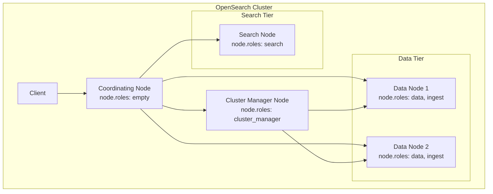
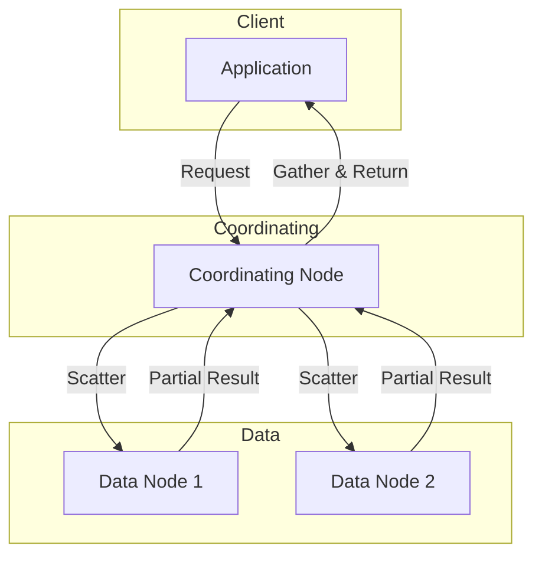

# Node Roles Configuration

## Summary

OpenSearch nodes can be configured with specific roles to optimize cluster performance and resource utilization. The `node.roles` setting defines what functions a node performs in the cluster. Starting from v3.0.0, list settings like `node.roles` can be properly configured via environment variables using JSON array syntax, enabling easier containerized deployments.

## Details

### Architecture



### Node Role Types

| Role | Abbreviation | Description | Use Case |
|------|--------------|-------------|----------|
| `cluster_manager` | `m` | Manages cluster state, index creation/deletion, node tracking | Dedicated management in large clusters |
| `data` | `d` | Stores data, executes search and aggregation operations | Primary data storage and processing |
| `ingest` | `i` | Runs ingest pipelines to transform data before indexing | Data preprocessing |
| `search` | `s` | Hosts search replicas for read-heavy workloads | Separating search from indexing |
| `remote_cluster_client` | `r` | Connects to remote clusters | Cross-cluster search/replication |
| `ml` | `l` | Executes machine learning tasks | ML workloads isolation |
| `coordinating_only` | `-` | Routes requests, aggregates results (set `node.roles: []`) | Load balancing, query coordination |

### Configuration

#### In opensearch.yml

```yaml
# Dedicated cluster manager node
node.name: cluster-manager-1
node.roles: [ cluster_manager ]

# Data and ingest node
node.name: data-node-1
node.roles: [ data, ingest ]

# Coordinating-only node (empty array)
node.name: coordinating-1
node.roles: []

# Search node for read-heavy workloads
node.name: search-node-1
node.roles: [ search ]
```

#### Via Environment Variables (v3.0.0+)

```bash
# Coordinating-only node
docker run -e 'node.roles=[]' opensearchproject/opensearch:3.0.0

# Data node only
docker run -e 'node.roles=["data"]' opensearchproject/opensearch:3.0.0

# Multiple roles
docker run -e 'node.roles=["data", "ingest", "remote_cluster_client"]' opensearchproject/opensearch:3.0.0
```

### Default Behavior

When `node.roles` is not specified, a node assumes all default roles:
- `cluster_manager`
- `data`
- `ingest`
- `remote_cluster_client`

### Data Flow



### Best Practices

| Cluster Size | Recommendation |
|--------------|----------------|
| Small (< 10 nodes) | Use default roles on all nodes |
| Medium (10-50 nodes) | 3 dedicated cluster managers, separate data nodes |
| Large (50+ nodes) | Dedicated cluster managers, data nodes, coordinating nodes, and optionally search nodes |

### Viewing Node Roles

```bash
# View all nodes with their roles
GET _cat/nodes?v&h=name,node.role,node.roles

# Example output
name              node.role node.roles
cluster-manager-1 m         cluster_manager
data-node-1       dir       data,ingest,remote_cluster_client
coordinating-1    -         -
```

## Limitations

- Node roles are static and require a node restart to change
- A cluster must have at least one cluster-manager-eligible node
- Coordinating-only nodes still consume resources for query coordination
- The `master` role is deprecated; use `cluster_manager` instead

## Change History

- **v3.0.0** (2025-02-25): Fixed empty array parsing from environment variables for `node.roles` setting
- **v2.4.0** (2022-11-15): Added `search` node role for dedicated search workloads
- **v2.3.0** (2022-09-06): Added support for dynamic/custom node roles defined by plugins
- **v2.0.0** (2022-05-26): Renamed `master` role to `cluster_manager`

## References

### Documentation
- [Configuration and System Settings](https://docs.opensearch.org/3.0/install-and-configure/configuring-opensearch/configuration-system/): Official documentation
- [Creating a Cluster](https://docs.opensearch.org/3.0/tuning-your-cluster/): Cluster architecture guide
- [CAT Nodes API](https://docs.opensearch.org/3.0/api-reference/cat/cat-nodes/): View node information

### Pull Requests
| Version | PR | Description | Related Issue |
|---------|-----|-------------|---------------|
| v3.0.0 | [#10625](https://github.com/opensearch-project/OpenSearch/pull/10625) | Fix empty array parsing from environment variables | [#3412](https://github.com/opensearch-project/OpenSearch/issues/3412) |
| v2.4.0 | [#4689](https://github.com/opensearch-project/OpenSearch/pull/4689) | Add 'search' node role | [#4652](https://github.com/opensearch-project/OpenSearch/issues/4652) |
| v2.3.0 | [#3436](https://github.com/opensearch-project/OpenSearch/pull/3436) | Support dynamic node roles | [#2877](https://github.com/opensearch-project/OpenSearch/issues/2877) |
| v2.7.0 | [#6331](https://github.com/opensearch-project/OpenSearch/pull/6331) | Fix deprecated master role attachment | [#6103](https://github.com/opensearch-project/OpenSearch/issues/6103) |

### Issues (Design / RFC)
- [Issue #3412](https://github.com/opensearch-project/OpenSearch/issues/3412): Bug report for empty node.roles environment variable
