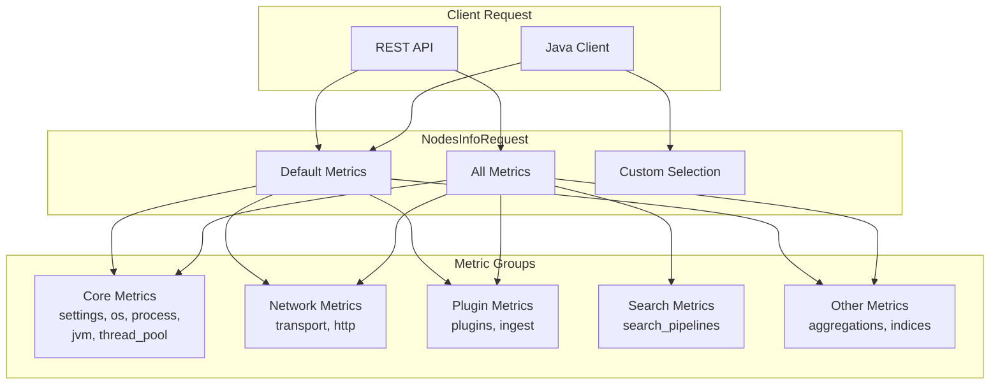

# Nodes Info API

## Summary

The Nodes Info API provides static information about cluster nodes, including host system details, JVM configuration, thread pool settings, installed plugins, and more. Starting from v3.0.0, the API introduces a "default metrics" concept that excludes certain metrics (like `search_pipelines`) from the default response to optimize response size.

## Details

### Architecture



### Components

| Component | Description |
|-----------|-------------|
| `NodesInfoRequest` | Request class for nodes info API with metric selection |
| `NodesInfoRequest.Metric` | Enum defining available metric groups |
| `defaultMetrics()` | Returns default set of metrics (excludes `search_pipelines`) |
| `allMetrics()` | Returns all available metrics |

### Configuration

The Nodes Info API does not require configuration. Metric selection is done per-request.

| Request Type | Metrics Returned |
|--------------|------------------|
| `GET /_nodes` | Default metrics (11 metrics) |
| `GET /_nodes/_all` | All metrics (12 metrics) |
| `GET /_nodes/<metric>` | Specified metric(s) only |

### Available Metrics

| Metric | Description | Default |
|--------|-------------|---------|
| `settings` | Node settings from config file and dynamic updates | ✓ |
| `os` | OS name, version, architecture, processors | ✓ |
| `process` | Process ID, refresh interval, mlockall status | ✓ |
| `jvm` | JVM version, memory, GC info, arguments | ✓ |
| `thread_pool` | Thread pool configurations | ✓ |
| `transport` | Transport layer addresses and profiles | ✓ |
| `http` | HTTP layer addresses and content length | ✓ |
| `plugins` | Installed plugins and modules | ✓ |
| `ingest` | Ingest pipelines and processors | ✓ |
| `aggregations` | Available aggregation types | ✓ |
| `indices` | Static index settings at node level | ✓ |
| `search_pipelines` | Search pipeline information | ✗ |

### Usage Example

```bash
# Get default node info
GET /_nodes

# Get all metrics including search_pipelines
GET /_nodes/_all

# Get specific metrics
GET /_nodes/jvm,thread_pool

# Get search_pipelines only
GET /_nodes/search_pipelines

# Filter by node
GET /_nodes/node1,node2/jvm
```

Java client example:

```java
// Default metrics request
NodesInfoRequest defaultRequest = new NodesInfoRequest();

// All metrics request
NodesInfoRequest allRequest = new NodesInfoRequest().all();

// Clear and add specific metrics
NodesInfoRequest customRequest = new NodesInfoRequest()
    .clear()
    .addMetric(NodesInfoRequest.Metric.JVM.metricName())
    .addMetric(NodesInfoRequest.Metric.SEARCH_PIPELINES.metricName());
```

### Response Field Formats

The API returns indexing buffer information with the following fields:

| Field | Format | Example |
|-------|--------|---------|
| `total_indexing_buffer_in_bytes` | Raw bytes (number) | `53687091` |
| `total_indexing_buffer` | Human-readable (string) | `"51.1mb"` |

**Note**: Prior to v3.0.0, these field formats were incorrectly swapped. See [PR #17070](https://github.com/opensearch-project/OpenSearch/pull/17070) for details.

## Limitations

- The `search_pipelines` metric is not included in default responses (v3.0.0+)
- Metric selection is per-request; there is no cluster-level default configuration
- Some metrics may have performance implications when requested frequently

## Change History

- **v3.0.0** (2025-05-06): Breaking change - Fixed swapped `total_indexing_buffer` and `total_indexing_buffer_in_bytes` field formats
- **v3.0.0** (2025-05-06): Breaking change - `search_pipelines` metric excluded from default metrics set

## References

### Documentation
- [Nodes Info API Documentation](https://docs.opensearch.org/3.0/api-reference/nodes-apis/nodes-info/): Official API reference
- [Breaking Changes Documentation](https://docs.opensearch.org/3.0/breaking-changes/): v3.0.0 breaking changes
- [PR #12497](https://github.com/opensearch-project/OpenSearch/pull/12497): Default metrics change
- [PR #17070](https://github.com/opensearch-project/OpenSearch/pull/17070): Indexing buffer format fix

### Pull Requests
| Version | PR | Description | Related Issue |
|---------|-----|-------------|---------------|
| v3.0.0 | [#17070](https://github.com/opensearch-project/OpenSearch/pull/17070) | Breaking change: Fix swapped indexing buffer field formats | [#16910](https://github.com/opensearch-project/OpenSearch/issues/16910) |
| v3.0.0 | [#12497](https://github.com/opensearch-project/OpenSearch/pull/12497) | Breaking change: Do not request search_pipelines by default |   |

### Issues (Design / RFC)
- [Issue #16910](https://github.com/opensearch-project/OpenSearch/issues/16910): Bug report for swapped field formats
