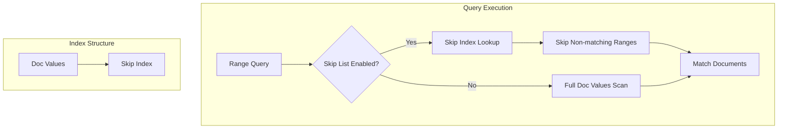
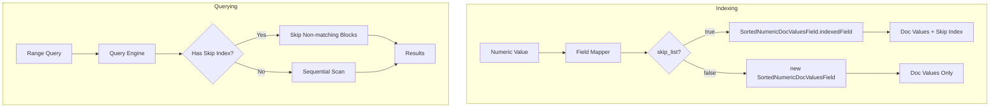

# Numeric Field Skip List

## Summary

The Numeric Field Skip List feature enables skip list indexing on doc values for numeric fields in OpenSearch. When enabled via the `skip_list` mapping parameter, this optimization allows the query engine to efficiently skip over document ranges that don't match query criteria, significantly improving performance for range queries and aggregations on numeric fields.

## Details

### Architecture



### Data Flow



### Components

| Component | Description |
|-----------|-------------|
| `NumberFieldMapper.Builder.skiplist` | New parameter in field mapper builder |
| `NumberType.createFields()` | Extended with `skiplist` parameter |
| `SortedNumericDocValuesField.indexedField()` | Lucene method for creating indexed doc values |
| `DocValuesSkipIndexType.RANGE` | Skip index type used when skip_list is enabled |

### Configuration

| Setting | Description | Default |
|---------|-------------|---------|
| `skip_list` | Boolean value that enables skip list indexing for doc values. Only effective when `doc_values` is also `true`. | `false` |

### Supported Field Types

| Field Type | Support | Notes |
|------------|---------|-------|
| `byte` | ✓ | Via INTEGER type |
| `short` | ✓ | Via INTEGER type |
| `integer` | ✓ | Direct support |
| `long` | ✓ | Direct support |
| `float` | ✓ | Direct support |
| `double` | ✓ | Direct support |
| `half_float` | ✓ | Direct support |
| `unsigned_long` | ✓ | Direct support |
| `scaled_float` | ✓ | Via LONG type (skip_list hardcoded to false) |
| `token_count` | ✓ | Via INTEGER type (skip_list hardcoded to false) |

### Usage Example

Create an index with skip list enabled:

```json
PUT /products
{
  "mappings": {
    "properties": {
      "price": {
        "type": "double",
        "skip_list": true
      },
      "stock_quantity": {
        "type": "integer",
        "skip_list": true
      },
      "rating": {
        "type": "float",
        "skip_list": true
      }
    }
  }
}
```

Index documents:

```json
POST /products/_bulk
{"index": {"_id": "1"}}
{"price": 29.99, "stock_quantity": 150, "rating": 4.5}
{"index": {"_id": "2"}}
{"price": 49.99, "stock_quantity": 75, "rating": 4.8}
{"index": {"_id": "3"}}
{"price": 19.99, "stock_quantity": 200, "rating": 4.2}
```

Range queries benefit from skip list optimization:

```json
GET /products/_search
{
  "query": {
    "bool": {
      "filter": [
        {
          "range": {
            "price": {
              "gte": 20.00,
              "lte": 40.00
            }
          }
        },
        {
          "range": {
            "stock_quantity": {
              "gte": 100
            }
          }
        }
      ]
    }
  }
}
```

Aggregations also benefit:

```json
GET /products/_search
{
  "size": 0,
  "aggs": {
    "price_ranges": {
      "range": {
        "field": "price",
        "ranges": [
          { "to": 25 },
          { "from": 25, "to": 50 },
          { "from": 50 }
        ]
      }
    }
  }
}
```

## Limitations

- Increases index size due to additional skip index data structure
- Only effective when `doc_values` is enabled (default is `true`)
- Performance benefits are most noticeable for:
  - Range queries on high-cardinality fields
  - Aggregations with range-based filtering
  - Analytics workloads with numeric filtering
- Some field types (`scaled_float`, `token_count`, `size`) have skip_list hardcoded to `false`
- Requires reindexing to enable on existing fields

## Related PRs

| Version | PR | Description |
|---------|-----|-------------|
| v3.2.0 | [#18889](https://github.com/opensearch-project/OpenSearch/pull/18889) | Add skip_list parameter to Numeric Field Mappers (default false) |

## References

- [Issue #17965](https://github.com/opensearch-project/OpenSearch/issues/17965): [SparseIndex] Modify FieldMappers to enable SkipList
- [PR #18066](https://github.com/opensearch-project/OpenSearch/pull/18066): Previous implementation (replaced by #18889)
- [Documentation PR #10560](https://github.com/opensearch-project/documentation-website/pull/10560): Add skip_list parameter documentation
- [Numeric field types documentation](https://docs.opensearch.org/latest/field-types/supported-field-types/numeric/)
- [OpenSearch 3.2 Release Blog](https://opensearch.org/blog/introducing-opensearch-3-2-next-generation-search-and-anayltics-with-enchanced-ai-capabilities/)

## Change History

- **v3.2.0** (2025-08-19): Initial implementation - Added `skip_list` parameter to all numeric field mappers
