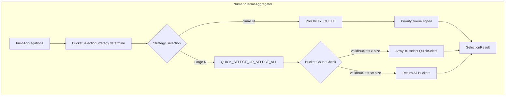
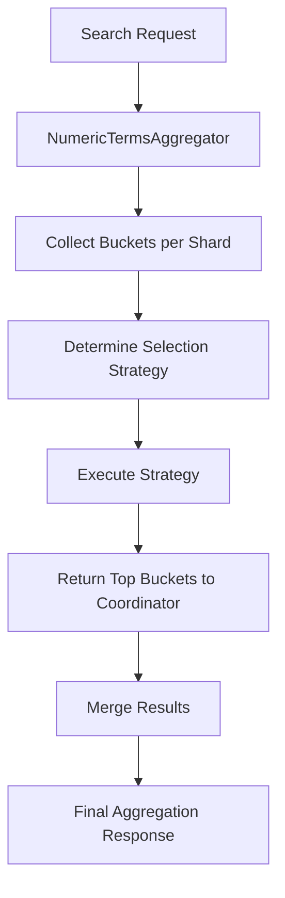

---
tags:
  - indexing
  - performance
  - search
---

# Numeric Terms Aggregation Optimization

## Summary

Numeric terms aggregation optimization improves the performance of bucket aggregations by dynamically selecting the most efficient algorithm for top-N bucket selection based on the ratio between requested bucket size and total bucket count. This feature uses quickselect algorithm instead of priority queue when appropriate, reducing computational overhead for large bucket requests.

## Details

### Architecture



### Data Flow



### Components

| Component | Description |
|-----------|-------------|
| `BucketSelectionStrategy` | Enum with PRIORITY_QUEUE and QUICK_SELECT_OR_SELECT_ALL strategies |
| `SelectionInput<B>` | Generic input container for strategy execution parameters |
| `SelectionResult<B>` | Result container with topBuckets, otherDocCount, and actualStrategyUsed |
| `BucketDocCountFunction` | Functional interface for bucket document count retrieval |
| `BucketUpdateFunction<B>` | Functional interface for bucket updates |
| `BucketArrayBuilder<B>` | Functional interface for bucket array construction |
| `PriorityQueueBuilder<B>` | Functional interface for priority queue construction |

### Configuration

| Setting | Description | Default | Range |
|---------|-------------|---------|-------|
| `search.aggregation.bucket_selection_strategy_factor` | Multiplier to determine strategy threshold. Priority queue used when `size * factor < bucketsInOrd`. | `5` | 0-10 |

### Strategy Selection Algorithm

```java
// Pseudocode for strategy determination
if (size * factor < bucketsInOrd || isKeyOrder(order) || partiallyBuiltBucketComparator == null) {
    return PRIORITY_QUEUE;
} else {
    return QUICK_SELECT_OR_SELECT_ALL;
}
```

**Strategy conditions:**

| Condition | Strategy | Reason |
|-----------|----------|--------|
| `size * factor < bucketsInOrd` | PRIORITY_QUEUE | Small top-N relative to total buckets |
| `isKeyOrder(order)` | PRIORITY_QUEUE | Key ordering requires sorted output |
| `partiallyBuiltBucketComparator == null` | PRIORITY_QUEUE | Significant terms aggregation |
| Otherwise | QUICK_SELECT_OR_SELECT_ALL | Large top-N benefits from quickselect |

### Usage Example

```json
// Standard terms aggregation - optimization applied automatically
GET /logs/_search
{
  "size": 0,
  "aggs": {
    "status_codes": {
      "terms": {
        "field": "status_code",
        "size": 100
      }
    }
  }
}
```

```yaml
# Cluster setting to adjust strategy factor
PUT /_cluster/settings
{
  "persistent": {
    "search.aggregation.bucket_selection_strategy_factor": 5
  }
}
```

### Debug Information

The selected strategy is exposed in profiling output:

```json
{
  "profile": {
    "shards": [{
      "aggregations": [{
        "debug": {
          "result_strategy": "long_terms",
          "total_buckets": 1000,
          "result_selection_strategy": "quick_select"
        }
      }]
    }]
  }
}
```

Possible values for `result_selection_strategy`:
- `priority_queue`: Traditional PriorityQueue-based selection
- `quick_select`: QuickSelect algorithm for top-N
- `select_all`: All valid buckets returned (no selection needed)

## Limitations

- Only applies to numeric field types in terms aggregations
- Does not optimize significant terms aggregations
- Does not apply when ordering by key (requires sorted output)
- Factor setting is cluster-wide, affecting all numeric terms aggregations
- Memory overhead for QUICK_SELECT_OR_SELECT_ALL is O(bucketsInOrd) vs O(size) for PRIORITY_QUEUE

## Change History

- **v3.2.0** (2025-08-07): Initial implementation with configurable bucket selection strategy factor

## Related Features
- [OpenSearch Dashboards](../opensearch-dashboards/ai-chat.md)

## References

### Documentation
- [Terms Aggregation Documentation](https://docs.opensearch.org/3.2/aggregations/bucket/terms/): Official terms aggregation docs
- [Lucene ArrayUtil.select](https://lucene.apache.org/core/9_0_0/core/org/apache/lucene/util/ArrayUtil.html): QuickSelect implementation

### Pull Requests
| Version | PR | Description | Related Issue |
|---------|-----|-------------|---------------|
| v3.2.0 | [#18702](https://github.com/opensearch-project/OpenSearch/pull/18702) | Initial implementation with quickselect optimization | [#18703](https://github.com/opensearch-project/OpenSearch/issues/18703) |

### Issues (Design / RFC)
- [Issue #18703](https://github.com/opensearch-project/OpenSearch/issues/18703): Original performance optimization request
