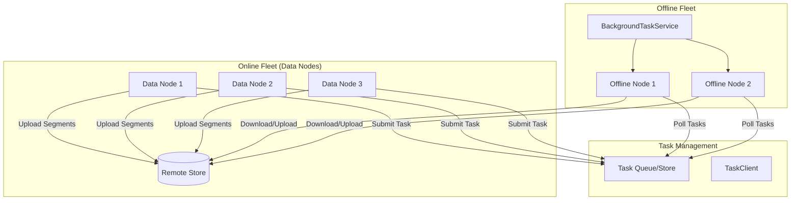
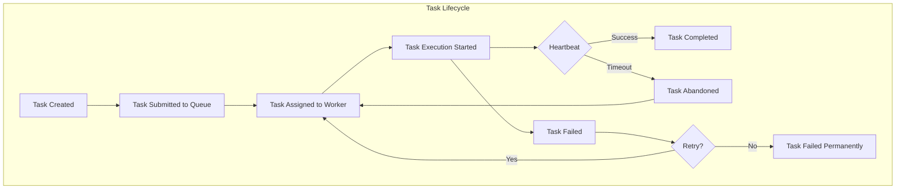

---
tags:
  - indexing
  - search
---

# Offline Nodes (Background Tasks)

## Summary

Offline Nodes is an OpenSearch feature that enables workload segregation by offloading resource-intensive background operations from data nodes to dedicated offline nodes. Background tasks like segment merges, force merges, snapshots, re-indexing, and remote garbage collection can consume significant resources, impacting the predictability of core indexing and search operations. By running these tasks on a separate fleet of offline nodes, users can achieve independent scalability and better resource utilization.

This feature is particularly beneficial for Remote Store enabled clusters where data is stored remotely and can be efficiently accessed from dedicated offline nodes.

## Details

### Architecture



### Data Flow



### Components

| Component | Description |
|-----------|-------------|
| `Task` | Core entity representing a background task with status, parameters, and lifecycle timestamps |
| `TaskId` | Unique identifier for each task |
| `TaskParams` | Abstract base class for task-specific parameters (e.g., MergeTaskParams) |
| `TaskStatus` | Task state: UNASSIGNED, ASSIGNED, ACTIVE, SUCCESS, FAILED, CANCELLED |
| `TaskType` | Category of task: MERGE, SNAPSHOT (extensible) |
| `TaskManagerClient` | Interface for task CRUD operations, listing, and assignment |
| `TaskProducerClient` | Interface for submitting new tasks to the queue |
| `TaskWorkerClient` | Interface for workers to retrieve assigned tasks and send heartbeats |
| `TaskWorker` | Interface for executing tasks on offline nodes |
| `WorkerNode` | Represents an offline node with id, name, and IP address |
| `BackgroundTaskService` | Service running on offline nodes that coordinates task execution |
| `TaskManagerClientPlugin` | Plugin interface for providing custom TaskManagerClient implementations |
| `TaskWorkerPlugin` | Plugin interface for providing custom TaskWorker implementations |

### Configuration

| Setting | Description | Default |
|---------|-------------|---------|
| `opensearch.experimental.feature.task.background.enabled` | Feature flag to enable background task execution | `false` |

### Task Queue Implementations

The framework supports multiple queue implementations:

1. **System Index**: Use an OpenSearch system index as the task queue
2. **Cluster State (PersistentTasksCustomMetadata)**: Leverage existing persistent tasks infrastructure
3. **External Queue**: Integrate with Apache Kafka, Apache Cassandra, or cloud-native solutions

### Usage Example

```java
// Task submission from Data Node
TaskProducerClient producer = getTaskProducerClient();
Task mergeTask = Task.Builder.builder(
    new TaskId(UUID.randomUUID().toString()),
    TaskStatus.UNASSIGNED,
    new MergeTaskParams(shardId, segmentsToMerge),
    TaskType.MERGE,
    System.currentTimeMillis()
).build();
producer.submitTask(mergeTask);

// Task execution on Offline Node
public class MergeTaskWorker implements TaskWorker {
    @Override
    public void executeTask(Task task) {
        MergeTaskParams params = (MergeTaskParams) task.getParams();
        // Download segments from Remote Store
        // Perform merge operation
        // Upload merged segments to Remote Store
        // Update task status
    }
}

// Task assignment and heartbeat
TaskManagerClient manager = getTaskManagerClient();
boolean assigned = manager.assignTask(taskId, workerNode);
if (assigned) {
    // Execute task
    workerClient.sendTaskHeartbeat(taskId, System.currentTimeMillis());
}
```

## Limitations

- **Experimental**: Feature is experimental and APIs may change in future releases
- **Remote Store Required**: Designed for Remote Store enabled clusters where data is accessible from offline nodes
- **Additional Cost**: Requires provisioning separate offline nodes and incurs additional data transfer costs
- **Implementation Required**: Users must implement queue backend and task workers for their use cases
- **Multiple Writers**: Requires handling multiple writers for single shard's Remote Segments Store

## Change History

- **v2.18.0** (2024-11-05): Initial implementation - Added offline-tasks library with core abstractions and interfaces

## Related Features
- [OpenSearch Dashboards](../opensearch-dashboards/ai-chat.md)

## References

### Pull Requests
| Version | PR | Description | Related Issue |
|---------|-----|-------------|---------------|
| v2.18.0 | [#13574](https://github.com/opensearch-project/OpenSearch/pull/13574) | Adds offline-tasks library containing various interfaces for Offline Background Tasks | [#13575](https://github.com/opensearch-project/OpenSearch/issues/13575) |

### Issues (Design / RFC)
- [Issue #13575](https://github.com/opensearch-project/OpenSearch/issues/13575): Add a new library containing required abstractions to run Offline Background Tasks
- [Issue #13554](https://github.com/opensearch-project/OpenSearch/issues/13554): Design Proposal - Offline Background Tasks
- [Issue #12361](https://github.com/opensearch-project/OpenSearch/issues/12361): RFC - Offline Background Tasks
- [Issue #12725](https://github.com/opensearch-project/OpenSearch/issues/12725): META - Phase #1 Offline Background Tasks
- [Issue #12727](https://github.com/opensearch-project/OpenSearch/issues/12727): Feature Request - Background Tasks
- [Issue #12726](https://github.com/opensearch-project/OpenSearch/issues/12726): Feature Request - Separation of Merges
