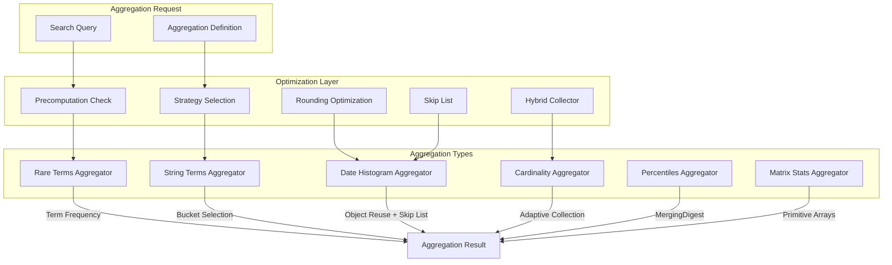

---
tags:
  - domain/core
  - component/server
  - performance
  - search
---
# Aggregation Optimizations

## Summary

OpenSearch provides various performance optimizations for aggregation operations. These optimizations reduce query latency and memory consumption by using smarter algorithms for bucket selection, precomputation techniques, object reuse patterns, and adaptive collector strategies. The optimizations target multiple aggregation types including rare terms, string terms, date histogram, cardinality, percentiles, and matrix_stats aggregations.

## Details

### Architecture



### Data Flow

```mermaid
flowchart TB
    subgraph "Rare Terms Optimization"
        RT1[Check Weight.count] --> RT2{Match All?}
        RT2 -->|Yes| RT3[Use TermsEnum.docFreq]
        RT2 -->|No| RT4[Standard Collection]
        RT3 --> RT5[Direct Bucket Count]
    end
    
    subgraph "String Terms Optimization"
        ST1[Calculate Bucket Count] --> ST2{Size vs Buckets}
        ST2 -->|"buckets ≤ size"| ST3[Select All]
        ST2 -->|"buckets ≤ 5×size"| ST4[Priority Queue]
        ST2 -->|"buckets > 5×size"| ST5[QuickSelect]
    end
    
    subgraph "Hybrid Cardinality"
        HC1[Start with Ordinals] --> HC2{Memory OK?}
        HC2 -->|Yes| HC3[Continue Ordinals]
        HC2 -->|No| HC4[Switch to Direct]
        HC4 --> HC5[Reuse Computed Data]
    end
    
    subgraph "Sub-aggregation Skip List"
        SL1[Filter Rewrite] --> SL2[Multi-range Traversal]
        SL2 --> SL3[Skip List for Sub-agg]
        SL3 --> SL4[Up to 10x Improvement]
    end
```



### Components

| Component | Description |
|-----------|-------------|
| `StringRareTermsAggregator` | Aggregator for rare terms with precomputation support |
| `GlobalOrdinalsStringTermsAggregator` | String terms aggregator with adaptive bucket selection |
| `BucketSelectionStrategy` | Strategy enum for selecting bucket selection algorithm |
| `Rounding` | Date rounding utilities with object reuse optimization |
| `TimeUnitPreparedRounding` | Prepared rounding implementations for time units |
| `TimeIntervalPreparedRounding` | Prepared rounding implementations for time intervals |
| `HybridCardinalityCollector` | Collector that switches between Ordinals and Direct based on memory |
| `MergingDigest` | Faster t-digest implementation for percentiles |
| `RunningStats` | Matrix stats with primitive array optimization |

### Configuration

| Setting | Description | Default |
|---------|-------------|---------|
| `search.bucket_selection_strategy_factor` | Threshold factor for quickselect vs priority queue | 5 |
| `search.aggregations.cardinality.hybrid_collector.enabled` | Enable hybrid cardinality collector | `true` |
| `search.aggregations.cardinality.hybrid_collector.memory_threshold` | Memory threshold for switching collectors | Dynamic |

### Optimization Strategies

#### Rare Terms Precomputation

When the following conditions are met, rare terms aggregation can skip document iteration:

1. `Weight.count(leafContext) == leafContext.reader().maxDoc()` (match-all query)
2. No deleted documents in the segment
3. No sub-aggregations defined
4. No `_doc_count` field present

The aggregator then uses `TermsEnum.docFreq()` to get bucket counts directly from the index.

#### String Terms Bucket Selection

Three strategies are available based on the ratio of requested size to total buckets:

| Strategy | Algorithm | Time Complexity | When Used |
|----------|-----------|-----------------|-----------|
| `select_all` | Direct copy | O(n) | buckets ≤ size |
| `priority_queue` | Heap-based selection | O(n log k) | buckets ≤ 5×size |
| `quick_select` | Partition-based selection | O(n) average | buckets > 5×size |

#### Hybrid Cardinality Collector

The hybrid collector addresses the trade-off between speed and memory:

- **OrdinalsCollector**: Faster but uses more memory (byte arrays sized by cardinality)
- **DirectCollector**: Slower but more memory-efficient

The hybrid approach starts with OrdinalsCollector and switches to DirectCollector if memory usage exceeds the threshold, reusing already computed aggregation data.

#### Filter Rewrite + Skip List for Sub-aggregations

Combines two optimization techniques for sub-aggregations:

1. **Filter Rewrite**: Uses multi-range traversal for top-level aggregation
2. **Skip List**: Optimizes sub-aggregation collection when data is sorted

This delivers up to 10x performance improvement for queries like `range-auto-date-histo-metrics` in the big5 benchmark.

#### Percentiles MergingDigest

Replaces `AVLTreeDigest` with `MergingDigest` from the t-digest library:

- Faster execution (up to 97% improvement for low-cardinality fields)
- Uses less than half the memory
- Same accuracy guarantees

#### Matrix Stats Primitive Arrays

Replaces `Map<String, Double>` with `double[]` in the hot loop:

- Eliminates boxing/unboxing overhead
- 80% performance improvement on nyc_taxis benchmark

#### Date Histogram Object Reuse

Rounding utility classes are instantiated once and reused:

```java
// Before: Created new object for each call
return new JavaTimeToMidnightRounding().nextRoundingValue(utcMillis);

// After: Reuses single instance
private final JavaTimeToMidnightRounding MIDNIGHT_ROUNDING = new JavaTimeToMidnightRounding();
return MIDNIGHT_ROUNDING.nextRoundingValue(utcMillis);
```

### Usage Example

```json
// Rare terms aggregation
GET /logs/_search
{
  "size": 0,
  "aggs": {
    "rare_errors": {
      "rare_terms": {
        "field": "error_code.keyword",
        "max_doc_count": 10,
        "precision": 0.001
      }
    }
  }
}

// String terms with large bucket count
GET /events/_search
{
  "size": 0,
  "aggs": {
    "by_user": {
      "terms": {
        "field": "user_id.keyword",
        "size": 10000
      }
    }
  }
}

// Date histogram with sub-aggregation (benefits from skip list)
GET /metrics/_search
{
  "size": 0,
  "aggs": {
    "by_hour": {
      "date_histogram": {
        "field": "@timestamp",
        "calendar_interval": "hour"
      },
      "aggs": {
        "avg_value": {
          "avg": { "field": "value" }
        }
      }
    }
  }
}

// Cardinality with hybrid collector (automatic)
GET /logs/_search
{
  "size": 0,
  "aggs": {
    "unique_users": {
      "cardinality": {
        "field": "user_id.keyword"
      }
    }
  }
}

// Percentiles with MergingDigest (automatic)
GET /response_times/_search
{
  "size": 0,
  "aggs": {
    "latency_percentiles": {
      "percentiles": {
        "field": "latency",
        "percents": [50, 95, 99]
      }
    }
  }
}

// Matrix stats with primitive arrays (automatic)
GET /taxi/_search
{
  "size": 0,
  "aggs": {
    "matrix_stats_result": {
      "matrix_stats": {
        "fields": ["trip_distance", "tip_amount"]
      }
    }
  }
}
```

## Limitations

- Rare terms precomputation requires specific conditions (match-all, no deletions, no sub-aggs)
- String terms quickselect does not apply to significant terms aggregations
- Date histogram optimization benefits are most visible with sub-aggregations
- Precomputation does not work with documents containing `_doc_count` field
- Hybrid cardinality collector memory threshold is dynamically calculated
- Filter rewrite + skip list requires data sorted on the aggregation field for maximum benefit
- Auto date histogram skip list currently only works when auto_date_histogram is root or within range filter rewrite context

## Change History

- **v3.4.0** (2026-01): Added hybrid cardinality collector, filter rewrite + skip list for sub-aggregations, MergingDigest for percentiles, primitive arrays for matrix_stats, skip list for auto_date_histogram
- **v3.3.0** (2026-01): Added precomputation for rare terms, quickselect for string terms, object reuse for date histogram
- **v3.0.0** (2025-02): Added `execution_hint` parameter for cardinality aggregation, multi-term aggregation latency/memory improvements, numeric term aggregation sorting optimization

## Related Features
- [OpenSearch Dashboards](../opensearch-dashboards/opensearch-dashboards-ai-chat.md)

## References

### Documentation
- [Cardinality Aggregation Documentation](https://docs.opensearch.org/3.0/aggregations/metric/cardinality/)
- [Percentile Aggregation Documentation](https://docs.opensearch.org/3.0/aggregations/metric/percentile/)
- [Rare Terms Documentation](https://docs.opensearch.org/3.0/aggregations/bucket/rare-terms/)
- [Terms Aggregation Documentation](https://docs.opensearch.org/3.0/aggregations/bucket/terms/)
- [Date Histogram Documentation](https://docs.opensearch.org/3.0/aggregations/bucket/date-histogram/)
- [Multi-terms Aggregation Documentation](https://docs.opensearch.org/3.0/aggregations/bucket/multi-terms/)

### Pull Requests
| Version | PR | Description | Related Issue |
|---------|-----|-------------|---------------|
| v3.4.0 | [#19524](https://github.com/opensearch-project/OpenSearch/pull/19524) | Hybrid Cardinality collector for high cardinality queries | [#19260](https://github.com/opensearch-project/OpenSearch/issues/19260) |
| v3.4.0 | [#19573](https://github.com/opensearch-project/OpenSearch/pull/19573) | Filter rewrite + skip list for sub-aggregation optimization | [#17447](https://github.com/opensearch-project/OpenSearch/issues/17447) |
| v3.4.0 | [#19648](https://github.com/opensearch-project/OpenSearch/pull/19648) | MergingDigest implementation for percentiles aggregation | [#18122](https://github.com/opensearch-project/OpenSearch/issues/18122) |
| v3.4.0 | [#19989](https://github.com/opensearch-project/OpenSearch/pull/19989) | Primitive arrays for matrix_stats aggregation | [#19741](https://github.com/opensearch-project/OpenSearch/issues/19741) |
| v3.4.0 | [#20057](https://github.com/opensearch-project/OpenSearch/pull/20057) | Skip list optimization for auto_date_histogram | [#19827](https://github.com/opensearch-project/OpenSearch/issues/19827) |
| v3.3.0 | [#18978](https://github.com/opensearch-project/OpenSearch/pull/18978) | Rare terms aggregation precomputation | [#13122](https://github.com/opensearch-project/OpenSearch/issues/13122) |
| v3.3.0 | [#18732](https://github.com/opensearch-project/OpenSearch/pull/18732) | String terms aggregation optimization | [#18704](https://github.com/opensearch-project/OpenSearch/issues/18704) |
| v3.3.0 | [#19088](https://github.com/opensearch-project/OpenSearch/pull/19088) | Date histogram rounding optimization |   |
| v3.0.0 | [#17312](https://github.com/opensearch-project/OpenSearch/pull/17312) | Introduce `execution_hint` for Cardinality aggregation | [#16837](https://github.com/opensearch-project/OpenSearch/issues/16837) |
| v3.0.0 | [#14993](https://github.com/opensearch-project/OpenSearch/pull/14993) | Latency and memory allocation improvements to Multi Term Aggregation |   |
| v3.0.0 | [#17252](https://github.com/opensearch-project/OpenSearch/pull/17252) | Improve performance of NumericTermAggregation by avoiding unnecessary sorting |   |

### Issues (Design / RFC)
- [Issue #19260](https://github.com/opensearch-project/OpenSearch/issues/19260): Auto Select Ordinals cardinality collector for high cardinality queries
- [Issue #18122](https://github.com/opensearch-project/OpenSearch/issues/18122): Speed up percentile aggregation by switching implementation
- [Issue #19741](https://github.com/opensearch-project/OpenSearch/issues/19741): Remove maps from hot loop in matrix_stats agg for performance
- [Issue #19827](https://github.com/opensearch-project/OpenSearch/issues/19827): Add skip_list logic to auto date histogram
- [Issue #17447](https://github.com/opensearch-project/OpenSearch/pull/17447): Support sub agg in filter rewrite optimization
- [Issue #13122](https://github.com/opensearch-project/OpenSearch/issues/13122): Rare Terms Aggregation Performance Optimization
- [Issue #18704](https://github.com/opensearch-project/OpenSearch/issues/18704): Optimize String terms agg
- [Issue #10954](https://github.com/opensearch-project/OpenSearch/issues/10954): Use Collector.setWeight to improve aggregation performance
- [Issue #16837](https://github.com/opensearch-project/OpenSearch/issues/16837): Use of Binary DocValue for high cardinality fields
