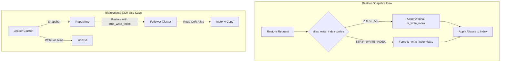
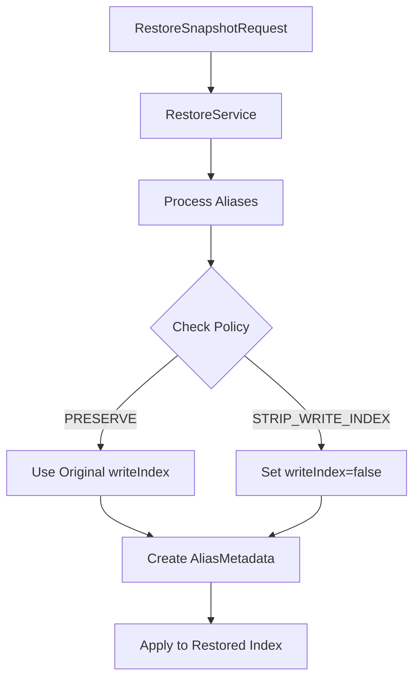

---
tags:
  - domain/core
  - component/server
  - indexing
---
# Alias Write Index Policy

## Summary

The Alias Write Index Policy feature provides control over how the `is_write_index` attribute of aliases is handled during snapshot restore operations. This enables safe bidirectional Cross-Cluster Replication (CCR) by preventing write alias conflicts when restoring snapshots to follower clusters.

## Details

### Architecture



### Data Flow



### Components

| Component | Description |
|-----------|-------------|
| `AliasWriteIndexPolicy` | Enum in `RestoreSnapshotRequest` defining policy options |
| `RestoreSnapshotRequest` | Extended with `aliasWriteIndexPolicy` field |
| `RestoreService` | Applies policy during alias restoration |

### Configuration

| Setting | Description | Default |
|---------|-------------|---------|
| `alias_write_index_policy` | REST parameter for restore requests | `preserve` |

### Policy Options

| Policy | Behavior |
|--------|----------|
| `preserve` | Maintains original `is_write_index` value from snapshot |
| `strip_write_index` | Forces `is_write_index=false` on all restored aliases |

### Usage Example

#### Basic Restore with Policy

```json
POST /_snapshot/my_repository/my_snapshot/_restore
{
  "indices": "logs-*",
  "include_aliases": true,
  "alias_write_index_policy": "strip_write_index"
}
```

#### Bidirectional CCR Setup

```json
// On follower cluster - restore without write conflicts
POST /_snapshot/shared_repo/leader_snapshot/_restore
{
  "indices": "orders",
  "rename_pattern": "orders",
  "rename_replacement": "orders_replica",
  "include_aliases": true,
  "alias_write_index_policy": "strip_write_index"
}
```

### Problem Solved

Before this feature, restoring an index that was a write index for an alias would fail if:
- The target cluster already had a write index for that alias
- Multiple indices from the snapshot shared the same alias with `is_write_index=true`

Error message:
```
Failed to restore snapshot: alias [rollover_alias] has more than one write index
```

## Limitations

- Policy applies to all aliases in the restore operation (no per-alias control)
- Only affects aliases being restored, not existing aliases in the cluster
- Requires OpenSearch 3.3.0 or later

## Change History

- **v3.3.0** (2025): Initial implementation - Added `alias_write_index_policy` parameter to Restore Snapshot API

## Related Features
- [OpenSearch Dashboards](../opensearch-dashboards/opensearch-dashboards-ai-chat.md)

## References

### Documentation
- [Restore Snapshot API](https://docs.opensearch.org/3.0/api-reference/snapshots/restore-snapshot/): Official documentation
- [Alias API](https://docs.opensearch.org/3.0/api-reference/index-apis/alias/): Alias `is_write_index` documentation

### Pull Requests
| Version | PR | Description | Related Issue |
|---------|-----|-------------|---------------|
| v3.3.0 | [#19368](https://github.com/opensearch-project/OpenSearch/pull/19368) | Enable Safe Bidirectional CCR via Alias policy on Restore |   |

### Issues (Design / RFC)
- [Issue #16139](https://github.com/opensearch-project/OpenSearch/issues/16139): Original bug report for write index restore failure
