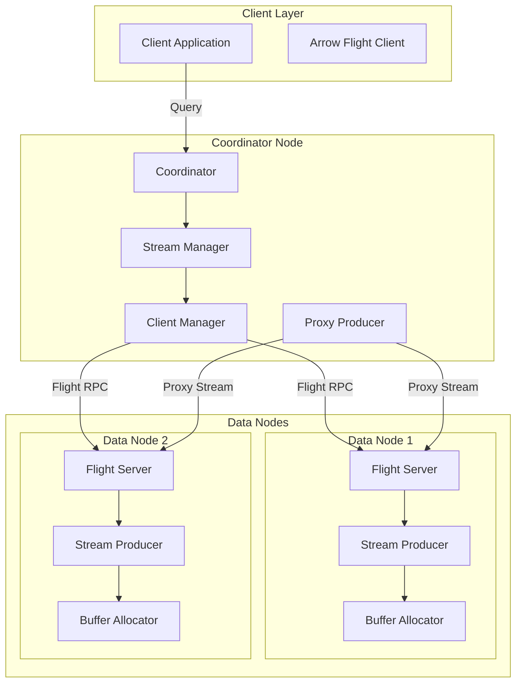
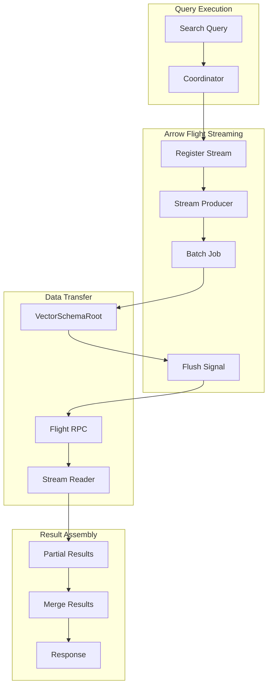

---
tags:
  - performance
  - search
---

# Arrow Flight RPC

## Summary

Arrow Flight RPC is a high-performance data transfer framework for OpenSearch that leverages Apache Arrow's columnar memory format and Flight RPC protocol. It enables efficient streaming communication between cluster nodes by eliminating serialization/deserialization overhead through zero-copy data transfer, making it ideal for large result sets, real-time data streaming, and high-throughput analytics workloads.

## Details

### Architecture



### Data Flow



### Components

| Component | Description |
|-----------|-------------|
| `FlightStreamPlugin` | Main plugin class that bootstraps Arrow Flight server and client infrastructure |
| `FlightServer` | Arrow Flight server implementation handling streaming requests on data nodes |
| `ClientManager` | Manages pool of Flight clients for efficient internode communication |
| `StreamManager` | Central interface for registering, managing, and accessing data streams |
| `StreamProducer` | Interface for producing Arrow data in batches with backpressure support |
| `StreamReader` | Interface for consuming Arrow data streams with blocking batch loading |
| `StreamTicket` | Ticket for identifying and accessing registered streams |
| `StreamTicketFactory` | Factory for creating stream tickets |
| `BatchedJob` | Job interface for producing stream data in batches |
| `FlushSignal` | Signal mechanism for coordinating producer-consumer data flow |
| `ServerConfig` | Configuration holder for Netty server and allocator settings |
| `SslContextProvider` | Provider for TLS/SSL context in secure Flight communication |
| `ProxyStreamProducer` | Proxy stream connecting clients to the correct data node holding the stream |

### Configuration

| Setting | Description | Default |
|---------|-------------|---------|
| `opensearch.experimental.feature.transport.stream.enabled` | Enable Arrow Flight streaming transport | `false` |
| `arrow.flight.publish_host` | Host address for Flight server publishing | Node IP |
| `arrow.flight.bind_host` | Host address for Flight server binding | Node IP |
| `transport.stream.type.default` | Transport stream type (`FLIGHT` or `FLIGHT-SECURE`) | - |
| `flight.ssl.enable` | Enable SSL/TLS for Flight connections | `false` |
| `http.type` | HTTP transport type (`reactor-netty4` or `reactor-netty4-secure`) | - |

### Usage Example

#### Plugin Installation

```bash
# Install required plugins
bin/opensearch-plugin install transport-reactor-netty4
bin/opensearch-plugin install arrow-flight-rpc
```

#### JVM Configuration (jvm.options)

```
-Dio.netty.allocator.numDirectArenas=1
-Dio.netty.noUnsafe=false
-Dio.netty.tryUnsafe=true
-Dio.netty.tryReflectionSetAccessible=true
--add-opens=java.base/java.nio=org.apache.arrow.memory.core,ALL-UNNAMED
```

#### OpenSearch Configuration (opensearch.yml)

```yaml
# Enable experimental streaming feature
opensearch.experimental.feature.transport.stream.enabled: true

# HTTP transport type
http.type: reactor-netty4        # For non-secure clusters
# http.type: reactor-netty4-secure # For secure clusters

# Flight server network settings (multi-node clusters)
arrow.flight.publish_host: 192.168.1.10
arrow.flight.bind_host: 192.168.1.10

# Security settings (if security enabled)
transport.stream.type.default: FLIGHT-SECURE
flight.ssl.enable: true
transport.ssl.enforce_hostname_verification: false
```

#### Enable Streaming via API

```json
PUT /_cluster/settings
{
    "persistent": {
        "plugins.ml_commons.stream_enabled": true
    }
}
```

#### Implementing a Stream Producer

```java
public class MyStreamProducer implements StreamProducer<VectorSchemaRoot, BufferAllocator> {
    
    @Override
    public VectorSchemaRoot createRoot(BufferAllocator allocator) {
        // Define schema and create VectorSchemaRoot
        Schema schema = new Schema(Arrays.asList(
            Field.nullable("id", new ArrowType.Int(64, true)),
            Field.nullable("value", new ArrowType.Utf8())
        ));
        return VectorSchemaRoot.create(schema, allocator);
    }
    
    @Override
    public BatchedJob<VectorSchemaRoot> createJob(BufferAllocator allocator) {
        return (root, flushSignal) -> {
            // Populate data in batches
            while (hasMoreData()) {
                populateBatch(root);
                flushSignal.awaitConsumer(timeout);
            }
        };
    }
    
    @Override
    public int estimatedRowCount() {
        return 1000;
    }
    
    @Override
    public String getAction() {
        return "my_stream_action";
    }
}
```

## Limitations

- **Experimental Feature**: Currently behind a feature flag, not recommended for production
- **Plugin Dependencies**: Requires `transport-reactor-netty4` plugin to be installed
- **JVM Requirements**: Specific JVM options required for Arrow memory management
- **Security Integration**: Requires security plugin changes for SSL context building
- **Certificate Hot Reload**: Not yet supported for Flight SSL certificates
- **Performance Tuning**: Default configurations need tuning based on workload benchmarks
- **Partitioned Streams**: Support for partitioned streams is planned but not yet implemented

## Change History

- **v3.0.0** (2025-02-20): Initial implementation with Flight server bootstrap logic and client for internode communication

## Related Features
- [OpenSearch Dashboards](../opensearch-dashboards/opensearch-dashboards-ai-chat.md)

## References

### Documentation
- [Arrow Flight](https://arrow.apache.org/docs/format/Flight.html): Arrow Flight RPC documentation
- [Apache Arrow](https://arrow.apache.org/): Apache Arrow project homepage

### Blog Posts
- [Blog: OpenSearch and Apache Arrow](https://opensearch.org/blog/opensearch-and-apache-arrow-a-tour-of-the-archery-range/): Overview of Arrow Flight integration

### Pull Requests
| Version | PR | Description | Related Issue |
|---------|-----|-------------|---------------|
| v3.0.0 | [#16962](https://github.com/opensearch-project/OpenSearch/pull/16962) | Arrow Flight RPC plugin with Flight server bootstrap logic and client for internode communication | [#16963](https://github.com/opensearch-project/OpenSearch/issues/16963) |
| v3.0.0 | [#16691](https://github.com/opensearch-project/OpenSearch/pull/16691) | Library changes containing POJOs and Arrow vector APIs | [#16679](https://github.com/opensearch-project/OpenSearch/issues/16679) |

### Issues (Design / RFC)
- [Issue #16679](https://github.com/opensearch-project/OpenSearch/issues/16679): META - Streams using Apache Arrow and Flight
- [Issue #16963](https://github.com/opensearch-project/OpenSearch/issues/16963): Arrow Flight server and client bootstrap logic
- [Issue #17065](https://github.com/opensearch-project/OpenSearch/issues/17065): General purpose FlightProducer
