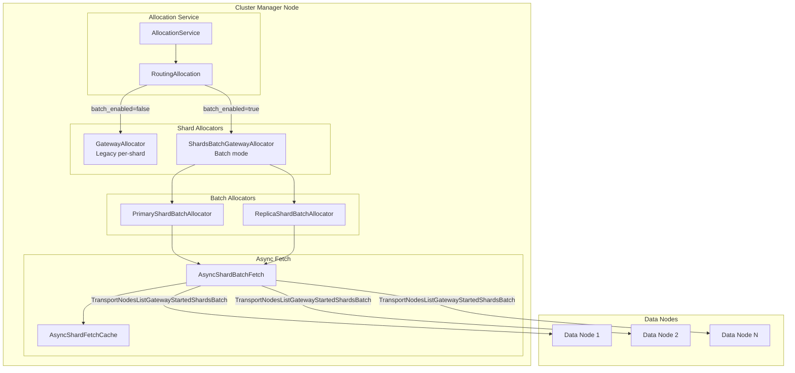
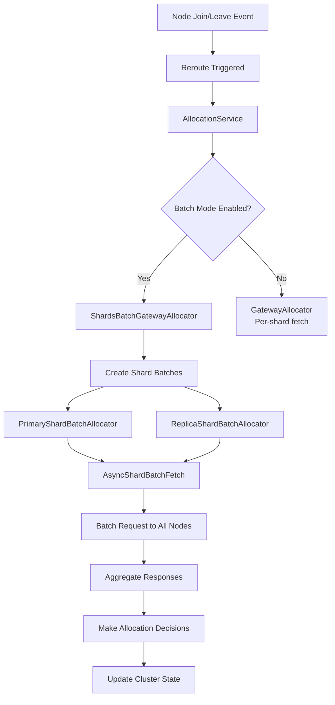

---
tags:
  - opensearch
---
# Async Shard Batch Fetch

## Summary

Async Shard Batch Fetch is a cluster manager optimization that batches shard metadata fetch operations during node joins and restarts. Instead of fetching metadata per-shard (which can cause memory spikes with large shard counts), this feature groups fetch requests into batches, significantly reducing memory pressure and improving cluster manager resilience.

This feature addresses scalability issues in clusters with tens of thousands of shards, where the original per-shard async fetch approach could consume gigabytes of memory and cause cluster manager instability.

## Details

### Architecture



### Data Flow



### Components

| Component | Description |
|-----------|-------------|
| `ShardsBatchGatewayAllocator` | Main allocator that handles batch-based shard allocation |
| `PrimaryShardBatchAllocator` | Allocates primary shards using batch fetch |
| `ReplicaShardBatchAllocator` | Allocates replica shards using batch fetch |
| `AsyncShardBatchFetch` | Handles async batch fetch operations to data nodes |
| `TransportNodesListGatewayStartedShardsBatch` | Transport action for batch shard metadata requests |

### Configuration

| Setting | Description | Default |
|---------|-------------|---------|
| `cluster.allocator.existing_shards_allocator.batch_enabled` | Enable batch mode for shard allocation | `true` (v3.1.0+) |
| `cluster.allocator.shard.batch.primary_allocator_timeout` | Timeout for primary shard batch allocation | `20s` (v3.1.0+) |
| `cluster.allocator.shard.batch.replica_allocator_timeout` | Timeout for replica shard batch allocation | `20s` (v3.1.0+) |

### Usage Example

```yaml
# opensearch.yml - Default configuration (recommended)
# Batch mode is enabled by default in v3.1.0+

# To customize timeouts for large clusters:
cluster.allocator.shard.batch.primary_allocator_timeout: 30s
cluster.allocator.shard.batch.replica_allocator_timeout: 30s

# To disable batch mode (not recommended):
cluster.allocator.existing_shards_allocator.batch_enabled: false
```

## Limitations

- **Shard ID collision**: When multiple replica shards exist for the same shard ID in different states (INITIALIZING and UNASSIGNED), the batch may only track one, potentially delaying allocation ([#18098](https://github.com/opensearch-project/OpenSearch/issues/18098))
- **Minimum timeout**: Allocator timeout cannot be set below 20 seconds when enabled
- **Memory during batch**: While batching reduces overall memory, large batches still require memory for aggregated responses

## Change History

- **v3.1.0** (2025-04-30): Enabled by default, updated timeout defaults to 20s
- **v2.18.0** (2024-10-22): Added OTel metrics for async shard fetch success/failure
- **v2.14.0** (2024-05-21): Added configurable timeout settings for batch allocators
- **v2.9.0** (2023-07-18): Initial batch fetch implementation (experimental, disabled by default)


## References

### Pull Requests
| Version | PR | Description | Related Issue |
|---------|-----|-------------|---------------|
| v3.1.0 | [#18139](https://github.com/opensearch-project/OpenSearch/pull/18139) | Enabled Async Shard Batch Fetch by default | [#17713](https://github.com/opensearch-project/OpenSearch/issues/17713) |
| v2.18.0 | [#15976](https://github.com/opensearch-project/OpenSearch/pull/15976) | Added OTel metrics for async shard fetch |   |
| v2.14.0 | [#12440](https://github.com/opensearch-project/OpenSearch/pull/12440) | Batch allocator timeout settings |   |
| v2.14.0 | [#12010](https://github.com/opensearch-project/OpenSearch/pull/12010) | Batch mode implementation |   |
| v2.9.0 | [#8960](https://github.com/opensearch-project/OpenSearch/pull/8960) | Initial batch fetch transport actions |   |

### Issues (Design / RFC)
- [Issue #8098](https://github.com/opensearch-project/OpenSearch/issues/8098): META - Cluster Manager Async Shard Fetch Revamp
- [Issue #5098](https://github.com/opensearch-project/OpenSearch/issues/5098): Original issue - Async shard fetches causing memory spikes with >50k shards
- [Issue #17713](https://github.com/opensearch-project/OpenSearch/issues/17713): Feature request to enable by default
- [Issue #18098](https://github.com/opensearch-project/OpenSearch/issues/18098): Known issue with replica shard assignment in batch mode
