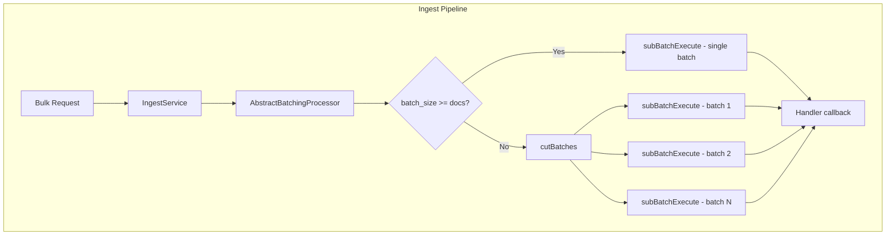
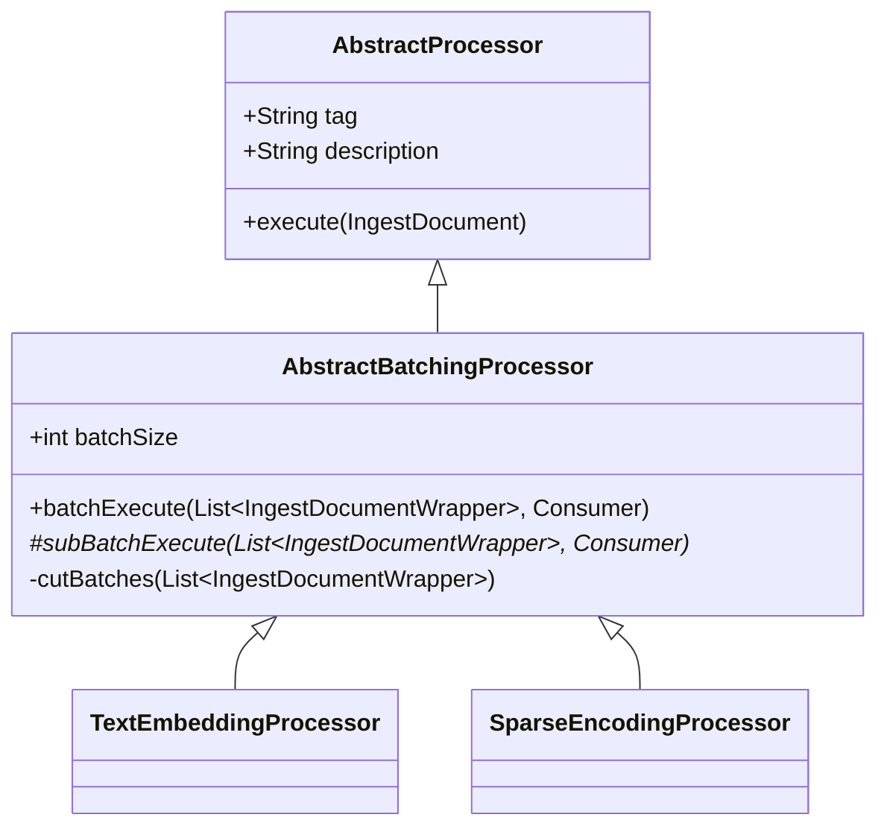

---
tags:
  - opensearch
---
# Batching Processor

## Summary

The Batching Processor framework provides an abstract base class (`AbstractBatchingProcessor`) for building ingest processors that can efficiently process multiple documents in batches. This enables significant performance improvements for bulk ingestion workloads, particularly for processors that benefit from batch operations such as ML inference processors.

## Details

### Architecture



### Components

| Component | Description |
|-----------|-------------|
| `AbstractBatchingProcessor` | Abstract base class extending `AbstractProcessor` |
| `AbstractBatchingProcessor.Factory` | Factory class for creating batch processor instances |
| `IngestDocumentWrapper` | Wrapper for documents being processed in batches |

### Class Hierarchy



### Configuration

| Setting | Type | Default | Description |
|---------|------|---------|-------------|
| `batch_size` | Integer | 1 | Number of documents to process in each batch. Must be a positive integer. |

### How It Works

1. **Document Collection**: When documents arrive via the Bulk API, they are wrapped in `IngestDocumentWrapper` objects
2. **Batch Evaluation**: The `batchExecute()` method checks if the batch size is larger than or equal to the document count
3. **Batch Splitting**: If documents exceed batch size, `cutBatches()` splits them into appropriately sized sub-batches
4. **Parallel Processing**: Each sub-batch is processed via `subBatchExecute()` with results collected asynchronously
5. **Result Aggregation**: An `AtomicInteger` counter tracks completion, triggering the handler when all batches complete

### Usage Example

#### Creating a Custom Batch Processor

```java
public class MyBatchProcessor extends AbstractBatchingProcessor {
    
    public MyBatchProcessor(String tag, String description, int batchSize) {
        super(tag, description, batchSize);
    }
    
    @Override
    protected void subBatchExecute(
            List<IngestDocumentWrapper> ingestDocumentWrappers,
            Consumer<List<IngestDocumentWrapper>> handler) {
        // Process documents in batch
        // Call handler.accept() with results when complete
    }
    
    @Override
    public IngestDocument execute(IngestDocument ingestDocument) {
        // Single document processing (fallback)
        return ingestDocument;
    }
    
    @Override
    public String getType() {
        return "my_batch_processor";
    }
}
```

#### Pipeline Configuration

```json
PUT _ingest/pipeline/batch-processing-pipeline
{
  "description": "Pipeline with batch-enabled processor",
  "processors": [
    {
      "text_embedding": {
        "model_id": "my-model-id",
        "batch_size": 10,
        "field_map": {
          "text_field": "embedding_field"
        }
      }
    }
  ]
}
```

### Batch-Enabled Processors

The following processors extend `AbstractBatchingProcessor`:

| Processor | Description |
|-----------|-------------|
| `text_embedding` | Generates vector embeddings from text fields |
| `sparse_encoding` | Generates sparse vectors for neural sparse search |

## Limitations

- Default batch size is 1, requiring explicit configuration for batch processing
- Batch processing benefits are most significant when using the Bulk API
- Concrete processors must implement thread-safe `subBatchExecute()` methods
- Results may be returned in different order than input documents

## Change History

- **v2.16.0** (2024-08-06): Initial implementation of `AbstractBatchingProcessor` base class

## References

### Documentation

- [Ingest Processors](https://docs.opensearch.org/latest/ingest-pipelines/processors/index-processors/)
- [Bulk API](https://docs.opensearch.org/latest/api-reference/document-apis/bulk/)
- [Text Embedding Processor](https://docs.opensearch.org/latest/ingest-pipelines/processors/text-embedding/)
- [Sparse Encoding Processor](https://docs.opensearch.org/latest/ingest-pipelines/processors/sparse-encoding/)

### Pull Requests

| Version | PR | Description |
|---------|-----|-------------|
| v2.16.0 | [#14554](https://github.com/opensearch-project/OpenSearch/pull/14554) | Add batching processor base type AbstractBatchingProcessor |
| v2.16.0 | [#14595](https://github.com/opensearch-project/OpenSearch/pull/14595) | Backport to 2.x branch |

### Related Issues

- [#14283](https://github.com/opensearch-project/OpenSearch/issues/14283) - Feature request: Make batch ingestion automatic
