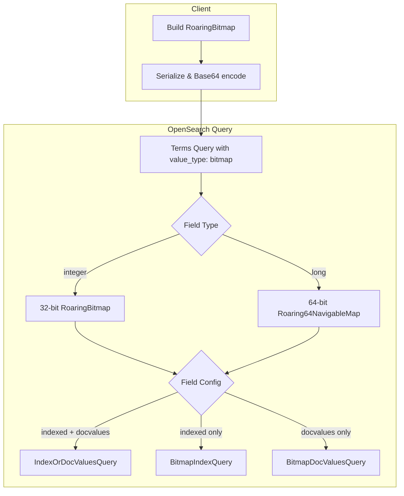

---
tags:
  - opensearch
---
# Bitmap Filtering

## Summary

Bitmap filtering provides an efficient way to filter documents by checking whether a numeric field value exists in a large set of identifiers. Instead of passing thousands of individual values in a `terms` query, users encode the set as a compressed RoaringBitmap and pass it as a Base64-encoded string with `"value_type": "bitmap"`. This dramatically reduces network overhead and improves query performance for large-scale filtering operations such as matching product IDs, user IDs, or other numeric identifiers.

## Details

### Architecture



### Components

| Component | Description |
|-----------|-------------|
| `BitmapDocValuesQuery` | 32-bit doc values query using `TwoPhaseIterator` for integer fields |
| `BitmapIndexQuery` | 32-bit index query using BKD tree point values intersection for integer fields |
| `Bitmap64DocValuesQuery` | 64-bit doc values query for long fields |
| `Bitmap64IndexQuery` | 64-bit index query using BKD tree point values intersection for long fields |
| `TermsQueryBuilder` | Extended with `ValueType.BITMAP` to route bitmap deserialization |
| `NumberFieldMapper` | `INTEGER.bitmapQuery()` and `LONG.bitmapQuery()` handle type-specific deserialization and query construction |

### Supported Field Types

| Field Type | Bitmap Implementation | Since |
|------------|----------------------|-------|
| `integer` | `RoaringBitmap` (32-bit) | v2.17.0 |
| `long` | `Roaring64NavigableMap` (64-bit) | v3.6.0 |

### Usage

#### Direct bitmap query (integer field)

```json
POST products/_search
{
  "query": {
    "terms": {
      "product_id": ["<base64-encoded RoaringBitmap bytes>"],
      "value_type": "bitmap"
    }
  }
}
```

#### Direct bitmap query (long field)

```json
POST employees/_search
{
  "query": {
    "terms": {
      "employee_id": ["<base64-encoded Roaring64NavigableMap portable bytes>"],
      "value_type": "bitmap"
    }
  }
}
```

#### Terms lookup from stored binary field

```json
POST products/_search
{
  "query": {
    "terms": {
      "product_id": {
        "index": "filters",
        "id": "customer123",
        "path": "customer_filter",
        "store": true
      },
      "value_type": "bitmap"
    }
  }
}
```

#### Boolean operations across multiple bitmaps

```json
POST products/_search
{
  "query": {
    "bool": {
      "must": [
        { "terms": { "product_id": ["<bitmap1>"], "value_type": "bitmap" } }
      ],
      "should": [
        { "terms": { "product_id": ["<bitmap2>"], "value_type": "bitmap" } }
      ],
      "must_not": [
        { "terms": { "product_id": ["<bitmap3>"], "value_type": "bitmap" } }
      ]
    }
  }
}
```

## Limitations

- Only `integer` and `long` numeric field types are supported; other numeric types (`short`, `byte`, `float`, `double`) are not supported
- The 64-bit implementation uses `Roaring64NavigableMap` which has lower performance than `Roaring64Bitmap` but provides guaranteed portable serialization
- Maximum bitmap size is limited by the HTTP request payload size limit
- `Roaring64NavigableMap` does not support `advanceIfNeeded()` on its iterator, resulting in a manual advance loop in the index query path

## Change History

- **v3.6.0**: Added 64-bit bitmap query support for `long` fields using `Roaring64NavigableMap` with `Bitmap64IndexQuery` and `Bitmap64DocValuesQuery`
- **v2.19.0**: Added `BitmapIndexQuery` for improved performance on smaller queries using BKD tree intersection; wrapped with `IndexOrDocValuesQuery` for runtime execution path selection
- **v2.17.0**: Initial bitmap filtering implementation with `BitmapDocValuesQuery` for `integer` fields using 32-bit `RoaringBitmap`

## References

### Documentation
- Blog: https://opensearch.org/blog/introduce-bitmap-filtering-feature/
- RoaringBitmap format spec: https://github.com/RoaringBitmap/RoaringFormatSpec

### Pull Requests
| Version | PR | Description |
|---------|-----|-------------|
| v3.6.0 | `https://github.com/opensearch-project/OpenSearch/pull/20606` | Add bitmap64 query support for long fields |
| v2.19.0 | `https://github.com/opensearch-project/OpenSearch/pull/16936` | Improve performance of bitmap filtering with index query |
| v2.17.0 | `https://github.com/opensearch-project/OpenSearch/pull/14774` | Initial bitmap filtering support |
