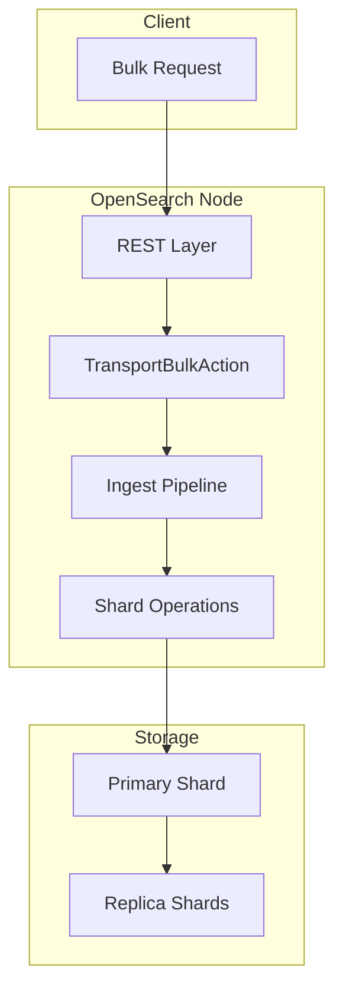
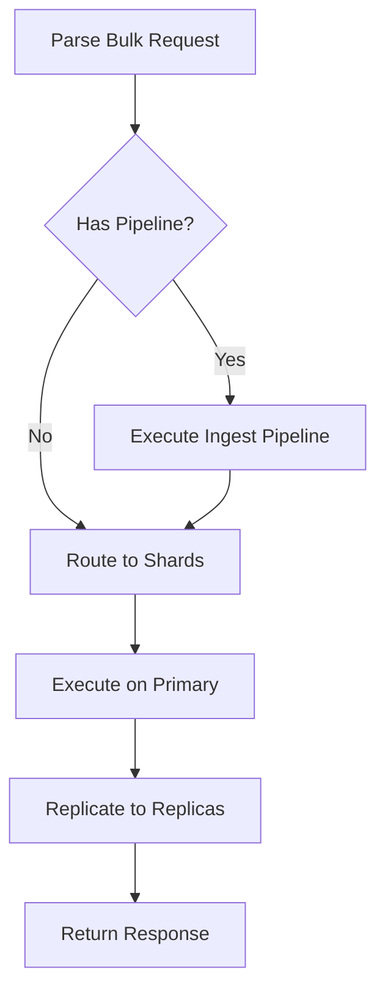

---
tags:
  - opensearch
---
# Bulk API

## Summary

The Bulk API allows adding, updating, or deleting multiple documents in a single request. Compared to individual indexing requests, the bulk operation provides significant performance benefits by reducing network overhead and allowing OpenSearch to optimize internal operations. The API supports index, create, update, and delete operations, each with specific behaviors and requirements.

## Details

### Architecture



### Data Flow



### Components

| Component | Description |
|-----------|-------------|
| `RestBulkAction` | REST handler for `_bulk` endpoint |
| `BulkRequest` | Container for bulk operations |
| `TransportBulkAction` | Coordinates bulk execution across shards |
| `IngestService` | Processes documents through ingest pipelines |
| `BulkShardRequest` | Per-shard bulk operations |

### Configuration

| Setting | Description | Default |
|---------|-------------|---------|
| `timeout` | Request timeout | `1m` |
| `refresh` | Refresh policy (`true`, `false`, `wait_for`) | `false` |
| `routing` | Custom routing value | - |
| `pipeline` | Ingest pipeline to use | - |
| `require_alias` | Require target to be an alias | `false` |
| `wait_for_active_shards` | Number of active shards required | `1` |
| `error_trace` | Include stack traces in error responses (v3.4.0+) | `false` |

### Supported Operations

#### Index
Creates or replaces a document:
```json
{ "index": { "_index": "test", "_id": "1" } }
{ "field": "value" }
```

#### Create
Creates a document only if it doesn't exist:
```json
{ "create": { "_index": "test", "_id": "1" } }
{ "field": "value" }
```

#### Update
Updates an existing document:
```json
{ "update": { "_index": "test", "_id": "1" } }
{ "doc": { "field": "new_value" } }
```

#### Delete
Deletes a document:
```json
{ "delete": { "_index": "test", "_id": "1" } }
```

### Usage Example

```bash
POST _bulk
{ "index": { "_index": "movies", "_id": "1" } }
{ "title": "The Matrix", "year": 1999 }
{ "create": { "_index": "movies", "_id": "2" } }
{ "title": "Inception", "year": 2010 }
{ "update": { "_index": "movies", "_id": "1" } }
{ "doc": { "rating": 8.7 } }
{ "delete": { "_index": "movies", "_id": "3" } }
```

### Document ID Constraints

- Document `_id` must be 512 bytes or less in size (enforced since v2.9.0)
- This limit applies to all bulk operations (index, create, update)

## Limitations

- Each line in the request body must be on a single line (no pretty-printing)
- Request body must end with a newline character
- Large bulk requests may cause memory pressure; consider splitting into smaller batches
- The `batch_size` parameter was removed in v3.0.0

## Change History

- **v3.4.0** (2026-01-14): Added proper `error_trace` parameter support for stack traces in bulk error responses
- **v3.4.0** (2026-01-14): Fixed `indices` property not being initialized during deserialization
- **v3.0.0** (2025-05-13): Removed deprecated `batch_size` parameter; batch processing is now automatic
- **v2.14.0** (2024-04-30): Added `batch_size` parameter for ingest pipeline batch processing (deprecated)
- **v2.9.0** (2023-07-18): Enforced 512 byte document ID limit in bulk updates
- **v1.0.0** (2021-07-12): Initial implementation


## References

### Documentation
- [Bulk API Documentation](https://docs.opensearch.org/3.0/api-reference/document-apis/bulk/): Official documentation
- [Common REST Parameters](https://docs.opensearch.org/3.0/api-reference/common-parameters/): Documentation for error_trace parameter

### Pull Requests
| Version | PR | Description | Related Issue |
|---------|-----|-------------|---------------|
| v3.4.0 | [#19985](https://github.com/opensearch-project/OpenSearch/pull/19985) | Implement error_trace parameter for bulk requests | [#19945](https://github.com/opensearch-project/OpenSearch/issues/19945) |
| v3.4.0 | [#20132](https://github.com/opensearch-project/OpenSearch/pull/20132) | Fix `indices` property initialization during deserialization |   |
| v3.0.0 | [#17801](https://github.com/opensearch-project/OpenSearch/pull/17801) | Remove deprecated `batch_size` parameter | [#14283](https://github.com/opensearch-project/OpenSearch/issues/14283) |
| v2.9.0 | [#8039](https://github.com/opensearch-project/OpenSearch/pull/8039) | Enforce 512 byte document ID limit | [#6595](https://github.com/opensearch-project/OpenSearch/issues/6595) |
| v2.14.0 | [#12457](https://github.com/opensearch-project/OpenSearch/pull/12457) | Add batch processing for ingest processors |   |

### Issues (Design / RFC)
- [Issue #19945](https://github.com/opensearch-project/OpenSearch/issues/19945): Bug report - Bulk API ignores error_trace query parameter
- [Issue #14283](https://github.com/opensearch-project/OpenSearch/issues/14283): Make batch ingestion automatic
- [Issue #6595](https://github.com/opensearch-project/OpenSearch/issues/6595): Bug report for _id size limit bypass
