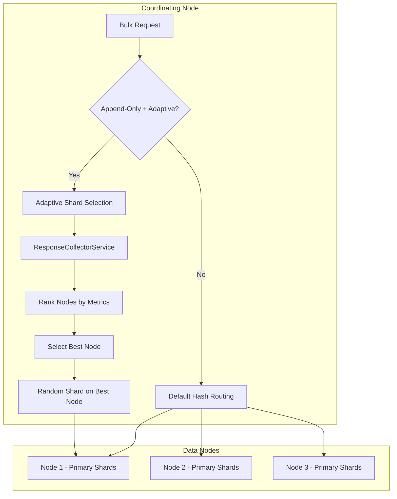

---
tags:
  - opensearch
---
# Bulk Write Optimization

## Summary

Bulk write optimization introduces adaptive shard selection for bulk indexing on append-only indices. Instead of using the default hash-based routing (which distributes documents evenly across shards), this feature routes all documents in a bulk request to the shard on the best-performing node. Node performance is ranked using real-time metrics: service time EWMA, thread pool queue size, and active client connections. This approach reuses the same ranking algorithm (`rankShardsAndUpdateStats`) that powers adaptive replica selection for search queries.

The feature targets log analysis and time-series workloads where documents are append-only (no updates or deletes) and document IDs are auto-generated. In production benchmarks, it improved bulk indexing throughput by over 20%.

## Details

### Architecture



### Components

| Component | Description |
|-----------|-------------|
| `TransportBulkAction.bulkAdaptiveSelectShard()` | Two-stage shard selection: rank nodes, then pick random shard on best node |
| `TransportBulkAction.getIndexPrimaryShards()` | Collects active primary shards grouped by node |
| `ResponseCollectorService` | Collects per-node metrics (service time, queue size, response time) |
| `BulkShardResponse` | Extended to carry `serviceTimeEWMAInNanos` and `nodeQueueSize` back to coordinator |
| `IndexShardRoutingTable.rankShardsAndUpdateStats()` | Shared ranking algorithm (also used by adaptive replica selection for search) |

### Configuration

| Setting | Description | Default | Scope |
|---------|-------------|---------|-------|
| `index.append_only.enabled` | Enable append-only mode (prerequisite) | `false` | Index, Final |
| `index.bulk.adaptive_shard_selection.enabled` | Enable adaptive shard selection for bulk writes | `false` | Index, Dynamic |

### Usage Example

```json
PUT my-log-index
{
  "settings": {
    "index.append_only.enabled": "true",
    "index.bulk.adaptive_shard_selection.enabled": "true",
    "index.number_of_shards": 6
  }
}

POST _bulk
{"index": {"_index": "my-log-index"}}
{"@timestamp": "2026-04-13T00:00:00Z", "message": "log entry 1"}
{"index": {"_index": "my-log-index"}}
{"@timestamp": "2026-04-13T00:00:01Z", "message": "log entry 2"}
```

### How It Works

1. On the coordinating node, `TransportBulkAction` checks if the target index has both `append_only.enabled` and `bulk.adaptive_shard_selection.enabled` set to `true`.
2. If so, it calls `bulkAdaptiveSelectShard()` which:
   - Gathers all active primary shards for the index, grouped by node
   - Picks one representative shard per node
   - Ranks nodes using `rankShardsAndUpdateStats()` with metrics from `ResponseCollectorService`
   - Selects the top-ranked node, then randomly picks one of its primary shards
3. All documents in the bulk request for that index are routed to the selected shard.
4. After the shard response returns, the coordinator records the node's service time EWMA and queue size into `ResponseCollectorService` for future ranking decisions.
5. Client connection counts are tracked per-node and decremented after each response.

## Limitations

- Only works on append-only indices (`index.append_only.enabled: true`)
- Custom document IDs are rejected with a `validation_exception`
- Potential ~5% performance degradation under low indexing pressure due to metric collection overhead
- All documents for a given index in one bulk request go to a single shard, which may cause temporary imbalance
- Cannot be enabled on non-append-only indices (throws `IllegalArgumentException`)

## Change History

- **v3.6.0**: Initial implementation — adaptive shard selection for bulk writes on append-only indices

## References

### Pull Requests
| Version | PR | Description |
|---------|-----|-------------|
| v3.6.0 | [#20065](https://github.com/opensearch-project/OpenSearch/pull/20065) | Add adaptive shard selection for bulk writes on append-only indices |

### Issues (Design / RFC)
- [#18307](https://github.com/opensearch-project/OpenSearch/issues/18307): META - Automatic routing for bulk
- [#18306](https://github.com/opensearch-project/OpenSearch/issues/18306): Adaptive shard selection for bulk writes
- [#9219](https://github.com/opensearch-project/OpenSearch/issues/9219): Automatic routing for bulk (original proposal)
