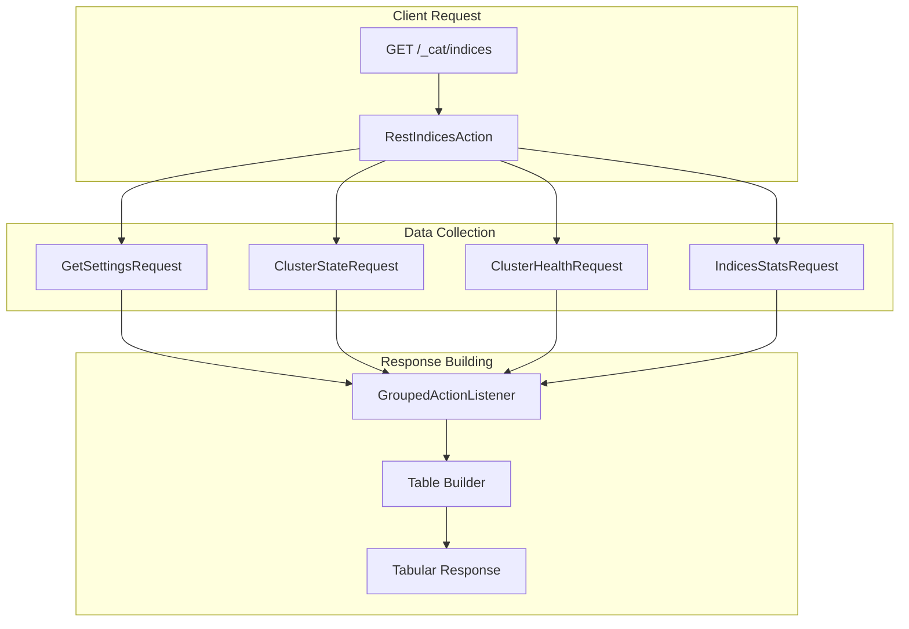
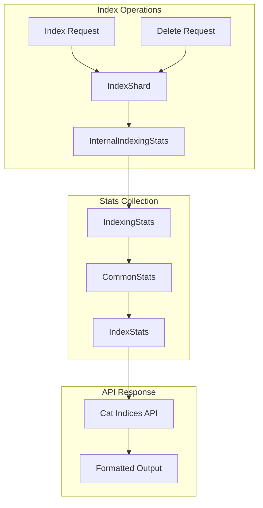

---
tags:
  - domain/core
  - component/server
  - indexing
  - observability
  - search
---
# Cat Indices API

## Summary

The Cat Indices API (`_cat/indices`) provides a human-readable, tabular view of index information in OpenSearch. It displays essential statistics about indexes including health status, document counts, storage size, and various operational metrics. The API supports numerous optional columns that can be selectively displayed using the `h` parameter.

## Details

### Architecture



### Data Flow



### Components

| Component | Description |
|-----------|-------------|
| `RestIndicesAction` | REST handler for `/_cat/indices` endpoint |
| `IndexingStats` | Statistics about indexing operations including counts, times, and timestamps |
| `CommonStats` | Aggregated statistics for an index across all shards |
| `MaxMetric` | Thread-safe metric for tracking maximum values (e.g., timestamps) |
| `Table` | Utility class for building tabular output |

### Configuration

The Cat Indices API supports various query parameters:

| Parameter | Description | Default |
|-----------|-------------|---------|
| `v` | Include column headers | `false` |
| `h` | Comma-separated list of columns to display | Default columns |
| `s` | Sort by column(s) | None |
| `bytes` | Unit for byte values (`b`, `kb`, `mb`, `gb`, `tb`, `pb`) | N/A |
| `health` | Filter by health status (`green`, `yellow`, `red`) | All |
| `pri` | Show only primary shard statistics | `false` |
| `local` | Return local information only | `false` |
| `cluster_manager_timeout` | Timeout for cluster manager connection | 30s |

### Available Columns

The API provides extensive column options organized by category:

**Basic Information:**
- `health`, `status`, `index`, `uuid`, `pri`, `rep`

**Document Statistics:**
- `docs.count`, `docs.deleted`

**Storage:**
- `store.size`, `pri.store.size`

**Indexing Statistics:**
- `indexing.index_total`, `indexing.index_time`, `indexing.index_current`
- `indexing.delete_total`, `indexing.delete_time`, `indexing.delete_current`
- `indexing.index_failed`

**Search Statistics:**
- `search.query_total`, `search.query_time`, `search.query_current`
- `search.fetch_total`, `search.fetch_time`, `search.fetch_current`
- `search.scroll_total`, `search.scroll_time`, `search.scroll_current`

**Timestamp Columns (v3.2.0+):**
- `last_index_request_timestamp` - Epoch milliseconds of last index request
- `last_index_request_timestamp_string` - ISO 8601 formatted timestamp

### Usage Example

Basic usage:
```bash
GET _cat/indices?v
```

Select specific columns:
```bash
GET _cat/indices?v&h=index,health,docs.count,store.size
```

Filter by health and sort:
```bash
GET _cat/indices?v&health=yellow&s=store.size:desc
```

Show indexing activity timestamps (v3.2.0+):
```bash
GET _cat/indices?v&h=index,last_index_request_timestamp,last_index_request_timestamp.string
```

Example output:
```
health status index   uuid                   pri rep docs.count store.size
green  open   movies  UZbpfERBQ1-3GSH2bnM3sg   1   1          1      7.7kb
yellow open   logs    abc123def456ghi789jkl   5   1     100000     50.2mb
```

## Limitations

- Response size can be limited by `cat.indices.response.limit.number_of_indices` cluster setting
- Some statistics may not be available for closed indices
- Timestamp columns reset when shards are relocated or nodes restart
- Mixed-version clusters may show incomplete data for newer columns

## Change History

- **v3.2.0**: Added `last_index_request_timestamp` and `last_index_request_timestamp_string` columns to track indexing activity


## References

### Documentation
- [CAT indices API Documentation](https://docs.opensearch.org/3.0/api-reference/cat/cat-indices/)
- [CAT API Overview](https://docs.opensearch.org/3.0/api-reference/cat/index/)

### Pull Requests
| Version | PR | Description | Related Issue |
|---------|-----|-------------|---------------|
| v3.2.0 | [#18405](https://github.com/opensearch-project/OpenSearch/pull/18405) | Add last index request timestamp columns | [#10766](https://github.com/opensearch-project/OpenSearch/issues/10766) |

### Issues (Design / RFC)
- [Issue #10766](https://github.com/opensearch-project/OpenSearch/issues/10766): Stats API to identify which indices are getting updates
