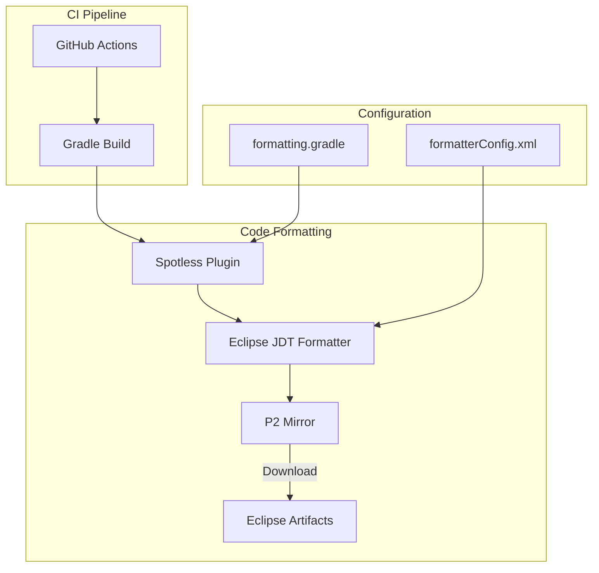

---
tags:
  - opensearch
---
# CI Infrastructure

## Summary

OpenSearch uses Gradle-based CI infrastructure for code formatting, testing, and build automation. The Spotless plugin enforces consistent code formatting using Eclipse JDT formatter across the codebase.

## Details

### Architecture



### Components

| Component | Description |
|-----------|-------------|
| `gradle/formatting.gradle` | Spotless plugin configuration for code formatting |
| `buildSrc/formatterConfig.xml` | Eclipse JDT formatter configuration file |
| Spotless Plugin | Gradle plugin for code formatting enforcement |
| Eclipse JDT Formatter | Java code formatter from Eclipse IDE |
| P2 Mirror | Eclipse artifact repository mirror |

### Configuration

| Setting | Description | Default |
|---------|-------------|---------|
| `eclipse().configFile` | Path to Eclipse formatter configuration | `buildSrc/formatterConfig.xml` |
| `eclipse().withP2Mirrors()` | P2 mirror configuration for artifact downloads | `mirror.umd.edu/eclipse` (v2.19.0+) |
| `trimTrailingWhitespace()` | Remove trailing whitespace | Enabled |
| `endWithNewline()` | Ensure files end with newline | Enabled |

### Usage Example

Running code formatting check:
```bash
./gradlew spotlessCheck
```

Applying code formatting:
```bash
./gradlew spotlessApply
```

## Limitations

- Eclipse JDT formatter downloads depend on external mirror availability
- Formatting rules are specific to Eclipse JDT and may differ from other formatters
- Large codebase formatting can be time-consuming

## Change History

- **v2.19.0** (2025-02-11): Added P2 mirror configuration to resolve Eclipse download failures

## References

### Pull Requests
| Version | PR | Description |
|---------|-----|-------------|
| v2.19.0 | [#17172](https://github.com/opensearch-project/OpenSearch/pull/17172) | Fix failing CI's with `Failed to load eclipse jdt formatter` |

### External References
- [Spotless Gradle Plugin](https://github.com/diffplug/spotless): Code formatting plugin
- [diffplug/spotless#1783](https://github.com/diffplug/spotless/issues/1783): Eclipse download failure issue
