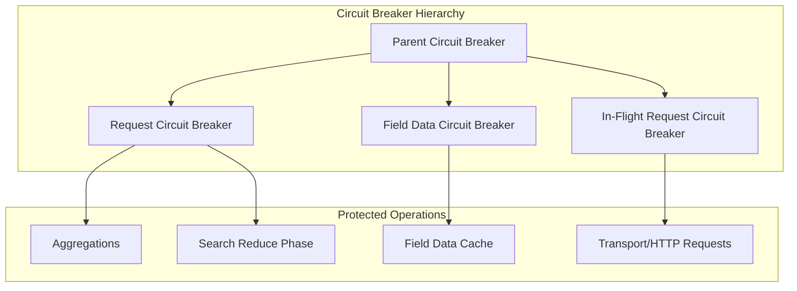

---
tags:
  - opensearch
---
# Circuit Breaker

## Summary

Circuit breakers are a memory protection mechanism in OpenSearch that prevent OutOfMemoryError by monitoring and limiting memory usage across various operations. When memory consumption approaches configured thresholds, circuit breakers "trip" and reject requests with a `CircuitBreakingException`, allowing the cluster to remain stable.

## Details

### Architecture



### Circuit Breaker Types

| Circuit Breaker | Purpose | Default Limit |
|-----------------|---------|---------------|
| Parent | Total memory limit for all child breakers | 95% JVM heap (real memory) or 70% (reserved) |
| Request | Memory for request data structures (aggregations, etc.) | 60% JVM heap |
| Field Data | Memory for loading field data into cache | 40% JVM heap |
| In-Flight Request | Memory for incoming transport/HTTP requests | 100% JVM heap |

### Configuration

| Setting | Type | Description | Default |
|---------|------|-------------|---------|
| `indices.breaker.total.use_real_memory` | Static | Use actual vs reserved memory | `true` |
| `indices.breaker.total.limit` | Dynamic | Parent breaker limit | 95% or 70% |
| `indices.breaker.request.limit` | Dynamic | Request breaker limit | 60% |
| `indices.breaker.request.overhead` | Dynamic | Estimation multiplier | 1.0 |
| `indices.breaker.fielddata.limit` | Dynamic | Field data breaker limit | 40% |
| `indices.breaker.fielddata.overhead` | Dynamic | Estimation multiplier | 1.03 |
| `network.breaker.inflight_requests.limit` | Dynamic | In-flight request limit | 100% |
| `network.breaker.inflight_requests.overhead` | Dynamic | Estimation multiplier | 2.0 |

### Error Response

When a circuit breaker trips, clients receive HTTP 429 with details:

```json
{
  "error": {
    "type": "circuit_breaking_exception",
    "reason": "[parent] Data too large, data for [<operation>] would be [X bytes], which is larger than the limit of [Y bytes]",
    "bytes_wanted": 512967080,
    "bytes_limit": 510027366,
    "durability": "TRANSIENT"
  },
  "status": 429
}
```

### Monitoring

Circuit breaker statistics are available via the Nodes Stats API:

```
GET /_nodes/stats/breaker
```

## Limitations

- Circuit breakers use estimations; actual memory usage may differ
- Some operations may not be fully covered by circuit breaker checks
- Overhead multipliers add safety margin but may cause premature tripping

## Change History

- **v2.16.0** (2024-08-06): Added circuit breaker protection to histogram aggregation empty bucket generation ([#14754](https://github.com/opensearch-project/OpenSearch/pull/14754))

## References

### Documentation
- [Circuit breaker settings](https://docs.opensearch.org/latest/install-and-configure/configuring-opensearch/circuit-breaker/)
- [Nodes Stats API - breakers](https://docs.opensearch.org/latest/api-reference/nodes-apis/nodes-stats/)

### Pull Requests
| Version | PR | Description |
|---------|-----|-------------|
| v2.16.0 | [#14754](https://github.com/opensearch-project/OpenSearch/pull/14754) | Use circuit breaker in InternalHistogram when adding empty buckets |
