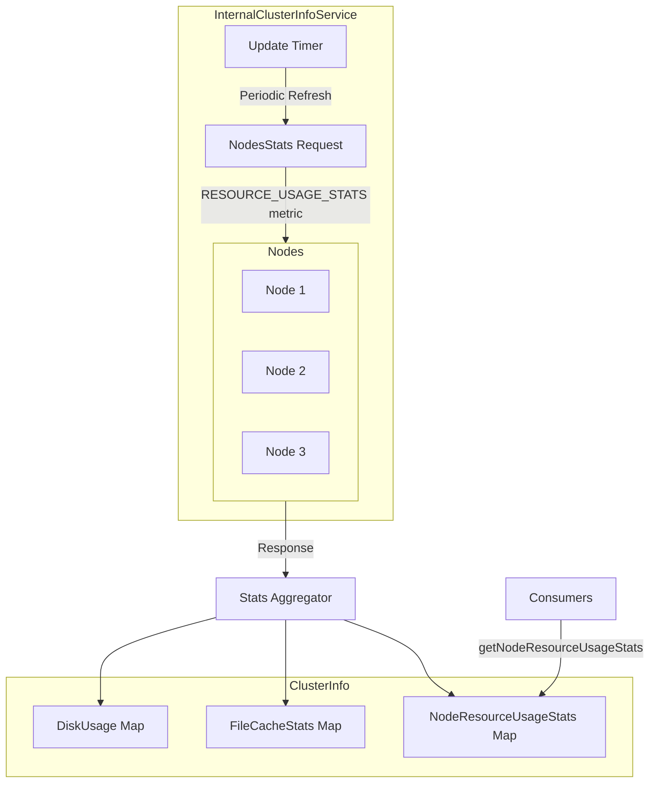
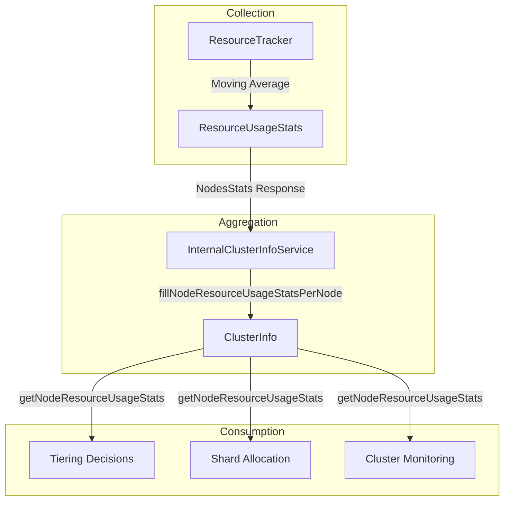

---
tags:
  - domain/core
  - component/server
  - indexing
  - observability
  - performance
---
# Cluster Info & Resource Stats

## Summary

The Cluster Info & Resource Stats feature extends OpenSearch's `ClusterInfo` service to include node-level resource usage statistics (CPU, JVM memory, I/O) alongside existing disk usage information. This enables cluster-wide visibility into resource consumption without requiring separate API calls to each node, supporting use cases like intelligent shard allocation, tiering decisions, and cluster health monitoring.

## Details

### Architecture



### Data Flow



### Components

| Component | Description |
|-----------|-------------|
| `ClusterInfo` | Core class that aggregates cluster-wide statistics including disk usage, file cache stats, and resource usage stats |
| `InternalClusterInfoService` | Service that periodically collects and aggregates node statistics |
| `NodeResourceUsageStats` | Data class containing CPU, memory, and I/O utilization percentages for a node |
| `NodesResourceUsageStats` | Container for resource usage stats across multiple nodes |
| `IoUsageStats` | Data class for I/O utilization statistics (Linux only) |

### Configuration

| Setting | Description | Default |
|---------|-------------|---------|
| `cluster.info.update.interval` | Interval for ClusterInfo refresh | 30s |
| `node.resource.tracker.global_cpu_usage.window_duration` | Window duration for CPU usage moving average | 30s |
| `node.resource.tracker.global_jvm_usage.window_duration` | Window duration for JVM memory moving average | 30s |
| `node.resource.tracker.global_io_usage.window_duration` | Window duration for I/O usage moving average | 5s |

### Usage Example

#### Accessing Resource Usage Stats Programmatically

```java
// Get ClusterInfo from the service
ClusterInfoService clusterInfoService = ...; // injected
ClusterInfo clusterInfo = clusterInfoService.getClusterInfo();

// Access resource usage stats for all nodes
Map<String, NodeResourceUsageStats> resourceStats = clusterInfo.getNodeResourceUsageStats();

for (Map.Entry<String, NodeResourceUsageStats> entry : resourceStats.entrySet()) {
    String nodeId = entry.getKey();
    NodeResourceUsageStats stats = entry.getValue();
    
    System.out.println("Node: " + nodeId);
    System.out.println("  CPU: " + stats.getCpuUtilizationPercent() + "%");
    System.out.println("  Memory: " + stats.getMemoryUtilizationPercent() + "%");
    
    IoUsageStats ioStats = stats.getIoUsageStats();
    if (ioStats != null) {
        System.out.println("  I/O: " + ioStats.getIoUtilisationPercent() + "%");
    }
}
```

#### JSON Response Format

When serialized, the resource usage stats appear in the ClusterInfo response:

```json
{
  "nodes": {
    "node-id-1": {
      "node_name": "node-1",
      "least_available": { ... },
      "most_available": { ... },
      "node_resource_usage_stats": {
        "node-id-1": {
          "timestamp": 1698401391000,
          "cpu_utilization_percent": "12.5",
          "memory_utilization_percent": "45.2",
          "io_usage_stats": {
            "max_io_utilization_percent": "23.1"
          }
        }
      }
    }
  }
}
```

## Limitations

- Resource usage stats require the `ResourceUsageCollector` to have collected sufficient data (typically 5-6 seconds after node startup)
- I/O usage statistics are only available on Linux systems
- Stats represent moving averages over configured window durations, not instantaneous values
- Cluster manager nodes do not report resource usage stats by default (only data and warm nodes)
- Stats are cleared when nodes are removed from the cluster

## Change History

- **v3.2.0** (2025-06-23): Initial implementation - Added NodeResourceUsageStats to ClusterInfo for cluster-wide resource visibility


## References

### Documentation
- [Nodes Stats API Documentation](https://docs.opensearch.org/3.0/api-reference/nodes-apis/nodes-stats/): Official documentation including resource_usage_stats metric
- [ClusterInfo.java](https://github.com/opensearch-project/OpenSearch/blob/main/server/src/main/java/org/opensearch/cluster/ClusterInfo.java): Source code

### Pull Requests
| Version | PR | Description | Related Issue |
|---------|-----|-------------|---------------|
| v3.2.0 | [#18480](https://github.com/opensearch-project/OpenSearch/pull/18480) | Add NodeResourceUsageStats to ClusterInfo | [#18472](https://github.com/opensearch-project/OpenSearch/issues/18472) |

### Issues (Design / RFC)
- [Issue #18472](https://github.com/opensearch-project/OpenSearch/issues/18472): Original feature request for Writable Warm support
