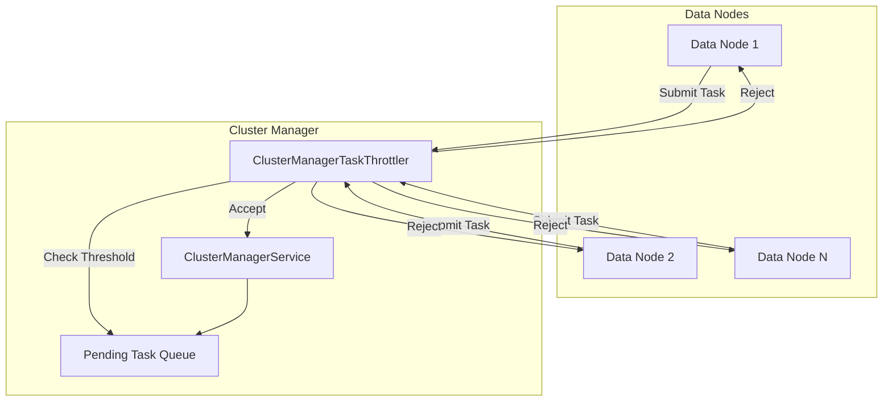
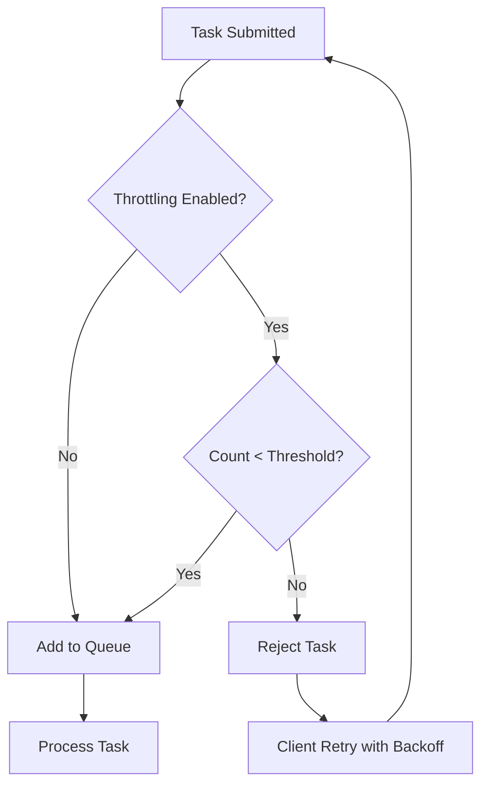

---
tags:
  - domain/core
  - component/server
  - indexing
  - performance
---
# Cluster Manager Task Throttling

## Summary

Cluster manager task throttling is a built-in protection mechanism that prevents the cluster manager from being overwhelmed by excessive task submissions. When nodes submit tasks like index creation, mapping updates, or snapshot operations, these tasks queue up on the cluster manager. Without throttling, spikes in task submissions can flood the cluster manager's pending task queue, degrading performance and potentially affecting cluster availability.

The throttling mechanism evaluates incoming tasks based on their type and rejects tasks when the number of pending tasks of the same type exceeds a configurable threshold. Rejected tasks are retried by the submitting node with exponential backoff.

## Details

### Architecture



### Data Flow



### Components

| Component | Description |
|-----------|-------------|
| `ClusterManagerTaskThrottler` | Core throttling logic that tracks task counts and enforces thresholds |
| `ClusterManagerTask` | Enum defining all task types with their keys and default thresholds |
| `ThrottlingKey` | Identifier for a registered task type used during throttling checks |
| `ClusterManagerThrottlingStats` | Statistics tracking for throttled tasks |
| `ClusterManagerService` | Service that processes cluster state updates and integrates with throttling |

### Configuration

| Setting | Description | Default |
|---------|-------------|---------|
| `cluster_manager.throttling.thresholds.<task-type>.value` | Maximum pending tasks of this type before throttling | Task-type specific (see below) |
| `cluster_manager.throttling.retry.base_delay` | Base delay for retry backoff | 1s |
| `cluster_manager.throttling.retry.max_delay` | Maximum delay for retry backoff | 30s |

### Default Thresholds by Task Type

| Task Type | Threshold | Rationale |
|-----------|-----------|-----------|
| Most operations (create-index, delete-index, etc.) | 50 | Standard operations with moderate frequency |
| `auto-create` | 200 | Higher frequency due to automatic index creation |
| `rollover-index` | 200 | Higher frequency in time-series workloads |
| `index-aliases` | 200 | Common operation in alias-based routing |
| `put-mapping` | 10000 | Very high frequency in dynamic mapping scenarios |
| `update-snapshot-state` | 5000 | High frequency during snapshot operations |

### Usage Example

```yaml
# opensearch.yml - Static configuration
cluster_manager.throttling.retry.base_delay: 2s
cluster_manager.throttling.retry.max_delay: 60s
```

```json
// Dynamic configuration via API
PUT _cluster/settings
{
  "persistent": {
    "cluster_manager.throttling.thresholds": {
      "create-index": {
        "value": 100
      },
      "put-mapping": {
        "value": 5000
      }
    }
  }
}
```

## Limitations

- Throttling is evaluated per task type, not globally across all task types
- Thresholds are cluster-wide settings and cannot be configured per-node
- When a task is rejected, the entire batch of tasks in that submission is rejected
- Throttling statistics are reset when the cluster manager node changes

## Change History

- **v3.0.0** (2025-05-06): Enabled default throttling for all task types with predefined thresholds; introduced `ClusterManagerTask` enum
- **v2.4.0** (2022-11-15): Initial implementation of cluster manager task throttling (disabled by default)


## References

### Documentation
- [Documentation](https://docs.opensearch.org/3.0/tuning-your-cluster/cluster-manager-task-throttling/): Official cluster manager task throttling documentation

### Blog Posts
- [OpenSearch 2.4.0 Blog](https://opensearch.org/blog/opensearch-2-4-is-available-today/): Introduction of cluster manager task throttling

### Pull Requests
| Version | PR | Description | Related Issue |
|---------|-----|-------------|---------------|
| v2.4.0 | [#4986](https://github.com/opensearch-project/OpenSearch/pull/4986) | Initial cluster manager task throttling implementation |   |
| v3.0.0 | [#17711](https://github.com/opensearch-project/OpenSearch/pull/17711) | Enabled default throttling for all tasks | [#17685](https://github.com/opensearch-project/OpenSearch/issues/17685) |

### Issues (Design / RFC)
- [Issue #17685](https://github.com/opensearch-project/OpenSearch/issues/17685): Feature request for default throttling in v3.0.0
