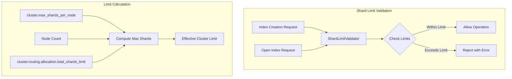

---
tags:
  - opensearch
---
# Cluster Shard Limits

## Summary

OpenSearch enforces cluster-wide shard limits to prevent resource exhaustion. The `ShardLimitValidator` class validates that creating new indices or opening closed indices won't exceed the configured maximum number of shards.

## Details

### Architecture



### Configuration

| Setting | Description | Default |
|---------|-------------|---------|
| `cluster.max_shards_per_node` | Maximum shards per data node | 1000 |
| `cluster.routing.allocation.total_shards_limit` | Hard limit for total cluster shards (-1 = disabled) | -1 |
| `cluster.ignore_dot_indexes` | Skip validation for dot-prefixed indexes | false |

### Limit Calculation

The effective cluster shard limit is calculated as:

```
computedMaxShards = min(Integer.MAX_VALUE, maxShardsPerNode × nodeCount)
effectiveLimit = min(totalShardsLimit, computedMaxShards)
```

If `total_shards_limit` is -1 (disabled), only the computed limit applies.

### Validation Behavior

- System indices are excluded from validation
- When `cluster.ignore_dot_indexes` is true, dot-prefixed indices (except data streams) are excluded
- Closed indices don't count toward the limit
- Validation occurs at index creation and when opening closed indices

### Usage Example

```json
PUT /_cluster/settings
{
  "persistent": {
    "cluster.max_shards_per_node": 2000
  }
}
```

## Limitations

- The computed maximum is capped at `Integer.MAX_VALUE` to prevent overflow
- Very high values of `cluster.max_shards_per_node` may not be practical due to memory constraints
- System indices bypass the limit, which could theoretically allow exceeding the configured maximum

## Change History

- **v2.16.0** (2024-06-20): Fixed integer overflow bug in max shards calculation ([#14155](https://github.com/opensearch-project/OpenSearch/pull/14155))

## References

### Documentation
- [Cluster Settings](https://docs.opensearch.org/latest/install-and-configure/configuring-opensearch/cluster-settings/)

### Pull Requests
| Version | PR | Description |
|---------|-----|-------------|
| v2.16.0 | [#14155](https://github.com/opensearch-project/OpenSearch/pull/14155) | Fix the computed max shards of cluster to avoid int overflow |
