---
tags:
  - domain/core
  - component/server
  - performance
---
# Cluster State Caching

## Summary

Cluster state caching optimizes the node join process by caching serialized cluster state on the cluster manager node. When multiple nodes join a cluster simultaneously, the cluster manager can reuse the cached serialized state instead of re-serializing it for each joining node. The cache is keyed by both cluster state version and OpenSearch software version to ensure compatibility in mixed-version clusters.

## Details

### Architecture

```mermaid
graph TB
    subgraph "Cluster Manager Node"
        JH[JoinHelper]
        SCSC[SerializedClusterStateCache]
        CSU[CompressedStreamUtils]
        TS[TransportService]
    end
    
    subgraph "Cache Structure"
        CSV[Cluster State Version]
        VM[Version Map]
        V1[Version A Bytes]
        V2[Version B Bytes]
    end
    
    subgraph "Joining Nodes"
        N1[Node Version A]
        N2[Node Version B]
    end
    
    JH --> SCSC
    SCSC --> CSV
    CSV --> VM
    VM --> V1
    VM --> V2
    
    JH -->|sendValidateJoinRequest| TS
    TS -->|VALIDATE_COMPRESSED_JOIN_ACTION_NAME| N1
    TS -->|VALIDATE_COMPRESSED_JOIN_ACTION_NAME| N2
```



### Node Join Validation Flow


### Components

| Component | Description |
|-----------|-------------|
| `JoinHelper` | Coordinates the node join process, manages the serialized cluster state cache |
| `SerializedClusterStateCache` | Inner class that caches serialized cluster state by cluster state version and OpenSearch version |
| `CompressedStreamUtils` | Utility for creating compressed, version-specific serialized streams |
| `BytesTransportRequest` | Transport request containing the compressed cluster state bytes |

### Configuration

| Setting | Description | Default |
|---------|-------------|---------|
| N/A | Cluster state caching is automatic and requires no configuration | - |

### Cache Implementation Details

The `SerializedClusterStateCache` class provides version-aware caching:

```java
public static final class SerializedClusterStateCache {
    private final Long clusterStateVersion;
    private final Map<Version, BytesReference> serialisedClusterStateBySoftwareVersion;
    private static final int MAX_VERSIONS_SIZE = 2;
}
```

Key behaviors:
- **Cache invalidation**: When cluster state version changes, the entire cache is replaced
- **Version-specific serialization**: Each OpenSearch version gets its own serialized representation
- **Size limit**: Maximum of 2 versions cached to prevent unbounded memory growth
- **LRU eviction**: When limit is reached, the oldest entry is removed

### Usage Example

The caching is transparent and automatic. During node join:


## Limitations

- Cache is limited to 2 OpenSearch versions (`MAX_VERSIONS_SIZE = 2`)
- Cache is invalidated on every cluster state version change
- Only applies to nodes running OpenSearch 2.9.0 or later (older nodes use uncompressed validation)

## Change History

- **v3.3.0** (2025-09-30): Fixed cluster state caching to use both cluster state version and node version as cache keys, resolving join failures in mixed-version clusters


## References

### Documentation
- [JoinHelper.java](https://github.com/opensearch-project/OpenSearch/blob/main/server/src/main/java/org/opensearch/cluster/coordination/JoinHelper.java): Source implementation

### Pull Requests
| Version | PR | Description | Related Issue |
|---------|-----|-------------|---------------|
| v3.3.0 | [#19307](https://github.com/opensearch-project/OpenSearch/pull/19307) | Fix: Cache serialised cluster state based on cluster state version and node version | [#19272](https://github.com/opensearch-project/OpenSearch/issues/19272) |

### Issues (Design / RFC)
- [Issue #19272](https://github.com/opensearch-project/OpenSearch/issues/19272): [BUG] Join Failure - Mixed Version cluster
