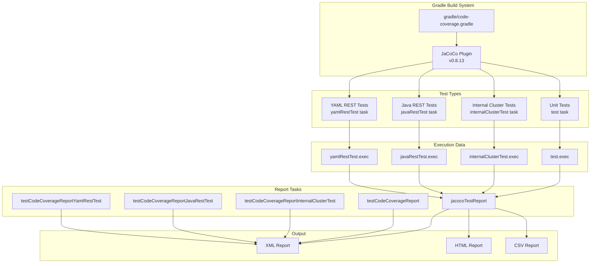
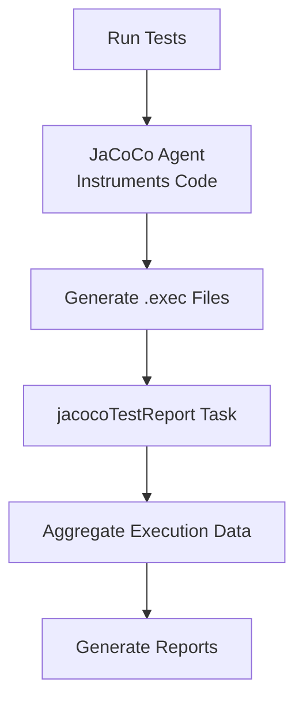

---
tags:
  - domain/core
  - component/server
  - ml
---
# Code Coverage (Gradle)

## Summary

OpenSearch provides local code coverage generation using Gradle with the JaCoCo plugin. This feature enables developers to generate coverage reports for unit tests, integration tests, and REST tests directly from their local environment, ensuring consistency with the coverage reported by GitHub CI workflows.

## Details

### Architecture



### Data Flow



### Components

| Component | Description |
|-----------|-------------|
| `gradle/code-coverage.gradle` | Main configuration file for JaCoCo integration |
| `jacocoTestReport` | Enhanced task that aggregates all test type execution data |
| `testCodeCoverageReport` | Dedicated report task for unit tests |
| `testCodeCoverageReportInternalClusterTest` | Dedicated report task for internal cluster tests |
| `testCodeCoverageReportJavaRestTest` | Dedicated report task for Java REST tests |
| `testCodeCoverageReportYamlRestTest` | Dedicated report task for YAML REST tests |

### Configuration

| Setting | Description | Default |
|---------|-------------|---------|
| `tests.coverage` | Enable coverage generation during `check` task | `false` |
| `tests.coverage.report.xml` | Generate XML format report | `true` |
| `tests.coverage.report.html` | Generate HTML format report | `false` |
| `tests.coverage.report.csv` | Generate CSV format report | `false` |

### Usage Examples

#### Unit Test Coverage

```bash
# Run unit tests for a specific module
./gradlew :server:test

# Generate coverage report
./gradlew :server:jacocoTestReport
```

#### Specific Test Coverage

```bash
# Run specific test
./gradlew :server:test --tests "org.opensearch.search.approximate.ApproximatePointRangeQueryTests.testNycTaxiDataDistribution"

# Generate HTML report
./gradlew :server:jacocoTestReport -Dtests.coverage.report.html=true
```

#### Integration Test Coverage

```bash
# Run internal cluster tests
./gradlew :server:internalClusterTest

# Generate coverage report
./gradlew :server:jacocoTestReport
```

#### REST Test Coverage

```bash
# Run Java REST tests
./gradlew :qa:die-with-dignity:javaRestTest

# Generate HTML report
./gradlew :qa:die-with-dignity:jacocoTestReport -Dtests.coverage.report.html=true
```

#### Combined Coverage with Check Task

```bash
# Run all tests with coverage enabled
./gradlew check -Dtests.coverage=true
```

### Report Output Location

Reports are generated at:
```
$buildDir/build/reports/jacoco/test/html/
```

## Limitations

- Coverage reports require running tests first to generate `.exec` execution data files
- The `jacocoTestReport` task only executes if at least one `.exec` file exists
- HTML and CSV reports are disabled by default to conserve disk space
- Coverage is measured at the line and branch level

## Change History

- **v3.3.0** (2025-10-14): Expanded coverage to include internalClusterTest and yamlRestTest; added testclusters directory permissions
- **v3.2.0** (2025-06-13): Initial implementation - ability to run code coverage locally with Gradle and produce JaCoCo reports

## Related Features
- [OpenSearch Dashboards](../opensearch-dashboards/opensearch-dashboards-ai-chat.md)

## References

### Documentation
- [JaCoCo Gradle Plugin](https://docs.gradle.org/current/userguide/jacoco_plugin.html): Official Gradle documentation
- [PR #18509](https://github.com/opensearch-project/OpenSearch/pull/18509): Main implementation
- [PR #18358](https://github.com/opensearch-project/OpenSearch/pull/18358): Related coverage improvement work
- [PR #18376](https://github.com/opensearch-project/OpenSearch/pull/18376): javaRestTest coverage addition

### Pull Requests
| Version | PR | Description | Related Issue |
|---------|-----|-------------|---------------|
| v3.3.0 | [#19165](https://github.com/opensearch-project/OpenSearch/pull/19165) | Include internalClusterTests and yamlRestTest in code coverage report | [#19140](https://github.com/opensearch-project/OpenSearch/issues/19140) |
| v3.3.0 | [#19085](https://github.com/opensearch-project/OpenSearch/pull/19085) | Grant access to testclusters dir for tests |   |
| v3.2.0 | [#18509](https://github.com/opensearch-project/OpenSearch/pull/18509) | Initial implementation - local code coverage with Gradle |   |

### Issues (Design / RFC)
- [Issue #19140](https://github.com/opensearch-project/OpenSearch/issues/19140): Bug report - Code coverage report does not include internalClusterTests
- [Issue #850](https://github.com/opensearch-project/OpenSearch/issues/850): Original feature request for test coverage reporting
