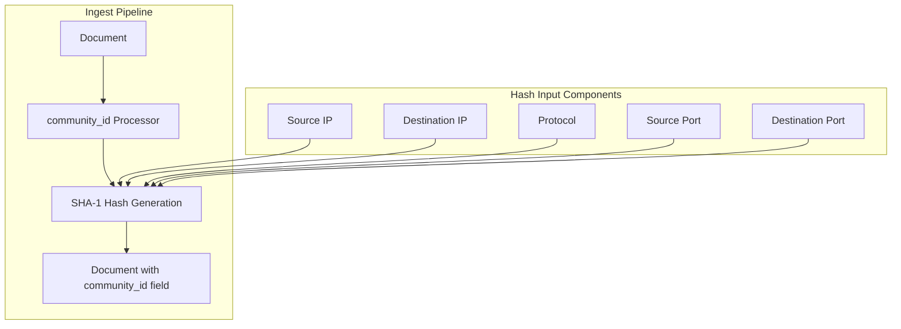

---
tags:
  - opensearch
---
# Community ID Ingest Processor

## Summary

The Community ID ingest processor generates a unique hash value for network flow tuples, enabling correlation and tracking of network traffic data. It implements the open Community ID Flow Hashing specification and supports TCP, UDP, SCTP, ICMP, and IPv6-ICMP protocols.

## Details

### Architecture



### Components

| Component | Description |
|-----------|-------------|
| `CommunityIdProcessor` | Main processor class that generates community ID hashes |
| `AbstractProcessor` | Base class providing common processor functionality |
| SHA-1 Algorithm | Cryptographic hash function used for generating the community ID |

### Configuration

| Parameter | Required | Default | Description |
|-----------|----------|---------|-------------|
| `source_ip_field` | Yes | - | Field containing the source IP address |
| `source_port_field` | Conditional | - | Field containing the source port (required for TCP/UDP/SCTP) |
| `destination_ip_field` | Yes | - | Field containing the destination IP address |
| `destination_port_field` | Conditional | - | Field containing the destination port (required for TCP/UDP/SCTP) |
| `iana_protocol_number_field` | Optional | - | Field containing the IANA protocol number |
| `protocol_field` | Conditional | - | Field containing the protocol name (required if `iana_protocol_number` not set) |
| `icmp_type_field` | Conditional | - | Field containing ICMP message type (required for ICMP/IPv6-ICMP) |
| `icmp_code_field` | Conditional | - | Field containing ICMP message code |
| `seed` | Optional | 0 | Seed for hash generation (0-65535) |
| `target_field` | Optional | `community_id` | Field to store the generated hash |
| `ignore_missing` | Optional | `false` | Exit quietly if required fields are missing |

### Supported Protocols

| Protocol | IANA Number | Port Fields Required |
|----------|-------------|---------------------|
| TCP | 6 | Yes |
| UDP | 17 | Yes |
| SCTP | 132 | Yes |
| ICMP | 1 | No (uses type/code) |
| IPv6-ICMP | 58 | No (uses type/code) |

### Usage Example

Create a pipeline:

```json
PUT /_ingest/pipeline/community_id_pipeline
{
  "description": "Generate community ID for network flow",
  "processors": [
    {
      "community_id": {
        "source_ip_field": "source_ip",
        "source_port_field": "source_port",
        "destination_ip_field": "destination_ip",
        "destination_port_field": "destination_port",
        "iana_protocol_number_field": "protocol",
        "target_field": "community_id"
      }
    }
  ]
}
```

Index a document:

```json
PUT testindex/_doc/1?pipeline=community_id_pipeline
{
  "source_ip": "66.35.250.204",
  "source_port": 80,
  "destination_ip": "128.232.110.120",
  "destination_port": 34855,
  "protocol": 6
}
```

Result includes the generated hash:

```json
{
  "community_id": "1:LQU9qZlK+B5F3KDmev6m5PMibrg=",
  "source_ip": "66.35.250.204",
  "source_port": 80,
  "destination_ip": "128.232.110.120",
  "destination_port": 34855,
  "protocol": 6
}
```

## Limitations

- Only supports IPv4 and IPv6 addresses
- Limited to five protocols: TCP, UDP, SCTP, ICMP, and IPv6-ICMP
- Seed value must be between 0 and 65535

## Change History

- **v2.16.0** (2024-07-23): Made `CommunityIdProcessor` class final for code consistency
- **v2.13.0** (2024-02-07): Initial implementation of the community_id ingest processor

## References

### Documentation

- [Community ID Processor Documentation](https://docs.opensearch.org/latest/ingest-pipelines/processors/community_id/)
- [Community ID Specification](https://github.com/corelight/community-id-spec)

### Pull Requests

| Version | PR | Description |
|---------|-----|-------------|
| v2.16.0 | [#14448](https://github.com/opensearch-project/OpenSearch/pull/14448) | Make the class CommunityIdProcessor final |
| v2.13.0 | [#12121](https://github.com/opensearch-project/OpenSearch/pull/12121) | Add community_id ingest processor |

### Related Issues

- [#2787](https://github.com/opensearch-project/OpenSearch/issues/2787) - Add Community ID ingest pipeline processor
