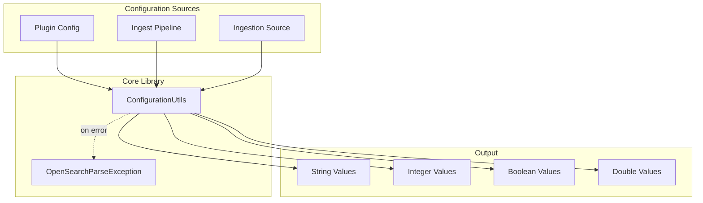
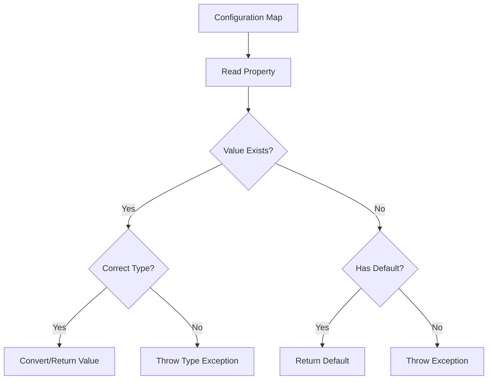

---
tags:
  - domain/core
  - component/server
  - search
---
# Configuration Utilities

## Summary

ConfigurationUtils is a core utility class in OpenSearch that provides standardized, type-safe methods for parsing configuration properties from `Map<String, Object>` structures. It simplifies configuration handling across OpenSearch components by offering consistent property extraction with built-in validation, type checking, and clear error messages.

## Details

### Architecture



### Data Flow



### Components

| Component | Package | Description |
|-----------|---------|-------------|
| `ConfigurationUtils` | `org.opensearch.core.util` | Main utility class with static methods for configuration parsing |
| `ConfigurationUtilsTests` | `org.opensearch.core.util` | Test suite covering all parsing scenarios |

### API Reference

| Method | Parameters | Returns | Description |
|--------|------------|---------|-------------|
| `readStringProperty` | `config, name` | `String` | Read required string, throws if missing |
| `readStringProperty` | `config, name, default` | `String` | Read string with fallback default |
| `readOptionalStringProperty` | `config, name` | `String` | Read optional string, returns null if missing |
| `readStringOrIntProperty` | `config, name, default` | `String` | Read string or int (converted to string) |
| `readOptionalStringOrIntProperty` | `config, name` | `String` | Read optional string or int |
| `readBooleanProperty` | `config, name, default` | `boolean` | Read boolean with default |
| `readIntProperty` | `config, name, default` | `Integer` | Read integer with default |
| `readDoubleProperty` | `config, name` | `Double` | Read required double |
| `newConfigurationException` | `name, reason` | `OpenSearchException` | Create standardized exception |

### Usage Example

```java
import org.opensearch.core.util.ConfigurationUtils;
import java.util.Map;

public class KafkaSourceConfig {
    private static final String PROP_TOPIC = "topic";
    private static final String PROP_BOOTSTRAP_SERVERS = "bootstrap_servers";
    
    private final String topic;
    private final String bootstrapServers;

    public KafkaSourceConfig(Map<String, Object> params) {
        // Required properties - throws OpenSearchParseException if missing
        this.topic = ConfigurationUtils.readStringProperty(params, PROP_TOPIC);
        this.bootstrapServers = ConfigurationUtils.readStringProperty(params, PROP_BOOTSTRAP_SERVERS);
    }
    
    public String getTopic() { return topic; }
    public String getBootstrapServers() { return bootstrapServers; }
}
```

### Error Messages

The utility provides consistent, informative error messages:

| Scenario | Error Message Format |
|----------|---------------------|
| Missing required property | `[propertyName] required property is missing` |
| Wrong type (string expected) | `[propertyName] property isn't a string, but of type [actualType]` |
| Wrong type (boolean expected) | `[propertyName] property isn't a boolean, but of type [actualType]` |
| Invalid int conversion | `[propertyName] property cannot be converted to an int [value]` |
| Invalid double conversion | `[propertyName] property cannot be converted to a double [value]` |

## Limitations

- Designed for flat configuration maps; does not support nested object parsing
- Does not remove properties from the map after reading (unlike some ingest utilities)
- No built-in support for list/array properties
- No support for enum parsing

## Change History

- **v3.0.0** (2025-02-05): Initial implementation - Added ConfigurationUtils to core library with support for string, boolean, int, and double property parsing


## References

### Documentation
- [Ingest Processors](https://docs.opensearch.org/3.0/ingest-pipelines/processors/index-processors/): Related configuration patterns
- [PR #17223](https://github.com/opensearch-project/OpenSearch/pull/17223): Implementation PR

### Pull Requests
| Version | PR | Description | Related Issue |
|---------|-----|-------------|---------------|
| v3.0.0 | [#17223](https://github.com/opensearch-project/OpenSearch/pull/17223) | Initial implementation |   |
