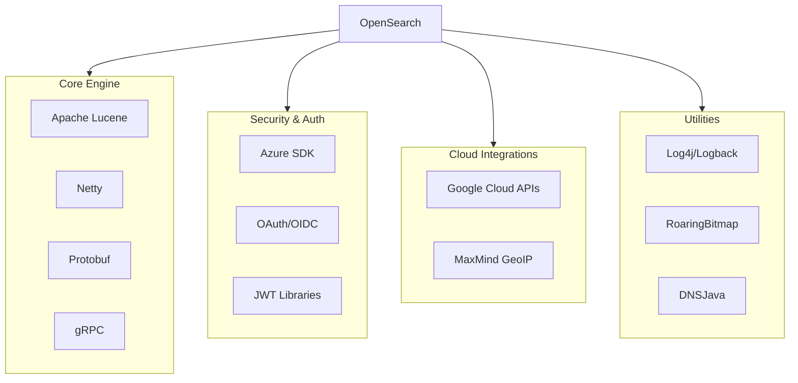

---
tags:
  - indexing
  - performance
  - search
  - security
---

# OpenSearch Core Dependencies

## Summary

OpenSearch maintains a comprehensive set of core dependencies that power its search engine capabilities, networking, security, and cloud integrations. Regular dependency updates ensure security patches, performance improvements, and compatibility with modern tooling.

## Details

### Architecture



### Components

| Category | Component | Description |
|----------|-----------|-------------|
| Search Engine | Apache Lucene | Core search and indexing library |
| Networking | Netty | Asynchronous event-driven network framework |
| Serialization | Protobuf | Protocol buffer serialization |
| RPC | gRPC | High-performance RPC framework |
| Logging | Log4j, Logback | Logging frameworks |
| Security | Azure SDK, OAuth2, JWT | Authentication and authorization |
| Cloud | Google APIs, GeoIP | Cloud service integrations |
| Data Structures | RoaringBitmap | Compressed bitmap implementation |

### Configuration

Dependency versions are managed in `buildSrc/version.properties` and Gradle build files. No user-facing configuration is required for dependency updates.

### Usage Example

Dependencies are internal to OpenSearch. Plugin developers can check compatible versions:

```bash
# Check current Lucene version
curl -s localhost:9200 | jq '.version.lucene_version'

# Check OpenSearch version info
curl -s localhost:9200
```

## Limitations

- Plugin compatibility may be affected by major dependency version changes
- Custom analyzers may need verification after Lucene upgrades
- Some cloud SDK updates may require credential refresh

## Change History

- **v2.18.0** (2024-10-22): Major dependency updates including Lucene 9.12.0, Netty 4.1.114.Final, gRPC 1.68.0, Protobuf 3.25.5, and 22 additional library updates

## Related Features
- [OpenSearch Dashboards](../opensearch-dashboards/ai-chat.md)

## References

### Documentation
- [Apache Lucene](https://lucene.apache.org/)
- [Netty Project](https://netty.io/)
- [gRPC Java](https://github.com/grpc/grpc-java)
- [Protocol Buffers](https://protobuf.dev/)

### Pull Requests
| Version | PR | Description | Related Issue |
|---------|-----|-------------|---------------|
| v2.18.0 | [#15333](https://github.com/opensearch-project/OpenSearch/pull/15333) | Apache Lucene 9.12.0 |   |
| v2.18.0 | [#16182](https://github.com/opensearch-project/OpenSearch/pull/16182) | Netty 4.1.114.Final |   |
| v2.18.0 | [#16213](https://github.com/opensearch-project/OpenSearch/pull/16213) | gRPC 1.68.0 |   |
| v2.18.0 | [#15684](https://github.com/opensearch-project/OpenSearch/pull/15684) | Protobuf 3.25.4 |   |
| v2.18.0 | [#16011](https://github.com/opensearch-project/OpenSearch/pull/16011) | Protobuf 3.25.5 | [#16006](https://github.com/opensearch-project/OpenSearch/issues/16006) |
