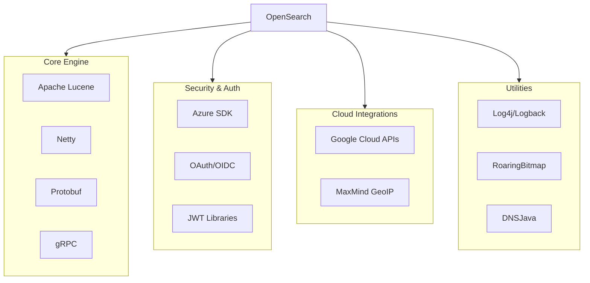

---
tags:
  - opensearch
---
# OpenSearch Core Dependencies

## Summary

OpenSearch maintains a comprehensive set of core dependencies that power its search engine capabilities, networking, security, and cloud integrations. Regular dependency updates ensure security patches, performance improvements, and compatibility with modern tooling.

## Details

### Architecture


```mermaid
graph TB
    subgraph Core["Core Engine"]
        Lucene[Apache Lucene]
        Netty[Netty]
        Protobuf[Protobuf]
        gRPC[gRPC]
    end
    
    subgraph Security["Security & Auth"]
        Azure[Azure SDK]
        OAuth[OAuth/OIDC]
        JWT[JWT Libraries]
    end
    
    subgraph Cloud["Cloud Integrations"]
        GCP[Google Cloud APIs]
        GeoIP[MaxMind GeoIP]
    end
    
    subgraph Utilities["Utilities"]
        Logging[Log4j/Logback]
        Bitmap[RoaringBitmap]
        DNS[DNSJava]
    end
    
    OpenSearch[OpenSearch] --> Core
    OpenSearch --> Security
    OpenSearch --> Cloud
    OpenSearch --> Utilities
```

### Components

| Category | Component | Description |
|----------|-----------|-------------|
| Search Engine | Apache Lucene | Core search and indexing library |
| Networking | Netty | Asynchronous event-driven network framework |
| Serialization | Protobuf | Protocol buffer serialization |
| RPC | gRPC | High-performance RPC framework |
| Logging | Log4j, Logback | Logging frameworks |
| Security | Azure SDK, OAuth2, JWT | Authentication and authorization |
| Cloud | Google APIs, GeoIP | Cloud service integrations |
| Data Structures | RoaringBitmap | Compressed bitmap implementation |

### Configuration

Dependency versions are managed in `buildSrc/version.properties` and Gradle build files. No user-facing configuration is required for dependency updates.

### Usage Example

Dependencies are internal to OpenSearch. Plugin developers can check compatible versions:

```bash
# Check current Lucene version
curl -s localhost:9200 | jq '.version.lucene_version'

# Check OpenSearch version info
curl -s localhost:9200
```

## Limitations

- Plugin compatibility may be affected by major dependency version changes
- Custom analyzers may need verification after Lucene upgrades
- Some cloud SDK updates may require credential refresh

## Change History

- **v3.6.0**: 15 dependency upgrades including Lucene 10.4.0, Netty 4.2.12.Final, Jackson 2.21.2 (security fix for GHSA-72hv-8253-57qq), OpenTelemetry 1.60.1, Reactor 3.8.4, Logback 1.5.27/1.5.32 (CVE-2026-1225 fix), Shadow Gradle Plugin 9.3.1 (major version bump with cross-plugin impact), JLine 4.0.0 (major version bump), and various minor library updates
- **v2.18.0** (2024-10-22): Major dependency updates including Lucene 9.12.0, Netty 4.1.114.Final, gRPC 1.68.0, Protobuf 3.25.5, and 22 additional library updates


## References

### Documentation
- [Apache Lucene](https://lucene.apache.org/)
- [Netty Project](https://netty.io/)
- [gRPC Java](https://github.com/grpc/grpc-java)
- [Protocol Buffers](https://protobuf.dev/)

### Pull Requests
| Version | PR | Description | Related Issue |
|---------|-----|-------------|---------------|
| v3.6.0 | [#20735](https://github.com/opensearch-project/OpenSearch/pull/20735) | Apache Lucene 10.4.0 | |
| v3.6.0 | [#20586](https://github.com/opensearch-project/OpenSearch/pull/20586) | Netty 4.2.12.Final | |
| v3.6.0 | [#20989](https://github.com/opensearch-project/OpenSearch/pull/20989) | Jackson 2.21.2 | GHSA-72hv-8253-57qq |
| v3.6.0 | [#20737](https://github.com/opensearch-project/OpenSearch/pull/20737) | OpenTelemetry 1.60.1 / Semconv 1.40.0 | |
| v3.6.0 | [#20589](https://github.com/opensearch-project/OpenSearch/pull/20589) | Reactor 3.8.4 / Reactor Netty 1.3.4 | |
| v3.6.0 | [#20525](https://github.com/opensearch-project/OpenSearch/pull/20525) | Logback 1.5.32 / 1.5.27 | CVE-2026-1225 |
| v3.6.0 | [#20715](https://github.com/opensearch-project/OpenSearch/pull/20715) | Nimbus JOSE+JWT 10.8 | |
| v3.6.0 | [#20886](https://github.com/opensearch-project/OpenSearch/pull/20886) | JAXB Impl 4.0.7 | |
| v3.6.0 | [#20799](https://github.com/opensearch-project/OpenSearch/pull/20799) | Nebula ospackage-base 12.3.0 | |
| v3.6.0 | [#20576](https://github.com/opensearch-project/OpenSearch/pull/20576) | Commons Text 1.15.0 | |
| v3.6.0 | [#20800](https://github.com/opensearch-project/OpenSearch/pull/20800) | JLine 4.0.0 | |
| v3.6.0 | [#20713](https://github.com/opensearch-project/OpenSearch/pull/20713) | JCodings 1.0.64 | |
| v3.6.0 | [#20714](https://github.com/opensearch-project/OpenSearch/pull/20714) | Joni 2.2.7 | |
| v3.6.0 | [#20760](https://github.com/opensearch-project/OpenSearch/pull/20760) | XZ 1.12 | |
| v3.6.0 | [#20569](https://github.com/opensearch-project/OpenSearch/pull/20569) | Shadow Gradle Plugin 9.3.1 | |
| v2.18.0 | [#15333](https://github.com/opensearch-project/OpenSearch/pull/15333) | Apache Lucene 9.12.0 |   |
| v2.18.0 | [#16182](https://github.com/opensearch-project/OpenSearch/pull/16182) | Netty 4.1.114.Final |   |
| v2.18.0 | [#16213](https://github.com/opensearch-project/OpenSearch/pull/16213) | gRPC 1.68.0 |   |
| v2.18.0 | [#15684](https://github.com/opensearch-project/OpenSearch/pull/15684) | Protobuf 3.25.4 |   |
| v2.18.0 | [#16011](https://github.com/opensearch-project/OpenSearch/pull/16011) | Protobuf 3.25.5 | [#16006](https://github.com/opensearch-project/OpenSearch/issues/16006) |
