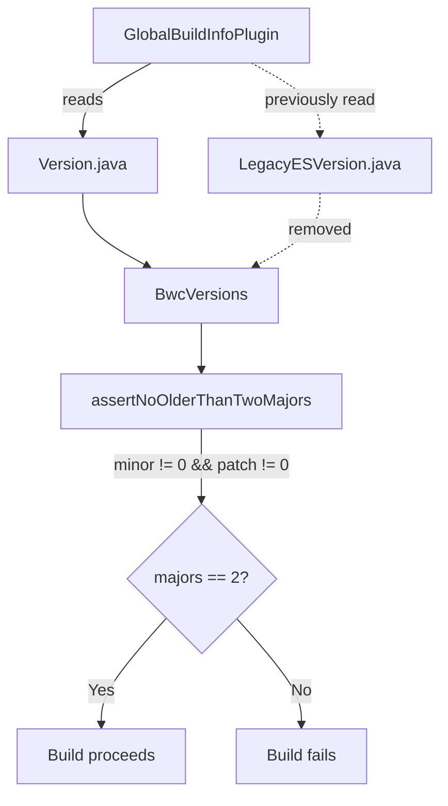

---
tags:
  - opensearch
---
# Core Version Update Fix

## Summary

Fix for the Gradle build system that prevented version-bumping OpenSearch core to a patch release (e.g., 3.3.1). The `GlobalBuildInfoPlugin` was including legacy Elasticsearch version numbers during backward compatibility version parsing, causing a validation failure when both minor and patch numbers were non-zero.

## Details

### Architecture

### Components

| Component | Description |
|-----------|-------------|
| `GlobalBuildInfoPlugin.resolveBwcVersions()` | Reads version source files and constructs `BwcVersions` |
| `BwcVersions.assertNoOlderThanTwoMajors()` | Validates that only 2 major versions exist in parsed versions |
| `Version.java` | OpenSearch version constants (2.x, 3.x) |
| `LegacyESVersion.java` | Legacy Elasticsearch version constants (6.x, 7.x) — no longer read |

### Root Cause

The `resolveBwcVersions()` method concatenated lines from both `Version.java` and `LegacyESVersion.java`. The `BwcVersions` constructor parsed all `V_X_Y_Z` patterns (including `LegacyESVersion` patterns), resulting in major versions `[2, 3, 6, 7]`. The `assertNoOlderThanTwoMajors()` check only triggers when `minor != 0 && patch != 0`, so the bug was invisible during regular minor releases (x.y.0).

## Limitations

- The fix only addresses the `resolveBwcVersions()` code path. The `DEFAULT_LEGACY_VERSION_JAVA_FILE_PATH` constant remains defined in the class.

## Change History
- **v3.3.1**: Removed `LegacyESVersion.java` reading from `resolveBwcVersions()` to fix patch release builds

## References

### Pull Requests
| Version | PR | Description |
|---------|-----|-------------|
| v3.3.1 | [opensearch-project/OpenSearch#19377](https://github.com/opensearch-project/OpenSearch/pull/19377) | Fix issue with updating core with a patch number other than 0 |

### Related Issues
- [opensearch-build#5720](https://github.com/opensearch-project/opensearch-build/issues/5720) — Discussion: Patch releases currently take a lot of effort
