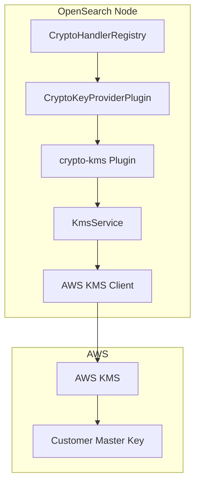
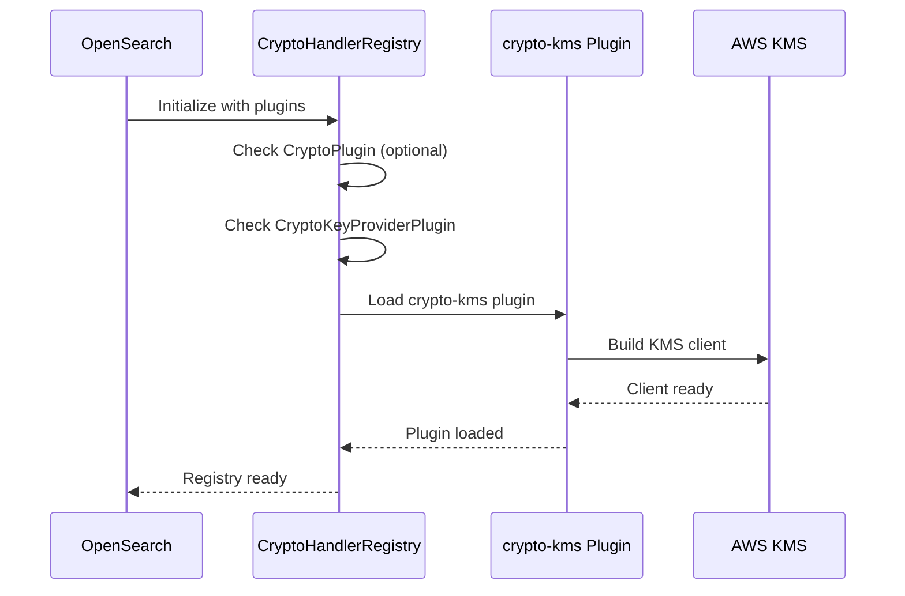

---
tags:
  - domain/core
  - component/server
  - search
---
# Crypto KMS Plugin

## Summary

The crypto-kms plugin provides AWS Key Management Service (KMS) integration for OpenSearch, enabling secure key management for encryption operations. It implements the `CryptoKeyProviderPlugin` interface to provide master key management through AWS KMS.

## Details

### Architecture



### Components

| Component | Description |
|-----------|-------------|
| `CryptoHandlerRegistry` | Central registry for crypto plugins and key providers |
| `CryptoKeyProviderPlugin` | Interface for key provider plugins |
| `KmsService` | Service class that manages AWS KMS client lifecycle |
| `SocketAccess` | Utility for privileged network operations |

### Plugin Loading Flow



### Configuration

The crypto-kms plugin uses AWS credentials and region configuration:

| Setting | Description | Default |
|---------|-------------|---------|
| AWS credentials | Standard AWS credential chain | Environment/IAM role |
| AWS region | KMS endpoint region | From environment |

### Dependencies

The plugin requires the following AWS SDK v2.x components:

| Dependency | Purpose |
|------------|---------|
| `software.amazon.awssdk:kms` | KMS client |
| `software.amazon.awssdk:auth` | AWS authentication |
| `software.amazon.awssdk:http-auth-aws` | AWS v4 signature authentication |
| `software.amazon.awssdk:http-auth` | HTTP authentication |
| `software.amazon.awssdk:apache-client` | HTTP client |
| `software.amazon.awssdk:checksums` | Checksum validation |
| `software.amazon.awssdk:retries` | Retry logic |
| `software.amazon.awssdk.crt:aws-crt` | AWS Common Runtime |

### Usage Example

Install the plugin:

```bash
bin/opensearch-plugin install crypto-kms
```

The plugin will automatically integrate with the CryptoHandlerRegistry when OpenSearch starts.

## Limitations

- Only one CryptoPlugin implementation is supported at a time
- Requires proper AWS credentials configuration
- Network access to AWS KMS endpoints required

## Change History

- **v3.1.0** (2026-01-10): Fixed plugin loading by decoupling CryptoPlugin and CryptoKeyProviderPlugin initialization; upgraded AWS SDK v2.x dependencies to fix NoClassDefFoundError


## References

### Pull Requests
| Version | PR | Description | Related Issue |
|---------|-----|-------------|---------------|
| v3.1.0 | [#18270](https://github.com/opensearch-project/OpenSearch/pull/18270) | Decouple CryptoPlugin and KeyProvider initialization | [#12472](https://github.com/opensearch-project/OpenSearch/issues/12472) |
| v3.1.0 | [#18268](https://github.com/opensearch-project/OpenSearch/pull/18268) | Upgrade dependencies for AWS SDK v2.x |   |

### Issues (Design / RFC)
- [Issue #12472](https://github.com/opensearch-project/OpenSearch/issues/12472): Feature request to decouple CryptoPlugin and CryptoKeyProviderPlugin
