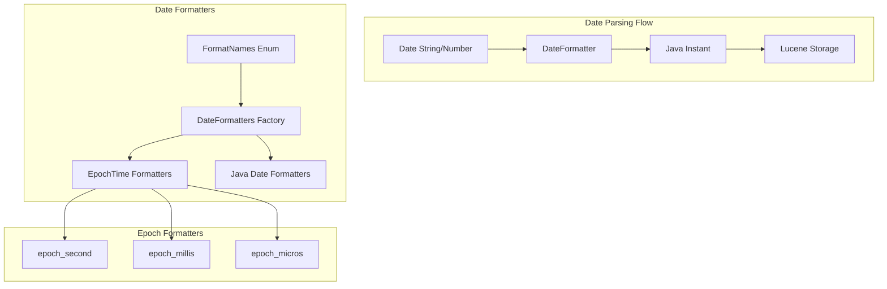

---
tags:
  - domain/core
  - component/server
  - indexing
---
# Date Format

## Summary

OpenSearch provides flexible date formatting options for date fields, allowing users to specify how date values are parsed during indexing and formatted during retrieval. The date format system supports built-in formats (like `epoch_millis`, `epoch_second`, `epoch_micros`, and ISO 8601 variants) as well as custom patterns using Java's DateTimeFormatter syntax.

## Details

### Architecture



### Components

| Component | Description |
|-----------|-------------|
| `FormatNames` | Enum defining all supported date format names |
| `DateFormatters` | Factory class that creates formatters for given patterns |
| `EpochTime` | Provides epoch-based formatters (seconds, millis, micros) |
| `JavaDateFormatter` | Wrapper for Java's DateTimeFormatter |

### Configuration

| Setting | Description | Default |
|---------|-------------|---------|
| `format` | Date format(s) for the field | `strict_date_time_no_millis\|\|strict_date_optional_time\|\|epoch_millis` |

Multiple formats can be specified using `||` as a separator.

### Supported Epoch Formats

| Format | Unit | Precision | Example |
|--------|------|-----------|---------|
| `epoch_second` | Seconds | 1 second | `1680000430` |
| `epoch_millis` | Milliseconds | 1 millisecond | `1680000430768` |
| `epoch_micros` | Microseconds | 1 microsecond | `1680000430768123` |

All epoch formats support:
- Positive and negative values
- Fractional precision (e.g., `123.456789` for sub-unit precision)
- Nanosecond resolution in fractional part

### Usage Example

```json
PUT my-index
{
  "mappings": {
    "properties": {
      "created_at": {
        "type": "date",
        "format": "epoch_micros"
      },
      "updated_at": {
        "type": "date",
        "format": "strict_date_optional_time||epoch_millis"
      },
      "custom_date": {
        "type": "date",
        "format": "yyyy-MM-dd HH:mm:ss"
      }
    }
  }
}
```

Index documents with different date formats:

```json
POST my-index/_doc/1
{
  "created_at": 1680000430768123,
  "updated_at": "2023-03-28T12:00:30.768Z",
  "custom_date": "2023-03-28 12:00:30"
}
```

## Limitations

- `epoch_micros` is not supported by Joda time (legacy date parsing)
- Custom patterns must follow Java's DateTimeFormatter syntax
- Maximum epoch values are constrained by Java's `Long.MAX_VALUE`

## Change History

- **v3.3.0** (2025-09-12): Added `epoch_micros` date format for microsecond precision timestamps

## Related Features
- [OpenSearch Dashboards](../opensearch-dashboards/opensearch-dashboards-ai-chat.md)

## References

### Documentation
- [Date field type documentation](https://docs.opensearch.org/3.0/field-types/supported-field-types/date/): Official date field documentation
- [Format mapping parameter](https://docs.opensearch.org/3.0/field-types/mapping-parameters/format/): Date format configuration

### Pull Requests
| Version | PR | Description | Related Issue |
|---------|-----|-------------|---------------|
| v3.3.0 | [#19245](https://github.com/opensearch-project/OpenSearch/pull/19245) | Add `epoch_micros` date format | [#14669](https://github.com/opensearch-project/OpenSearch/issues/14669) |

### Issues (Design / RFC)
- [Issue #14669](https://github.com/opensearch-project/OpenSearch/issues/14669): Feature request for epoch_micros support
