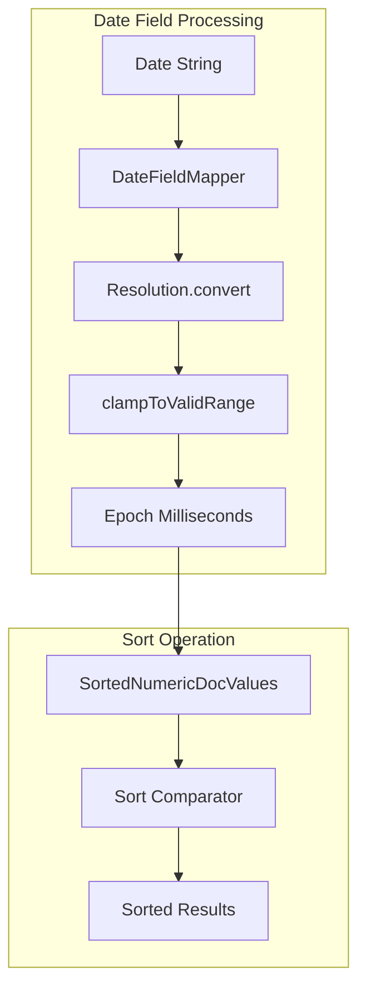

---
tags:
  - opensearch
---
# Date Field Sorting

## Summary

OpenSearch supports sorting search results by date fields. Date values are stored internally as epoch milliseconds (long values), enabling efficient sorting operations. Starting from v2.19.0, OpenSearch includes overflow prevention to handle extreme date values safely during sorting.

## Details

### Architecture



### Date Resolution

OpenSearch date fields support two resolutions:

| Resolution | Storage | Range |
|------------|---------|-------|
| MILLISECONDS | Epoch milliseconds (long) | -292275055 to +292278994 years |
| NANOSECONDS | Epoch nanoseconds (long) | 1677-09-21 to 2262-04-11 |

### Sorting Configuration

Date fields can be sorted using the standard sort syntax:

```json
{
  "sort": [
    {
      "date_field": {
        "order": "asc",
        "missing": "_last"
      }
    }
  ]
}
```

| Parameter | Description | Values |
|-----------|-------------|--------|
| `order` | Sort direction | `asc`, `desc` |
| `missing` | Handling for missing values | `_first`, `_last`, or a specific value |
| `unmapped_type` | Type to use if field is unmapped | `date` |

### Overflow Prevention (v2.19.0+)

The `DateUtils.clampToMillisRange()` method ensures date values stay within the valid epoch millisecond range:

```java
public static Instant clampToMillisRange(Instant instant) {
    if (instant.isBefore(INSTANT_LONG_MIN_VALUE)) {
        return INSTANT_LONG_MIN_VALUE;
    }
    if (instant.isAfter(INSTANT_LONG_MAX_VALUE)) {
        return INSTANT_LONG_MAX_VALUE;
    }
    return instant;
}
```

## Limitations

- Extreme date values outside the epoch millisecond range are clamped, which may affect sort precision
- Sorting on date fields with many missing values may have performance implications
- Date math expressions in sort are not supported; use scripted sorting for complex date calculations

## Change History

- **v2.19.0** (2025-01-14): Added overflow prevention for extreme date values during sorting ([#16812](https://github.com/opensearch-project/OpenSearch/pull/16812))

## References

### Documentation

- [Date field type](https://docs.opensearch.org/latest/field-types/supported-field-types/date/)
- [Sort results](https://docs.opensearch.org/latest/search-plugins/searching-data/sort/)

### Pull Requests

| Version | PR | Description |
|---------|-----|-------------|
| v2.19.0 | [#16812](https://github.com/opensearch-project/OpenSearch/pull/16812) | Overflow prevention when handling date values |

### Related Issues

- [#16709](https://github.com/opensearch-project/OpenSearch/issues/16709) - arithmetic_exception: long overflow while running sort query on date field
- [#5713](https://github.com/opensearch-project/OpenSearch/issues/5713) - Random arithmetic_exception - "long overflow" errors
