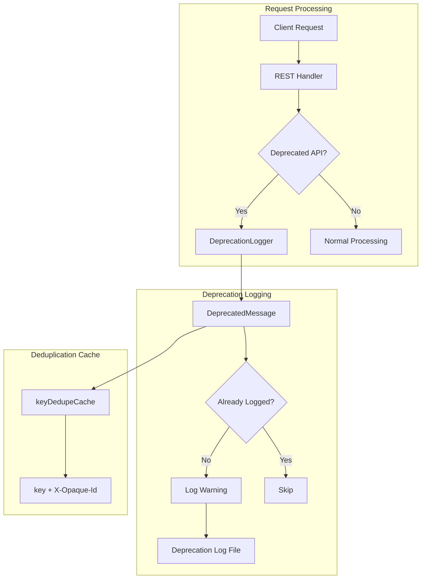

---
tags:
  - opensearch
---
# Deprecation Logger

## Summary

The Deprecation Logger is an internal OpenSearch component that logs warnings when clients use deprecated API features. It helps operators identify deprecated usage patterns before upgrading to new versions where those features may be removed.

## Details

### Architecture



### Components

| Component | Description |
|-----------|-------------|
| `DeprecationLogger` | Main logger class that wraps Log4j2 for deprecation-specific logging |
| `DeprecatedMessage` | Log message class that carries deprecation context including `X-Opaque-Id` |
| `keyDedupeCache` | Thread-safe set for deduplicating log messages |

### Configuration

Deprecation logging can be configured through cluster settings:

| Setting | Description | Default |
|---------|-------------|---------|
| `logger.deprecation.level` | Log level for deprecation messages | `WARN` |

Configure via Cluster Settings API:
```json
PUT /_cluster/settings
{
  "persistent": {
    "logger.deprecation.level": "WARN"
  }
}
```

Or in `opensearch.yml`:
```yaml
logger.deprecation.level: WARN
```

### Deduplication Mechanism

The deprecation logger deduplicates messages to prevent log flooding. Messages are deduplicated based on:
- **Message key**: A unique identifier for the deprecation warning
- **X-Opaque-Id**: The client-provided request identifier header

This means the same deprecation warning is logged only once per unique combination of message key and `X-Opaque-Id`.

### Log Output

Deprecation logs are written to:
- `logs/opensearch_deprecation.log` (plain text)
- `logs/opensearch_deprecation.json` (JSON format)

Example log entry:
```
[2024-12-03T19:59:46,000][WARN][o.o.d.a.ActionModule] [node1] Deprecated API usage detected...
```

### Usage Example

Internal usage within OpenSearch code:
```java
private static final DeprecationLogger deprecationLogger = DeprecationLogger.getLogger(MyClass.class);

// Log a deprecation warning
deprecationLogger.deprecate("my_deprecated_feature", "This feature is deprecated and will be removed in a future version");
```

## Limitations

- **Cache Size Limit** (v2.19.0+): The deduplication cache is limited to 16,384 entries. Once reached, new unique deprecation messages are suppressed.
- **No Cache Expiration**: Cached entries persist for the node's lifetime; there is no TTL or automatic cleanup.
- **Not Configurable**: The cache size limit (16,384) is hardcoded and cannot be changed via configuration.

## Change History

- **v2.19.0** (2025-01-21): Fixed unbounded memory usage by adding a 16,384 entry limit to the deduplication cache. Added optimization to skip cache operations when deprecation logging is disabled.

## References

### Documentation

- [OpenSearch Logs Documentation](https://docs.opensearch.org/latest/install-and-configure/configuring-opensearch/logs/)

### Pull Requests

| Version | PR | Description |
|---------|-----|-------------|
| v2.19.0 | [#16724](https://github.com/opensearch-project/OpenSearch/pull/16724) | Bound the size of cache in deprecation logger |

### Related Issues

| Issue | Description |
|-------|-------------|
| [#16702](https://github.com/opensearch-project/OpenSearch/issues/16702) | [BUG] DeprecationLogger - Unbounded memory usage |
